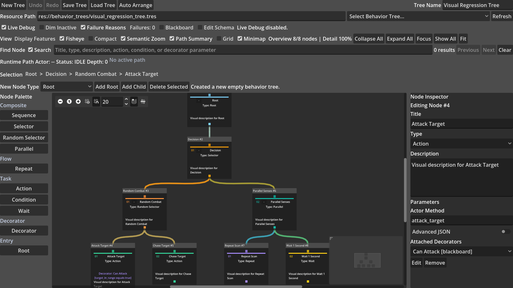
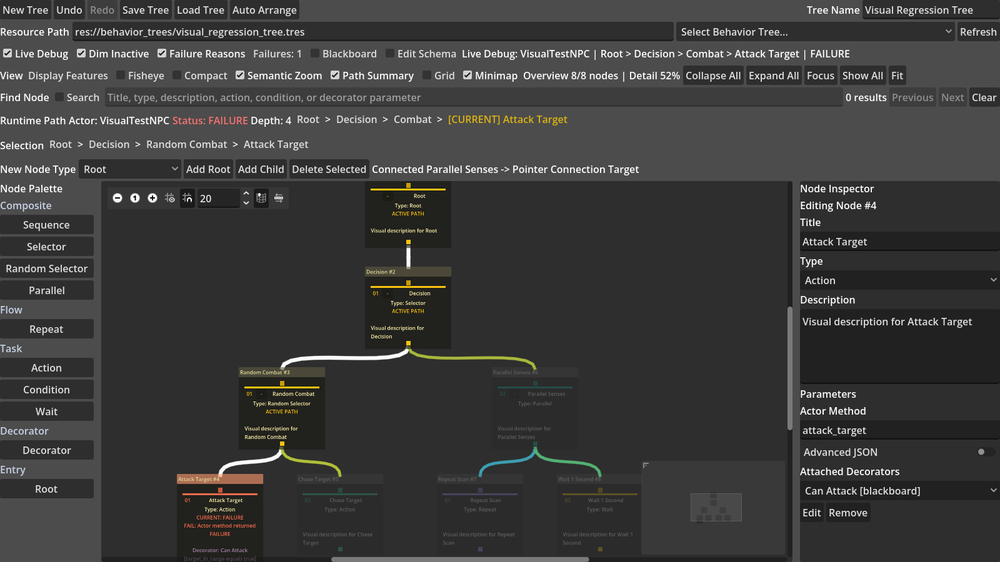
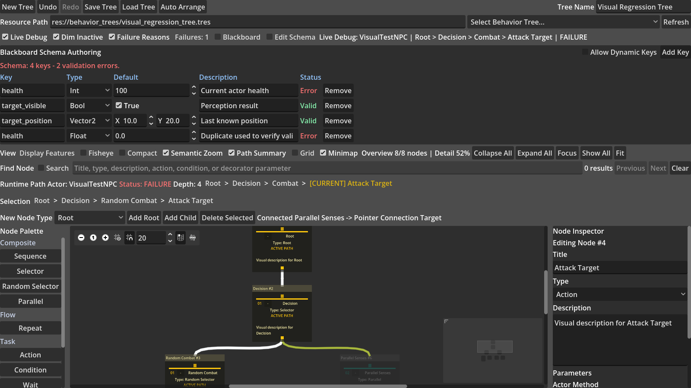

# Godot 4.6 Visual Behavior Tree Editor

一个面向 Godot 4.6 的可视化行为树编辑器与 NPC 运行时组件，也是大型行为树可读性优化方向的毕业设计项目。

项目可以在 Godot 编辑器中创建、连接、配置和保存 `.tres` 行为树，并通过 `BehaviorTreeComponent` 驱动 2D NPC。游戏运行时，当前执行路径、失败原因和 Blackboard 数据只显示在 Godot 编辑器插件中，不会覆盖游戏画面。

## 主要功能

- 可视化创建、删除、拖动、连接和断开节点，支持右键菜单、Undo/Redo、保存、加载和结构校验。
- 支持 `Root`、`Sequence`、`Selector`、`Random Selector`、`Parallel`、`Repeat`、`Action`、`Condition`、`Wait` 和 `Decorator`。
- Action 和 Condition 可以调用 NPC Actor 的具体方法。
- Blackboard 支持类型化 Schema、默认值、引用检查、运行值查看和比较条件。
- Decorator 支持 Blackboard 条件、Cooldown、Time Limit、Invert、Force Result 和 Repeat Forever。
- Sequence 等有序节点按画布横坐标从左到右执行。
- 运行时实现 `SUCCESS`、`FAILURE`、`RUNNING` 和组合节点的跨 Tick 执行记忆。

## Live Debug

运行游戏时，编辑器可以高亮当前活动节点链、淡化非当前分支，并标注 Condition、Action 或 Decorator 的失败原因。路径按钮可以直接定位到正在执行的节点。

## 大树显示优化

插件提供 24 个可独立开关的显示功能，以及独立的 Grid 画布开关，包括：

- Fisheye / Focus+Context、Semantic Zoom 和 Compact Mode。
- Subtree Collapse / Expand、Focus、Breadcrumb 和 Path Summary。
- Search + Highlight、增强 Minimap 和 Fit-to-view。
- Non-active Branch Dimming 和 Failure Reason Annotation。
- Multi-column Layout、Stable Layout、Straight Connections、Orthogonal Edges 和 Edge Bundling。
- Shape/Icon Type Encoding 和色盲友好配色。

每项显示优化都具有安全关闭和视觉状态复位路径，不会修改行为树运行数据。

## Blackboard Schema

Schema 编辑器支持 `Bool`、`Int`、`Float`、`String` 和 `Vector2`，并检查空键、重复键、未声明引用、类型错误和未使用键。

## 快速开始

1. 使用 Godot 4.6 打开 `testgame/testgame/project.godot`。
2. 进入 `Project > Project Settings > Plugins`。
3. 启用 `Behavior Tree Editor`。
4. 打开底部的 `Behavior Tree` 面板。
5. 从父节点底部方块拖到子节点顶部方块完成连线。
6. 运行 `res://scenes/test_game.tscn` 查看 NPC 行为和 Live Debug。

可分发插件位于 `visual_scripting/addons/behavior_tree_editor`，安装包位于 `dist/behavior-tree-editor-0.9.0.zip`。

## 示例游戏

示例包含玩家移动、近战攻击、冲刺、隐身和治疗，以及多个由行为树控制的敌人。敌人可以巡逻、索敌、追击、左右攻击、搜索最后已知位置、撤退和治疗。

## 验证状态

| 测试套件 | 结果 |
| --- | ---: |
| Runtime / Resource | 153/153 |
| Editor GUI | 195/195 |
| Basic Game Integration | 13/13 |
| Complex Arena Integration | 26/26 |
| Real GPU Visual Regression | 72/72 |
| 核心合计 | 459/459 |

## 文档

- [功能速览](docs/PLUGIN_FEATURES_QUICK_ZH.md)
- [完整用户手册](docs/USER_GUIDE_ZH.md)
- [技术实现文档](docs/TECHNICAL_DOCUMENTATION_ZH.md)
- [当前引用论文与原文](research/cited_articles/文章与链接清单.md)

## 当前范围

当前正式目标版本为 Godot 4.6。Service 节点不在毕业设计范围内；人体可读性对比实验仍需招募真实参与者，自动几何测试不能替代用户研究结论。

插件以 MIT License 分发，许可证位于插件目录中。
