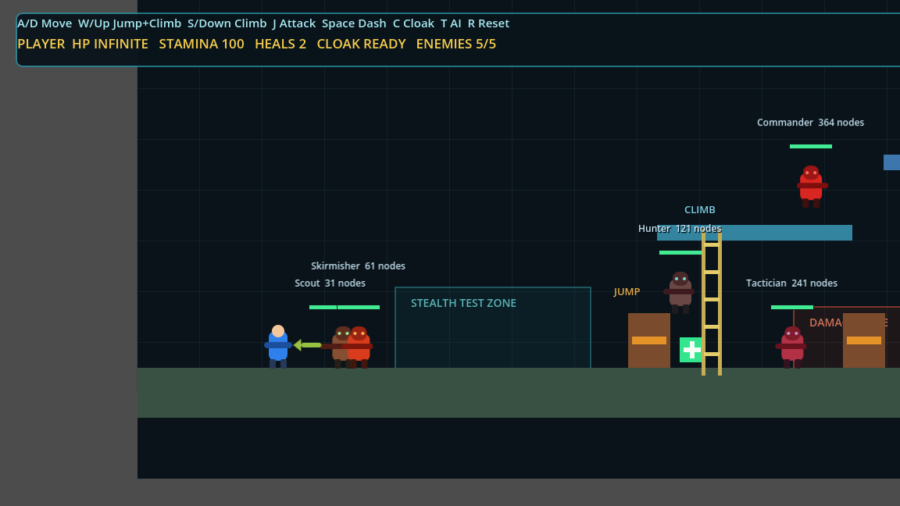
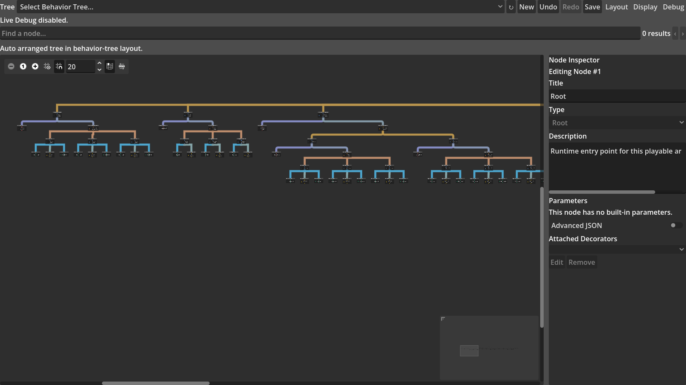

# 可玩游戏与复杂 NPC 功能证据

## 证据用途

这套游戏只用于证明行为树插件能够正确控制真实的二维游戏 NPC。它不增加“行为树基础功能是否有帮助”这一研究问题，也不把游戏表现当成大型行为树显示优化已经提高真人可用性的证据。

## 固定演示场景

运行场景为 `res://scenes/test_game.tscn`。场景固定放置五个敌人，不会继续生成新敌人；玩家为无限生命，因此可以完整观察敌人行为并完成演示。

| 敌人 | 实际加载的资源 | 节点数 |
| --- | --- | ---: |
| Scout | `arena_scout_31.tres` | 31 |
| Skirmisher | `arena_skirmisher_61.tres` | 61 |
| Hunter | `arena_hunter_121.tres` | 121 |
| Tactician | `arena_tactician_241.tres` | 241 |
| Commander | `arena_commander_364.tres` | 364 |

五名敌人各自加载不同的行为树资源。敌人被击败后停止行为树并永久退出本轮游戏；击败第五名敌人后只触发一次完成状态和胜利面板。按 `R` 可以恢复五名敌人、行为树、黑板、玩家、计数器和胜利状态。

## 可重复演示步骤

1. 运行 `test_game.tscn`，确认 HUD 显示 `PLAYER HP INFINITE` 和 `ENEMIES 5/5`。
2. 使用 `J` 或鼠标左键依次击败敌人，确认计数逐步降到 `0/5`，敌人不会自动复活，最后出现胜利面板。
3. 按 `R`，确认游戏恢复到 `ENEMIES 5/5`。
4. 在 Godot 底部的 `Behavior Tree` 面板选择 `res://behavior_trees/arena_tactician_241.tres`。
5. 在 `Debug` 菜单开启 `Live Debug` 和 `Active Path Highlight`；可选开启 `Non-active Branch Dimming` 与 `Live Blackboard`。
6. 在游戏中接近 Tactician、停留在开放射击通道、移动到箱子或高台附近、按 `C` 隐身并在近距离攻击。编辑器中的活动路径会随追击、远程攻击、跳跃、攀爬、搜索、防御和近战等状态变化。

完整按键和更细的操作说明见 `testgame/testgame/COMPLEX_ARENA_GUIDE.md`。

## 当前版本截图

### 游戏场景

画面同时显示无限生命玩家、五名敌人、五种树规模、跳跃箱、梯子、平台、伤害区和治疗物品。HUD 只有游戏信息，没有行为树节点、活动路径或黑板覆盖层。

### 游戏实际使用的 241 节点树

该图直接加载 `arena_tactician_241.tres`，包含 241 个资源节点，其中 202 个作为画布卡片显示，其余为附着 Decorator。它不是显示实验使用的另一棵 241 节点夹具。

### 真实 Runner 的 Live Debug

该图由正在运行的 `EnemyTactician/BehaviorTreeComponent` 通过插件的 Live Debug bridge 产生。截图中的 Actor、资源路径、活动节点编号、活动连线和叶节点均经过自动断言；当前固定运行状态显示的是 Chase 分支。

## 自动验证结果

| 验证 | 结果 | 主要内容 |
| --- | ---: | --- |
| 基础游戏集成 | 40/40 | 五种树绑定、无限生命、有限敌人、永久击败、游戏内无行为树调试覆盖层 |
| 五敌人通关流程 | 215/215 | 真实攻击、计数、完成信号、胜利、永久死亡、重置、树文件不变 |
| 复杂 Tactician 行为 | 34/34 | 方向近战、防御、远程投射物、跳跃、攀爬、追击、搜索、返回、恢复 |
| 实际游戏树视觉证据 | 26/26 | 实际 241 节点资源、真实 Runner 路径、两张截图、资源 SHA-256 不变 |
| **带断言合计** | **315/315** | 以上四组 |

真实渲染器冒烟测试另确认：五个 Runner 同时工作，树规模为 `[31, 61, 121, 241, 364]`，五名敌人仍存活，HUD 正常，并成功保存游戏截图。全部进程正常退出，日志没有脚本错误、泄漏、原生崩溃或非法内存访问。

## 能够支持的结论

这些证据支持一个有限结论：插件的编辑资源、运行时、Actor 方法调用、黑板、Decorator 和 Live Debug 能够共同控制一个可完成的二维游戏；不同规模的真实行为树也能够在同一场景中运行。大型树显示优化的效果仍由节点规模实验、屏幕尺寸实验和结构化开发者评价单独讨论，不能由这套游戏功能测试直接推出。
