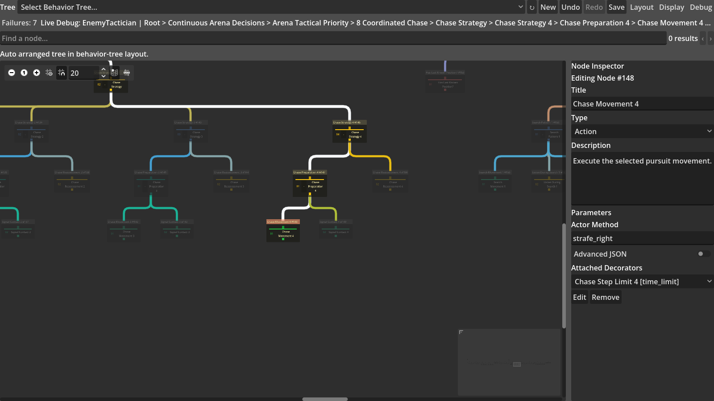
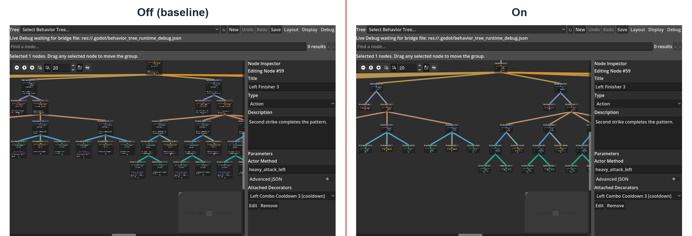
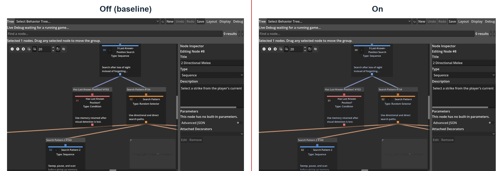
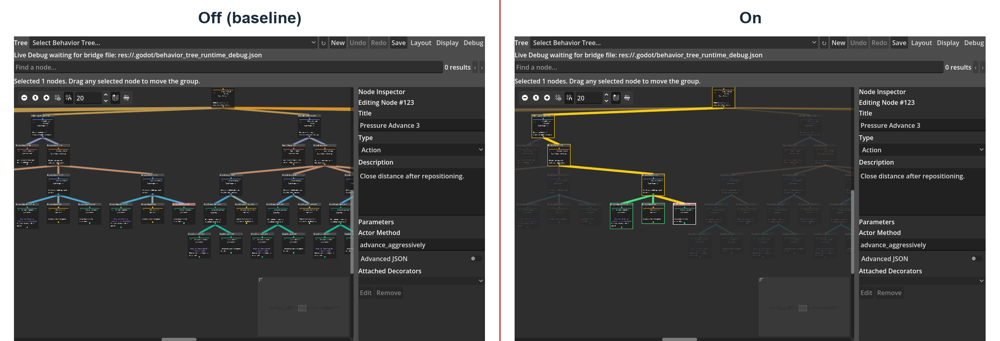
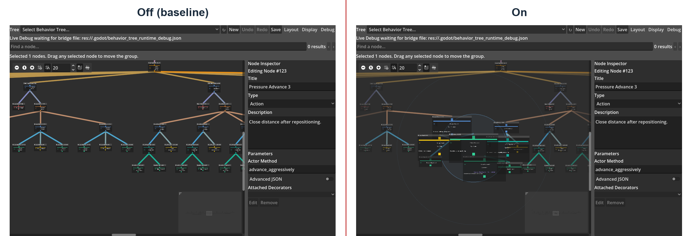
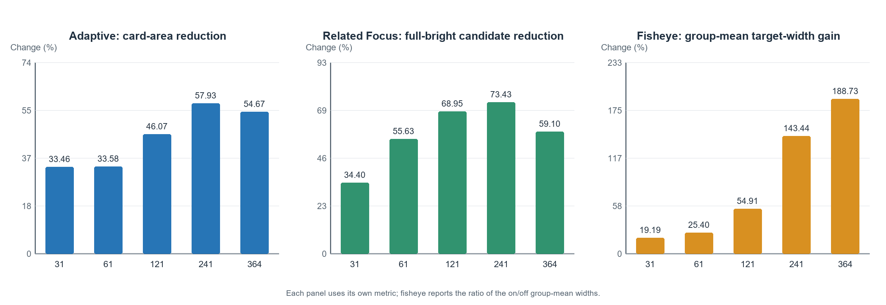
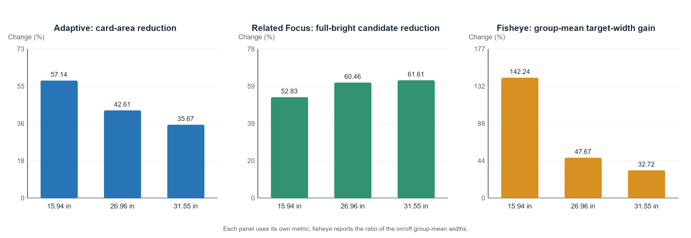

# Acknowledgements

This section is reserved for the author to thank the supervisor and the people who helped to test the software and review the dissertation. The author should complete the final wording before submission.

# Declaration

This dissertation is submitted to the University of Warwick in support of my application for the degree of Master of Science in Games Engineering. It is my own work and has not been submitted for a degree at another university. Except where sources are explicitly cited, the software, test data and analysis described in this dissertation were produced through this project. This dissertation does not report any participant-study results. Before final submission, the author must review and personalise this declaration in accordance with University requirements, including an accurate statement of how generative artificial intelligence was used.

# Abstract

Visual behaviour trees are commonly used to author decisions for game agents, but conventional node–link editors develop two direct problems as a tree grows. First, node cards and text occupy an increasingly large canvas. Second, dragging, connections, runtime states and unrelated branches compete for attention at the same time. This dissertation implements a complete behaviour-tree editing and runtime platform in Godot 4.6 and focuses the research on the display and editing interaction of large behaviour trees. The current Display menu contains only five switchable features: Smart Drag Reflow, Adaptive Zoom Detail, Readable Edge Overlay, Related Node Focus and Fisheye Focus. Search, straight connections, active paths, failure explanations and overview controls remain fixed baseline capabilities and are not included in the five-feature comparison.

The experiment uses five behaviour trees that control playable enemies and contain 31, 61, 121, 241 and 364 resource nodes. The three screen conditions are derived from the real EDID physical dimensions of 15.94-, 26.96- and 31.55-inch devices. The formal experiment replayed these three size profiles as SubViewports on the same NVIDIA GeForce RTX 5070 Laptop GPU. Each feature was compared in an off–on pair using the same tree, target and view, producing 450 state records and 225 comparisons. The experiment also checked tree topology, saved coordinates and sibling execution order, and used same-content screenshots and a structured developer evaluation to explain practical trade-offs beyond the numerical measures.

The results show that Smart Drag Reflow removed the deliberately induced card overlap in 45/45 controlled conditions. Adaptive Zoom Detail reduced total card area by an average of 45.14% without introducing a new hierarchy violation. Related Node Focus correctly dimmed 5,637/5,637 unrelated-node instances and reduced the number of fully bright candidates in the viewport by an average of 58.30%. Fisheye Focus increased mean target-card width from 119.43 px to 192.56 px and produced its largest gain on the small-screen profile and the 241–364-node trees, but it introduced new local overlap in 17/45 conditions. Readable Edge Overlay kept connection routes unchanged and used a background-opacity multiplier of 0.72 to reveal part of a line hidden behind a card, although the present evidence supports it only as a local aid.

Considering feature coverage, direct relevance to practical editing tasks, reversibility and observed side effects, Adaptive Zoom Detail is the most stable general-purpose optimisation. Smart Drag Reflow and Related Node Focus are most suitable for node editing and structural inspection respectively. Fisheye Focus is useful for local inspection of large trees on small screens, while Readable Edge Overlay is suitable for specific edge-occlusion cases. The automated data in this dissertation describe measurable changes in display and interaction state; they do not replace a usability study with external game developers.

Keywords: behaviour tree; Godot; node–link editor; semantic zoom; focus and context; graph layout; game artificial intelligence

# Chapter 1 Introduction

## 1.1 Research background

Modern game agents need to execute complex behavioural logic. In a small prototype, placing all decisions in one procedural script may be practical, but the control flow becomes increasingly difficult to inspect and modify as states and interruption conditions are added. A Behaviour Tree (BT) represents decision logic as a hierarchy of control nodes and leaf nodes. Composite nodes determine how children are selected, while conditions and actions connect the abstract decision structure to game state and Actor code. The ability to edit high-level strategy independently of movement, animation or combat methods is one of the principal benefits of behaviour trees in game development (Colledanchise and Ögren, 2018; Iovino et al., 2022).

A conventional node–link tree directly expresses parent–child topology, but its space requirements increase quickly with its width and depth. Behaviour-tree cards may also display parameters, descriptions, Decorators, blackboard keys and execution state, making them larger than ordinary hierarchical diagrams that show labels only. When tens or hundreds of cards occupy a limited canvas, a developer must zoom, pan and search frequently, while the current execution path can be lost among inactive branches. This is more than a cosmetic problem because the node graph is the main tool through which a designer locates tasks, understands order, modifies conditions and diagnoses failures.

This project therefore uses a Godot plugin that can save, run and debug genuine NPC decisions as its experimental platform, while narrowing the research scope to the five features that remain in the current Display menu. These features address occlusion caused by dragging, information density during zooming, cards that hide connections, the relationship scope of selected nodes and local detail within an overview. Each feature can be disabled independently so that the baseline can be restored and checked for visual residue.

## 1.2 Problem definition and research gap

Previous work has separately considered tidy tree layout, node-overlap removal, semantic zoom, focus and context, subgraph emphasis and edge congestion. Classic tree-layout research emphasises hierarchy, order and compactness (Reingold and Tilford, 1981; Sugiyama et al., 1981; Buchheim et al., 2006), while layout-adjustment research seeks to preserve original positions and topology while removing overlap (Misue et al., 1995; Dwyer et al., 2006; Dwyer et al., 2009). Semantic zoom changes a representation with scale (Bederson et al., 1996; Summers et al., 2003), whereas fisheye views magnify a focus while retaining context (Furnas, 1986; Sarkar and Brown, 1994). Interactive emphasis can support the inspection of related subgraphs in larger node–link diagrams (Ware and Bobrow, 2005), and systems such as EdgeLens directly address edge congestion and occlusion (Wong et al., 2003).

These studies provide a design foundation, but they do not directly answer how such methods should be combined in a game behaviour-tree editor. A behaviour tree differs from an ordinary hierarchy such as a file directory: sibling order can determine execution priority; leaf nodes call Actor code; a Decorator can prevent a branch from running; and runtime state changes continuously. A usable solution must preserve execution order, support editing and undo, expose blackboard state, and explain failures without adding a debugging overlay to the game view.

Existing studies also cannot substitute for a comparison in this project. Their graph types, node counts, screens, tasks and participants differ. Reduced area, changed opacity or target magnification can show what changed in the interface, but cannot by themselves prove that developers understand it more quickly. This project must therefore record the before-and-after change, applicable environment and side effects of each feature on the same executable behaviour-tree platform.

## 1.3 Aim and research question

This dissertation aims to design and evaluate composable display optimisations for large trees on a functionally validated Godot 4.6 visual behaviour-tree platform that can control genuine NPCs. The research question is: across different behaviour-tree node scales and physical screen sizes, can the composable display optimisations proposed in this project improve measurable display and editing-interaction performance for large behaviour trees compared with a conventional baseline display, while preserving behaviour-tree structure and execution semantics?

The principal contributions are:

- a Godot 4.6 behaviour-tree platform that includes editing, resources, a runtime, blackboards, Decorators and Live Debug;
- a Display menu consolidated into five switchable features that address distinct problems, together with a clear boundary between these features and fixed baseline capabilities;
- 225 off–on pairs across five real game behaviour trees and three physical-size profiles;
- a structured developer evaluation that records each feature's benefit, cost, applicable tree scale, applicable screen and recommended state using the same questions; and
- conclusions that distinguish the most stable general feature from features that are most effective in particular conditions, instead of combining measures with different units into a meaningless total score.

## 1.4 Project objectives and success criteria

The project work is divided into platform construction and research evaluation. Platform construction includes serialisable tree, node, Decorator and typed-blackboard resources; `success`, `failure` and `running` semantics for Root, Sequence, Selector, Reactive Selector, Random Selector, Parallel, Repeat, Wait, Action and Condition; a reusable component that assigns a tree and Actor to an NPC and allows leaves to call Actor methods; creation, connection, disconnection, dragging, box selection, multi-node movement, typed editing, validation, saving, loading, undo and redo; and editor-only presentation of the active path, node states, blackboard and failure reasons.

Before the display-optimisation experiment, the basic behaviour-tree plugin must first be shown to work correctly. Each node type must execute as intended; an edited behaviour tree must save and reopen correctly; and undo and redo must not corrupt tree content. The five playable enemies must load the 31-, 61-, 121-, 241- and 364-node trees respectively. The player must have unlimited health, the number of enemies must be finite, and the game must end after all enemies have been defeated.

The display study has three kinds of success criterion. First, a feature must produce its claimed direct change: for example, Smart Drag must reduce overlap caused by dragging, Adaptive must reduce overview card area, and Related Focus must dim unrelated nodes. Second, a feature must not change tree topology, Decorator ownership or sibling execution order; automatically moved neighbours may use only temporary display offsets. Third, disabling a feature must not leave residual size, opacity, frame or temporary layout state. A script error, crash, memory leak, illegal access or abnormal exit causes the test to fail even if the remaining assertions pass.

# Chapter 2 Literature review

## 2.1 Behaviour trees as executable hierarchies

A behaviour tree repeatedly evaluates a rooted hierarchy and propagates one of three states: `success`, `failure` or `running`. A Sequence normally stops at the first child that fails or remains running; a Selector stops at the first child that succeeds or remains running; and a leaf reads state or performs an action. This small status interface allows complex logic to be composed and interruption policies to be expressed explicitly (Colledanchise and Ögren, 2018). The survey by Iovino et al. (2022) further shows that behaviour trees have expanded from game development into robotics and other AI systems, although their precise execution semantics remain implementation-dependent.

The three-state interface appears simple but contains important implementation choices. A running Sequence may remember its current child index, whereas a Reactive Selector must recheck high-priority conditions and pre-empt a lower-priority branch. A Random Selector should retain the same choice while its child is running. A Parallel requires success and failure policies, while Repeat and Wait must clear memory when restarted or interrupted. Editor presentation and runtime semantics therefore cannot be entirely separated: child order, Decorator ownership and node identity all affect execution and must be serialised correctly.

A blackboard provides shared key–value state between perception, conditions and actions. Unreal Engine's technical documentation illustrates the industrial practice of combining a blackboard, Decorators and runtime observation (Epic Games, n.d.). This project does not attempt to reproduce every capability of a commercial system; instead, it establishes a platform sufficient for genuine NPC decisions and display experiments.

## 2.2 Node–link trees, hierarchy and scale

Node–link diagrams suit behaviour trees because their edges directly represent ancestry and sibling groups. The tidy-tree drawing proposed by Reingold and Tilford (1981) emphasises centring a parent relative to its children, spacing within a level and avoiding subtree overlap. Sugiyama et al. (1981) divide hierarchical-system layout into within-layer ordering and horizontal position assignment to reduce crossings and clarify hierarchy. Buchheim et al. (2006) further provide a linear-time drawing method for rooted trees of unbounded degree. These methods suit generating a tree layout from scratch, but an interactive behaviour-tree editor must also allow free dragging.

Increasing scale amplifies both node and edge problems. Ghoniem et al. (2005) compare node–link and matrix representations and show that graph size, density and task jointly affect performance rather than node count alone. SpaceTree combines a node–link tree with dynamic layout and selective display, illustrating that representation and interaction need to be evaluated together (Plaisant et al., 2002). This project retains an editable node graph because parent–child direction and sibling order are core behaviour-tree semantics, but controls how much information is presented during zooming and selection.

## 2.3 Local overlap avoidance and positional stability

Interactive editing differs from a one-off automatic layout. If the system rearranges the whole tree after one node is dragged, overlap may disappear, but the user's newly formed memory of locations may also be disrupted. Misue et al. (1995) describe this as layout adjustment and discuss overlap handling and the mental map. Dwyer et al. (2006) formulate node-overlap removal as a separation-constraint problem: nodes should not overlap, while the result should remain as close as possible to the original positions. Dwyer et al. (2009) subsequently consider preservation of existing topology in constrained layout.

These studies explain the design direction of Smart Drag but are not direct descriptions of its implementation. This project does not reproduce a complete published algorithm. Instead, it limits the activation distance, update frequency, propagation depth and maximum number of affected cards, and uses behaviour-tree parent–child and sibling relationships to decide which cards move as a group. The system protects only parent-above-child relationships that were already valid before the drag. If a user has deliberately placed a group in the opposite direction, the plugin does not force it into a standard tree arrangement.

The mental map must not be treated as an automatic usability conclusion. Archambault and Purchase (2013) review dynamic-graph studies and show that whether position preservation supports a task depends on the changes and structures that the user must track. This dissertation therefore treats unchanged tree structure and minimal movement of unrelated positions as engineering constraints, but does not claim that they have proved faster human understanding.

## 2.4 Semantic zoom and focus plus context

Semantic zoom differs from geometric zoom. Geometric zoom changes physical size, whereas semantic zoom changes display attributes. Pad++ demonstrates the basic idea of changing a representation with scale in a zoomable interface (Bederson et al., 1996). Summers et al. (2003) compare flat representation, conventional semantic zoom and continuous semantic zoom in program visualisation, providing empirical precedent in a related domain for reducing detail while zoomed out and restoring fields while zoomed in. However, their programs, tasks and participants differ from this project, so their speed and accuracy results cannot be transferred to behaviour trees.

Furnas (1986) uses degree of interest to describe the salience of focus and context elements. Sarkar and Brown (1994) and Lamping et al. (1995) subsequently apply fisheye and focus-plus-context techniques to graphical hierarchies. The review by Cockburn et al. (2009) shows that overview-plus-detail, zooming and focus-plus-context each have costs and that no method is best for every task. A study of small-screen scatterplots with 24 participants by Büring et al. (2006) also found no significant difference in completion time between two methods, although most participants preferred the fisheye. Fisheye must therefore be tested separately in the present task rather than being assumed to be faster in advance.

## 2.5 Relationship emphasis and edge occlusion

Large graphs do not necessarily require nodes to be hidden. Ware and Bobrow (2005) use interactive emphasis to support visual queries in medium-sized node–link diagrams, showing that highlighting a topologically related subgraph after selecting a target is a viable approach. van Ham and Perer (2009) propose “search, show context, expand on demand”, using a target of interest to control the visible scope of a large graph. Related Node Focus in this project does not hide nodes. It retains their global positions and uses frames and opacity to distinguish selected nodes, ancestors, descendants, siblings and unrelated branches.

Edges can also be occluded by nodes and by other edges. EdgeLens by Wong et al. (2003) curves connections around a focus to open space occupied by edge congestion. This project does not implement EdgeLens and does not alter connection routes. Readable Edge Overlay takes a more conservative approach: lines can appear through a semi-transparent card background, while text outlines mask the glyph area. The two techniques address related problems but use different operations and produce different visual results.

## 2.6 Physical screen size and the research gap

Physical screen size, usable display space and information scale are not the same variable. Jakobsen and Hornbæk (2013) show that interaction outcomes on large and small displays are affected jointly by information space and display scale. Tan et al. (2004) find that physical size can affect spatial performance in a controlled-viewpoint 3D navigation task, but that task is not behaviour-tree editing and its percentage result cannot be transferred to this project.

The literature shows that each technique has a theoretical and empirical background, but the following combination remains absent: a genuinely executable Godot behaviour-tree platform; the same five current features; off–on screenshots with identical content and view; paired data across 31 to 364 nodes and several physical-size profiles; and a consistent developer evaluation of benefit, cost and recommended state. The research gap is not the invention of an entirely new graph algorithm. It is the translation of these methods into reproducible behaviour-tree editing features and an honest assessment of which features are worth retaining.

# Chapter 3 Research method

## 3.1 Research strategy

This study first implements a Godot 4.6 plugin that can correctly author and run behaviour trees, and then uses it to test display optimisations for large trees. The research focus is not whether behaviour trees are suitable for making games, but whether these display optimisations improve measurable interface performance across different node counts and screen sizes.

The study uses two complementary forms of evidence. The first is deterministic off–on pairing, which records direct measures such as card area, overlap, opacity, target width and structural safety. The second is a structured developer evaluation in which the project developer answers the same questions for every feature: what it helps, what problem it causes, the tree scales and screens for which it is more useful, and whether it should be enabled by default. The second form is not a participant study, contains no questionnaire score and is not used to make inferences about the wider population of developers.

## 3.2 Experimental objects

The experiment uses the behaviour trees actually loaded by the five enemies in the current playable game. Resource nodes include Decorators attached to other nodes, whereas Decorators are not displayed as separate canvas cards. Resource-node counts and canvas-card counts must therefore be reported separately.

| Resource nodes | Canvas cards | Decorators | Resource | Game Actor |
| ---: | ---: | ---: | --- | --- |
| 31 | 30 | 1 | `arena_scout_31.tres` | Scout |
| 61 | 56 | 5 | `arena_skirmisher_61.tres` | Skirmisher |
| 121 | 104 | 17 | `arena_hunter_121.tres` | Hunter |
| 241 | 202 | 39 | `arena_tactician_241.tres` | Tactician |
| 364 | 301 | 63 | `arena_commander_364.tres` | Commander |

Table 3.1 Resource nodes, canvas cards and Decorators in the five real behaviour trees

All five trees contain executable composite nodes, conditions, actions and Decorators rather than empty structures created for screenshots. The larger trees cover directional melee combat, ranged projectiles, obstacle jumping, ladder climbing, pursuit, last-known-position search, retreat, healing, patrol and idle behaviour. Branch shape and field content also change as scale increases, so the experiment can compare behaviour under genuine complexity, but every difference between adjacent scales cannot be interpreted as a pure causal effect of node count.

## 3.3 Screen-size profiles

The screen conditions are derived from EDID records of the physical width and height of three devices collected on 23 August 2026. A consistent density of 35 logical units per centimetre is used to generate each SubViewport. Only the laptop screen is currently enabled, so the formal experiment replays the three physical-size profiles on the same GPU. It does not claim that the window was rerun separately on the three physical displays.

| Profile | Physical width × height | Diagonal | Physical area | SubViewport | Usable GraphEdit area |
| --- | ---: | ---: | ---: | ---: | ---: |
| Laptop | 34×22 cm | 15.94 in | 748 cm² | 1190×770 | 858×642 |
| Medium | 60×33 cm | 26.96 in | 1980 cm² | 2100×1155 | 1768×1027 |
| Large | 70×39 cm | 31.55 in | 2730 cm² | 2450×1365 | 2118×1237 |

Table 3.2 Physical-size sources and replayed canvas dimensions for the three profiles

Resolution, refresh rate and Windows scaling are retained only as device-audit information and are not used to explain effects. Whether a node lies inside the viewport is calculated from the usable GraphEdit area rather than the complete SubViewport, which also contains the toolbar and Inspector.

## 3.4 Paired operation of the five features

Three deterministic task targets are selected in advance from the left, centre and right of each tree. They cover different branches and are not treated as random replications. Every state uses a fresh copy of the tree resource, rebuilds the canvas and explicitly sets feature states, so it does not inherit temporary offsets from the previous record. The script uses a fixed order and always records the off state before the on state within a pair; the experiment does not randomise or rotate order.

For Smart, Adaptive, Overlay and Related, the off state disables all five experimental features. Fisheye is the only exception: because it is intended for use in an overview, both its off and on states retain Adaptive and differ only in whether fisheye is additionally applied. This design measures the incremental effect of fisheye relative to an adaptive overview.

| Feature | Off state and operation | On state and principal measures |
| --- | --- | --- |
| Smart Drag Reflow | Drag a fixed leaf into the region of a fixed target card and record the deliberately induced occlusion | Repeat the same drag path; compare overlap area, number of automatically moved cards, maximum displacement and movement of distant branches |
| Adaptive Zoom Detail | Continue to show full cards at a fixed overview zoom | Switch to medium/low detail according to zoom; compare card area, field count, cards fully within the viewport and hierarchy violations |
| Readable Edge Overlay | Fix a real parent–child connection that passes through a non-endpoint card, with the card kept opaque | Multiply the background by 0.72; compare the segment crossing the card, weighted visible length, text-mask styling and route stability |
| Related Node Focus | Select the same node without applying relationship emphasis; the third task selects two nodes | Take the union of multi-selection relationships; compare unrelated-node dimming, reduction in fully bright candidates, frame roles and geometric stability |
| Fisheye Focus | Adaptive overview without fisheye | Apply one stable fisheye state to a fixed target; compare target width, restored fields, distant opacity and new occlusion |

Table 3.3 Off–on operation and measures for the five features

The total number of state records is 5 features × 3 screen profiles × 5 trees × 3 tasks × 2 states = 450. These records form 225 one-to-one comparisons, with 45 pairs for each feature. Each state waits for two rendered frames before recording. The experiment uses Godot 4.6 stable, the OpenGL Compatibility renderer and an NVIDIA GeForce RTX 5070 Laptop GPU.

## 3.5 Data processing and success criteria

The analysis aligns off and on states using `pair_id` and gives equal weight to each screen–tree–task condition. Because the tasks and interface states are deterministic, the three tasks are fixed branch cases rather than samples drawn randomly from a population. The dissertation therefore reports paired means, medians, ranges and the number of conditions that satisfy a feature contract. It does not calculate p-values or confidence intervals without a clearly defined population.

All pairs share the following checks: resource-node count, parent–child relationships, Decorator ownership, left-to-right sibling execution order and coordinates of non-dragged resource nodes remain unchanged; disabling a feature leaves no residual size, opacity, frame or temporary offset; and logs contain no script error, crash, leak or non-zero exit. The formal Smart fixture cancels the drag and restores the source node after recording, allowing saved coordinates to be compared exactly with their pre-experiment state. In normal use, a node actively dragged by the user saves its new coordinate and enters Undo/Redo, while automatically avoided neighbours remain absent from the resource.

Each feature also has its own success criteria. Smart must substantially reduce induced overlap and must not automatically move more than 24 cards. Adaptive must reduce area or fields without increasing hierarchy violations. Overlay must contain a segment crossing a card, lower the background opacity, retain an active text-protection style and keep the route unchanged. Related must dim every unrelated node. Fisheye must select the correct target and raise it to at least approximately 180 px. Fisheye is not required to preserve zero overlap across the whole graph because it is designed as a local inspection tool that tolerates peripheral occlusion; new overlap is reported as a side effect.

## 3.6 Structured developer evaluation

The structured developer evaluation uses the same trees, targets and paired screenshots as the automated experiment. The evaluator is the developer of this project. Each feature answers the same five questions: which task it helps most directly; its most apparent problem; the node scale at which it is more useful; the screen profile at which it is more useful; and whether it should be enabled by default or on demand. Every conclusion must refer to a table, screenshot or raw-data result rather than personal preference alone.

This evaluation supplements design questions that automated measures cannot answer, such as whether movement of a small number of neighbours is acceptable, which information is hidden by low-detail cards, and whether local fisheye occlusion disrupts global inspection. It cannot demonstrate that other developers would have the same experience. Completion time, error rate, zoom/pan count and subjective ratings from real participants remain future work.

## 3.7 Plugin-function and playable-game validation

The display experiment depends on a functionally correct platform. Validation is divided into resource and runtime tests, editor-interface tests, basic-game tests, complex-arena tests and the five-enemy completion flow. It covers node execution, Decorators, Actor method calls, creation and connection, save and reload, undo and redo, multi-selection dragging, display-feature reset, permanent enemy defeat and game completion.

Playable validation does not address an additional research question about whether behaviour trees help game development. It only confirms that the five experimental trees are loaded by game Actors, that complex behaviour executes, that the player has unlimited health, that the five finite enemies can be defeated one by one, and that a completion state is eventually reached. The dissertation therefore evaluates more than a set of static graphs detached from a runtime.

# Chapter 4 System design and implementation

## 4.1 Overall architecture

The system consists of five parts: an editor plugin, a resource model, a runtime, a debugging bridge and a test game. The editor plugin runs within the Godot editor and presents a behaviour-tree resource as an interactive GraphEdit canvas. The resource model stores nodes, parent–child relationships, Decorators, the blackboard Schema and node coordinates. The runtime reads the same resource and passes tick results to the game Actor. The debugging bridge returns current state, failure reasons and blackboard values to the editor. The test game supplies an executable environment only and does not overlay a behaviour-tree debugging interface on the game view.

Figure 4.1 Relationship between the plugin, resources, runtime, debugging bridge and test game

This separation allows the same tree to be edited, saved, tested automatically and run in the game. Display features change only temporary card size, opacity, frame or canvas offset; they do not rewrite node types or connections. A node that the user deliberately drags and releases is the exception: its new coordinate is saved normally and can be undone or redone. Other cards moved automatically for avoidance are not written back to the resource.

## 4.2 Resource model and structural validation

A behaviour-tree resource stores the root and the node collection. Every node has a stable identity, type, editor coordinate, parameters and child references. A Decorator is attached to its owning node rather than represented as an independent canvas card. The blackboard Schema defines key names, types and default values. Actions and Conditions use typed controls to select methods, keys, comparison operators and values, so users do not need to write JSON manually.

Pre-save validation rejects multiple roots, cycles, disconnected invalid references, incorrect child counts, invalid Decorator ownership and blackboard keys that do not conform to the Schema. Cards and connections are reconstructed after loading. Sibling nodes are ordered from left to right by horizontal coordinate, and this order affects the execution priority of Sequence, Selector and other ordered composite nodes. Display reflow must therefore not silently change resource x-coordinates or sibling execution order.

## 4.3 Runtime and node semantics

Every runtime tick returns `SUCCESS`, `FAILURE` or `RUNNING`. Root passes the result from its only child. Sequence runs children from left to right and stops at a child that fails or remains running. Selector stops at a child that succeeds or remains running. Reactive Selector rechecks high-priority branches on every tick. Random Selector retains the selected child for one running episode. Parallel counts success and failure according to its configuration. Repeat controls a finite or infinite repetition. Wait records elapsed time. Action calls an Actor method. Condition checks an Actor method or blackboard value.

| Node | Principal responsibility | Runtime memory that must be retained |
| --- | --- | --- |
| Root | Enter the whole tree | None |
| Sequence / Selector | Combine results in sibling order | Current running child |
| Reactive Selector | Recheck from highest priority each time | Reset the previous branch when pre-empted |
| Random Selector | Select a child randomly | Current selection and random state |
| Parallel | Evaluate several children concurrently | State of each child |
| Repeat / Wait | Repeat or wait | Count or elapsed time |
| Action / Condition | Call the Actor or read state | Depends on the task |

Table 4.1 Principal semantics of the current runtime nodes

Before and after its owning node executes, a Decorator applies a blackboard condition, cooldown, time limit, result inversion, forced result or repetition rule. When a branch is interrupted, running nodes and Decorators are reset so that an incorrect state is not inherited on the next entry. The runtime uses the tree resource but does not depend on the editor being open, so disabling every display feature does not change game results.

## 4.4 Editing workflow and fixed baseline display

The user right-clicks empty canvas space to create a node, creates parent–child relationships through ports, and edits parameters through typed fields in the Inspector. Nodes can be deleted, disconnected, box-selected and dragged as a group. Clicking a node clears the previous single selection and selects the current node; only box selection or a modified selection operation creates a multi-selection. Holding the pointer on empty space pans the view. Every structural edit, parameter edit and user drag is entered into Undo/Redo and can be saved to a `.tres` resource and loaded again.

The editor displays parent–child relationships using fixed straight connections and applies consistent colours to ports, selection state and runtime state. Search, Minimap, active-path highlighting, inactive-branch dimming, Decorator condition badges and failure explanations are fixed baseline capabilities. They do not have research switches in the current Display menu and are not part of the five off–on comparisons. This distinction prevents baseline navigation and runtime debugging from being confused with the five switchable optimisations investigated here.

## 4.5 Live Debug and blackboard inspection

While the game is running, the debugging bridge records active nodes, node return values, failure reasons and a blackboard snapshot for the current Actor. The editor presents the active path on the original behaviour-tree canvas and displays the current value and type of each blackboard key in the side panel. A failure explanation is placed near the node at which the failure occurs, for example when a condition is false, a method is missing or a Decorator blocks a branch.

Figure 4.2 Live Debug on the current version of the real 241-node behaviour tree

The debugging interface does not add an overlay to the running game and does not require the Actor to know about editor UI. Its purpose is to demonstrate that the experimental trees are executable and to let a developer inspect where execution currently is and why a branch was not entered. It is not an independent condition in the five-feature display experiment.

## 4.6 The current five Display features

The Display menu now contains only the five switchable features included in this research. Factory settings for a fresh installation enable Smart Drag, Adaptive, Related Focus and Fisheye and disable Edge Overlay; an existing project restores the user's previously saved choices. The formal experiment does not depend on factory settings, because it explicitly disables or enables the tested feature for each pair.

### 4.6.1 Smart Drag Reflow

Smart Drag Reflow addresses new occlusion caused by dragging one node onto another. It activates only after cumulative movement reaches 10 screen pixels and then updates after each further 8 screen pixels. A click or a very small correction does not trigger reflow. Temporary avoidance is updated during the drag, allowing the user to see other cards move aside before the mouse button is released.

The algorithm first finds the local structure colliding with the dragged card and then moves related parents, siblings and children within two to four consecutive levels as small groups. It processes at most 24 cards in one operation and limits collision-propagation passes. This reduces the risk of the whole tree suddenly being forced into regular rows. It preserves a parent-above-child relationship only if that relationship was valid before the drag; if the user deliberately placed a group in an inverted arrangement, the system does not force it into a standard tree layout.

Smart reflow is used for a single-node drag. A box-selected multi-node drag is treated as one rigid group and does not invoke the solver for each node, preventing the relative positions within the group from changing. On release, only the new coordinate of the user-dragged node is saved; displacement of automatically avoided cards remains display-layer data. Disabling the feature or rebuilding the canvas clears these temporary offsets.

### 4.6.2 Adaptive Zoom Detail

Adaptive Zoom Detail links card size and field count to the GraphEdit zoom. Below 0.62 zoom, it uses a compact card of approximately 188×88 and retains only the low-detail information needed to identify the structure. Between 0.62 and 0.88, it restores normal size and a medium set of fields. At 0.88 and above, it presents an approximately 250×150 normal card with all fields.

After card size changes, the system checks the entire canvas for collisions and uses temporary offsets to preserve the existing relative structure where possible. This is not a permanent replacement of the tree layout and is not Smart Drag's local 24-card solver. Fields and normal card size return when the view is enlarged, and disabling the feature also clears adaptive sizes and offsets.

This feature exchanges information density for overview space. Its purpose is not to keep all text readable at the smallest zoom, but to let the user first see the tree shape and branch extent and then enlarge the view to inspect parameters when necessary. The experiment records changes in area, field count, cards completely inside the viewport and hierarchical relationships separately.

### 4.6.3 Readable Edge Overlay

Readable Edge Overlay addresses a local case in which a connection is hidden by a non-endpoint card. When enabled, supported card backgrounds multiply their original opacity by 0.72 so that a straight line behind the card can become partially visible. Text, icons and controls use fixed foreground colours with a 2 px dark outline, preventing the revealed line from passing directly through glyphs. The route, endpoints and execution order of the connection remain unchanged.

The feature applies transparency only to card backgrounds using `StyleBoxFlat`. Disabling it restores the original background, text style and modulation colour. It is not EdgeLens: the system does not curve, bundle or reroute connections. It also does not reduce the number of nodes, card area or whole-graph edge density, so its expected effect is more local than that of the other four features.

### 4.6.4 Related Node Focus

Related Node Focus calculates a relationship set after selection. Every selected node receives a white frame; all of its ancestors and descendants receive yellow frames; siblings that share a parent receive green frames; and the opacity of every other unrelated card and connection is multiplied by 0.18. Node positions and sizes remain unchanged, so the original spatial context of the whole tree is still visible.

When several nodes are box-selected, the system combines the ancestor, descendant and sibling sets of every selected node rather than applying the feature only to the last selection. If an attached Decorator is selected, relationship calculation first maps it to its owning card. Clicking empty space clears the selection and restores all frames and opacity values.

Related Focus and the runtime active path are separate layers. The former answers which nodes are structurally related to the selection; the latter answers what the Actor is currently executing. They can coexist, but the formal experiment compares only the on/off change in structural relationship emphasis.

### 4.6.5 Fisheye Focus

Fisheye Focus is intended for an overview that has already been zoomed out. The system continuously calculates scale from the screen distance between stable reference centres and the pointer, rather than magnifying only the single card directly beneath it. The focus radius is 124 px, with surrounding transitions at radii of 280, 340 and 520 px. A focused card is enlarged by at least 1.12×, and the scale can increase dynamically according to the current zoom so that its screen width approaches 180 px. Distant cards shrink to 0.68× and their opacity falls to 0.12.

Only the eight nearest cards participate in limited local avoidance. Other cards may scale and fade but do not push the whole canvas. The system quantises the focus centre into 24 px buckets and card dimensions into 12 px buckets, so small pointer tremors do not trigger reflow every frame. Fisheye pauses for 0.2 seconds during mouse-wheel zoom and then resumes automatically.

Fisheye prioritises clarity for the focus and nearby nodes and tolerates greater overlap among distant nodes or at card edges. It is not a zero-overlap layout and does not guarantee that every parent and child card remains completely separated. The experiment therefore records new overlap and visual hierarchy violations in addition to target magnification.

## 4.7 Experimental recording and reproducibility

The five-feature experiment uses a Godot script to construct genuine editor views directly. It copies the tree resource, sets the screen profile and task target, switches one feature, waits for rendering and records a CSV row. Each record contains the experimental commit, tree-resource hash, screen profile, target, switch state, feature measures and safety signatures. The analysis script reads only the raw CSV and generates a paired table, summaries by tree and screen, a structured evaluation table and before-and-after comparison figures.

The formal data directory contains 450 raw observations, 225 pairs, an execution-environment manifest, SHA-256 hashes of source resources, ten raw evidence images and derived results. Readable Edge Overlay has an additional clearer same-content screenshot for presentation in the dissertation, but the numerical conclusions in the text remain based on the 450 formal records; the supplementary screenshot is not treated as a new statistical sample.

## 4.8 Playable five-enemy test game

The test game assigns the five differently sized behaviour trees to Scout, Skirmisher, Hunter, Tactician and Commander. The number of enemies is finite, the player has unlimited health, and the objective is to defeat each enemy using movement, jumping and attacks. The scene contains ranged projectiles, directional melee attacks, obstacles, jumping routes, ladders, healing items and hazardous areas. Enemies can patrol, detect the player, pursue, search the last known position, traverse obstacles, climb, retreat and recover.

Figure 4.3 Five enemies in the playable scene, each controlled by a different-sized behaviour tree

The smaller trees use fewer branches to provide basic behaviour, while larger trees handle more combat and environmental reactions. The game reaches a completion state after all five enemies have been permanently defeated. This demonstrates that the behaviour-tree platform is not a static graph viewer, but game completion is not treated as evidence of display-optimisation effectiveness.

# Chapter 5 Experimental results

## 5.1 Plugin-function and playable-game validation

Five core automated test suites were rerun on the current version. The 154 resource and runtime assertions cover node states, runtime memory, Decorators, blackboards, and save/load. The 335 editor assertions cover creation, connection, typed editing, selection, dragging, Undo/Redo and display reset. The remaining tests cover the basic game, complex arena and five-enemy completion flow. All 778 assertions passed, every process exited normally, and the logs contained no script error, native crash, illegal memory access or leak report.

| Validation suite | Passed/total | Principal scope |
| --- | ---: | --- |
| Resources and runtime | 154/154 | Nodes, Decorators, blackboards, save and reload |
| Editor interface | 335/335 | Editing, selection, dragging, display features and reset |
| Basic game | 40/40 | Actor calls and basic scene |
| Complex arena | 34/34 | Combat, movement, recovery and environmental behaviour |
| Five-enemy flow | 215/215 | Loading five tree scales, permanent defeat and completion |
| Total | 778/778 | Current core automated assertions |

Table 5.1 Plugin-function and game-validation results for the current version

Each of the five behaviour trees controls its corresponding enemy, and the game can be completed. The subsequent display results are therefore based on real resources that load and execute correctly. Table 5.1 demonstrates only that the current implementation passed the specified tests; it does not show that the display features necessarily improve human use.

## 5.2 Formal display data and safety checks

The formal experiment produced 450 state records and 225 off–on comparisons. Each of the five features has 45 pairs spanning three screen profiles, five trees and three deterministic tasks. All 225 feature contracts passed. Parent–child topology, Decorator ownership, sibling execution order and the checked resource-coordinate signature were identical across 450/450 states. The Smart drag fixture restores its source node after recording, so coordinate equality here shows that automatic avoidance did not write to the resource; normal editing still saves the new position of a node deliberately dragged by the user.

| Feature | Before activation | After activation | Direct change | Principal side effect |
| --- | --- | --- | --- | --- |
| Smart Drag Reflow | Mean controlled overlap area of 36,611.59 px² | Reduced to 0 in 45/45 cases | Controlled overlap reduced by 100% | Mean of 1.67 other cards moved |
| Adaptive Zoom Detail | Full cards and fields | Mean total card-area reduction of 45.14% | Mean field reduction of 43.61% | Fields deliberately hidden at low zoom |
| Readable Edge Overlay | Background multiplier 1.00 | Background multiplier 0.72 | Provides a 28% visibility proxy channel | Does not reduce whole-graph density |
| Related Node Focus | All viewport candidates at normal brightness | Every unrelated node multiplied by 0.18 | Mean reduction of 58.30% in fully bright candidates | Unsuitable for simultaneously comparing unrelated branches |
| Fisheye Focus | Mean target width 119.43 px | Mean target width 192.56 px | Median paired width increase of 86.18% | New local overlap in 17/45 cases |

Table 5.2 Principal result of each feature relative to its off state

Each row in Table 5.2 uses a different unit and the values cannot be added across rows. The following sections explain the five results separately and show before-and-after figures using the same 241-node tree, screen profile and target.

## 5.3 Before-and-after comparison of the five features

### 5.3.1 Smart Drag Reflow

With the feature disabled, the deliberately induced overlap area across 45 fixed drag conditions had a mean of 36,611.59 px², a median of 35,147.25 px² and a range of 33,147.00–45,945.56 px². Every condition fell to 0 when the feature was enabled, producing a 100% reduction in controlled overlap. The median number of automatically moved cards per operation was 1, with a range of 1–4 and a mean of 1.67. Maximum automatic displacement was 208.54 px. Every condition preserved the parent-above-child relationships that were valid before the drag.

Figure 5.1 Smart Drag Reflow off and on: removing card occlusion at the same dragged position

Figure 5.1 shows that the feature acts directly on overlap created during editing rather than regenerating the whole tree. In 6/45 conditions, however, a structurally related card more than 900 px from the drag point also moved as part of a group. This was not a whole-graph reflow, but it shows that “local” cannot be taken to mean that only the visually nearest nodes are affected.

### 5.3.2 Adaptive Zoom Detail

After activation, total card area fell by a mean of 45.14% and a median of 54.67%, with paired reductions ranging from 21.12% to 58.13%. The number of visible information fields fell by a mean of 43.61% and a median of 52.08%. The number of cards completely inside the viewport increased in 10/45 conditions, for a total gain of 25 cards. In the other conditions, the fully contained card count did not increase, although card area and field count still fell. No new visual parent–child hierarchy violation occurred in any of the 45 conditions.

Figure 5.2 Adaptive Zoom Detail off and on: reducing card area and fields at the same overview zoom

In Figure 5.2, the on state retains node identity and structural information but no longer presents every parameter. The 45.14% result can be interpreted only as the mean reduction in total card area. It cannot be described as a 45.14% increase in nodes visible on one screen, because the fully contained count changed in only ten conditions.

### 5.3.3 Readable Edge Overlay

The controlled parent–child connection passed through a non-endpoint card for a mean length of 132.19 px, with a median of 128.98 px and a range of 3.44–222.35 px. Enabling the feature multiplied background opacity by 0.72, giving a mean weighted visible length of 37.01 px for this segment: a 28% visibility proxy. The connection route remained exactly unchanged in 45/45 conditions, and the text foreground and outline-protection styles were retained.

Figure 5.3 Readable Edge Overlay off and on: the same route appears through a card background while avoiding text

Figure 5.3 uses a clearer supplementary screenshot of the same task; the numerical conclusions still come from the 45 formal pairs. The 28% value is a visual channel defined by the opacity rule, not an improvement in connection-identification accuracy or human readability. The evidence supports the claim that part of an occluded segment can appear, not that congestion across the complete tree is reduced.

### 5.3.4 Related Node Focus

The 45 conditions contained 5,637 unrelated-node instances, all of which were dimmed correctly when the feature was enabled. Related nodes retained an opacity of 1.00, whereas unrelated nodes used 0.18, giving a salience ratio of 5.56:1. The number of fully bright candidates within the viewport fell by a mean of 58.30% and a median of 68.00%. Node coordinates, card area and connection routes did not change.

Figure 5.4 Related Node Focus off and on: keeping the selected nodes and their related branches prominent

The third task selected two nodes and verified that the result was the union of both relationship sets rather than only the last selection. White, yellow and green frames further distinguish selected nodes, ancestors/descendants and siblings. The feature reduces the number of fully bright candidates competing for attention; it does not hide or remove unrelated nodes.

### 5.3.5 Fisheye Focus

With fisheye disabled, the target-card width had a mean of 119.43 px; after activation it had a mean of 192.56 px and a final range of 180.00–219.75 px. The median paired width increase was 86.18%, and the median number of restored fields was 2. All 45 targets reached at least approximately 180 px, while distant cards simultaneously fell to 0.68 scale and 0.12 opacity.

Figure 5.5 Fisheye Focus off and on: restoring target size and dimming distant nodes in an overview

The cost is also clear: at least one new local overlap occurred in 17/45 conditions and new visual parent–child hierarchy occlusion occurred in 8/45. Structure, execution order and saved coordinates remained safe, but the view no longer guaranteed global tidiness. Fisheye is therefore suitable for brief local inspection and should not be interpreted as a whole-graph layout replacing Adaptive or Smart.

## 5.4 Results across node scales

Table 5.3 summarises only the three measures that changed clearly with scale. Adaptive and Related use the mean reduction from each pair. For fisheye, the mean off and on widths are first calculated separately within each scale and the ratio of these two group means is then reported, preventing a small number of extremely narrow off-state targets from disproportionately increasing the result.

| Resource nodes | Adaptive area reduction | Related fully bright candidate reduction | Fisheye mean width: off→on | Fisheye group-mean increase |
| ---: | ---: | ---: | ---: | ---: |
| 31 | 33.46% | 34.40% | 175.27→208.90 px | 19.19% |
| 61 | 33.58% | 55.63% | 165.15→207.10 px | 25.40% |
| 121 | 46.07% | 68.95% | 120.25→186.27 px | 54.91% |
| 241 | 57.93% | 73.43% | 74.16→180.54 px | 143.44% |
| 364 | 54.67% | 59.10% | 62.34→180.00 px | 188.73% |

Table 5.3 Principal display changes across five behaviour-tree scales

Figure 5.6 Effects of Adaptive, Related Focus and Fisheye across tree scales

Adaptive shows greater area reduction from 121 nodes onwards and reaches 57.93% at 241 nodes. Related reduces fully bright candidates by approximately seven tenths at 121 and 241 nodes. Fisheye consistently restores absolute target width to approximately 180 px, but the off-state width becomes progressively smaller as the tree grows, so its relative increase is most apparent at 241 and 364 nodes.

Smart removes fixture overlap at every scale. The mean number of automatically moved cards rises from 1.67/1.33/1.33 for the 31/61/121-node trees to 2.00 for both the 241- and 364-node trees. Overlay applies a fixed 28% opacity rule; the controlled length crossing a card varies with the particular route and does not increase monotonically with total node count. Because the five trees are real game resources, scale, shape and field content change together, and Table 5.3 cannot independently estimate the causal effect of adding one node.

## 5.5 Results across screen sizes

Table 5.4 uses replayed profiles derived from three real EDID physical sizes. Adaptive and Related report the mean paired percentage. Fisheye reports the mean off and on width for each screen profile and the relative change between the two group means.

| Screen profile | Adaptive area reduction | Related fully bright candidate reduction | Fisheye mean width: off→on | Fisheye group-mean increase |
| --- | ---: | ---: | ---: | ---: |
| 15.94 in | 57.14% | 52.83% | 75.05→181.80 px | 142.24% |
| 26.96 in | 42.61% | 60.46% | 133.44→197.06 px | 47.67% |
| 31.55 in | 35.67% | 61.61% | 149.81→198.83 px | 32.72% |

Table 5.4 Principal display changes under three physical-size profiles

Figure 5.7 Effects of Adaptive, Related Focus and Fisheye across screen-size profiles

The 15.94-inch profile produces the largest Adaptive area reduction and the largest local-width increase from fisheye. These two features mainly compensate for cards being compressed in a small-screen overview. Related produces a larger reduction in fully bright candidates on the medium and large profiles because the greater usable area contains more unrelated branches simultaneously in the off state. It extends the structural inspection range already provided by a large screen rather than compensating for an undersized target.

Fisheye side effects also vary with the screen. New overlap occurs in 9/15, 5/15 and 3/15 conditions for the 15.94-, 26.96- and 31.55-inch profiles respectively, while new visual hierarchy occlusion occurs in 6/15, 2/15 and 0/15. Local magnification therefore offers its greatest benefit on the small profile but also its greatest cost. Smart and Overlay use the same local collision/opacity fixture in all three profiles, producing the same principal percentages; this does not show that they are entirely unaffected by real devices or user operation.

## 5.6 Structured developer evaluation

| Recommended order | Feature | Most suitable task and environment | Advantage supported by data | Observed cost | Recommendation |
| ---: | --- | --- | --- | --- | --- |
| 1 | Adaptive Zoom Detail | Small screens and overviews of 121–364 nodes | Area and fields both fall, with no new hierarchy violation | Fields hidden at low zoom | Most stable general default |
| 2 | Smart Drag Reflow | Direct drag editing on all screens | Removes induced overlap in 45/45 cases | A small number of neighbours or structural groups move | Enable by default during editing |
| 3 | Related Node Focus | Structural tracing above 121 nodes | Dims every unrelated instance | Makes simultaneous comparison of unrelated branches less convenient | Trigger by default after selection |
| 4 | Fisheye Focus | Local inspection of 241–364 nodes on a small screen | Restores targets to at least approximately 180 px | Local overlap and hierarchy occlusion | Enable on demand |
| 5 | Readable Edge Overlay | A specific connection crossing a card | Keeps the route unchanged and provides a visibility channel | Local effect and subtle difference | Retain as a situational feature |

Table 5.5 Structured developer evaluation based on consistent questions

Table 5.5 does not combine five different units into a total score. The recommended order considers feature coverage, the corresponding development task, direct change from the off state, safe reset and observed side effects. It represents the project developer's design judgement based on the current evidence and does not represent the mean preference of an external developer population.

# Chapter 6 Discussion

## 6.1 Platform correctness as a prerequisite for display research

The 778/778 core assertions and the completable five-enemy scene show that the current tree resources, editor and runtime work together. More importantly, all 225 display comparisons preserve topology, Decorator ownership, sibling execution order and the experimental resource-coordinate signature. Changes in area, opacity and target size can therefore be attributed to the switched display feature rather than to a change in tree content.

These tests still validate only the current node types, scenarios and assertions. They do not prove that every future Actor method will be correct, and they do not make basic behaviour-tree capability a separate research question. The objects of evaluation remain the five display optimisations.

## 6.2 Interpretation of the display optimisations

### 6.2.1 Effects across different complex behaviour-tree scales

In a small tree, the conventional full display already retains comparatively large cards, so the five features are not equally necessary. On the 31-node tree, Adaptive reduces area by a mean of 33.46%, Related reduces fully bright candidates by 34.40%, and the fisheye group mean increases by only 19.19%. Smart retains direct value because a single incorrect drag can still cause occlusion, but there is less reason to keep fisheye continuously active.

Information density and unrelated branches become more apparent problems from 121 nodes onwards. Adaptive reduces card area by 46.07%, 57.93% and 54.67% on the 121-, 241- and 364-node trees respectively. Related reduces fully bright candidates by 68.95%, 73.43% and 59.10% at the same scales. They address different stages: Adaptive first reduces how much space the whole tree occupies in an overview, and Related then makes a selected structure stand out from the other still-visible branches.

Fisheye provides the strongest local restoration on the largest trees. Mean target width rises from 74.16 px to 180.54 px on the 241-node tree and from 62.34 px to 180.00 px on the 364-node tree, corresponding to group-mean increases of 143.44% and 188.73%. It can therefore restore an almost unrecognisable overview target to approximately the intended display size. However, new overlap occurs in 5/9 fisheye conditions for the 241-node tree and 9/9 for the 364-node tree, showing that strong magnification cannot serve as a whole-graph tidiness solution.

The effects of Smart and Overlay depend more on a local event than on total node count. Smart removes the controlled overlap at all five scales, although larger trees cause slightly more other cards to move on average. Overlay always applies the same opacity rule; whether it is useful depends on whether the current route actually passes through a card. A tree containing 364 nodes does not imply that every edge receives the same benefit.

### 6.2.2 Effects across physical screen sizes

The screen results show that small and large displays require different forms of support. The 15.94-inch profile produces both the largest Adaptive area reduction (57.14%) and the largest fisheye group-mean width increase (142.24%). Adaptive allows more of the tree shape to remain visible on the small profile, and fisheye then restores one local region to at least approximately 180 px. Together they compensate for limited small-screen space rather than making the small screen equivalent to the large one.

On the 31.55-inch profile, the relative Adaptive area reduction falls to 35.67% and the fisheye group-mean increase falls to 32.72%, because larger cards are already visible in the off state. The principal advantage of the large profile is its capacity to contain more information at once. Related Focus reduces fully bright candidates by a mean of 61.61% without discarding that information, compared with 52.83% on the small profile. A large screen is therefore more suitable for retaining global positions while filtering relationships, whereas a small screen has a stronger need to compress the whole view before restoring a local region.

Fisheye also presents a clear trade-off. New overlap occurs in 9/15 small-profile conditions and 3/15 large-profile conditions, while new hierarchy occlusion falls from 6/15 to 0/15. Its benefit and risk are both greatest on the small profile. A reasonable use is to inspect a target briefly within a small-screen overview and then exit fisheye, rather than retaining it as the main layout continuously.

The local fixtures for Smart and Overlay do not change their principal percentages between profiles in this experiment. This shows that their operation does not require a larger logical canvas, but the present results are physical-size profile replays on one GPU. Their use with genuinely different viewing distances, pixel densities and input devices still requires external user evaluation.

### 6.2.3 Which features are most valuable

If only one general-purpose feature for large trees is selected, Adaptive Zoom Detail is the most valuable. It supports continuous browsing rather than a single moment, reduces area or fields as designed in 45/45 conditions, introduces no hierarchy violation and restores the original state completely when disabled. Its mean area reduction of 45.14% also spans five tree scales and three screen profiles. Its cost is explicit and controllable: some fields are temporarily unavailable while the user is zoomed out.

The answer differs for specific tasks. Smart Drag Reflow is most effective during direct editing because it reduces every controlled new overlap to zero while moving only 1.67 other cards on average. Related Node Focus is most effective for structural inspection because it dims 5,637/5,637 unrelated instances and reduces fully bright viewport candidates by a mean of 58.30%. The two features do not need to compete: one operates while positions are changed, while the other supports selection and structural understanding.

Fisheye provides the largest relative improvement in a specific environment. It produces group-mean target-width increases of 188.73% on the 364-node tree and 142.24% on the small-screen profile, but also produces the most local occlusion. It is therefore recommended for on-demand use rather than ranked first generally simply because its percentage is largest. Readable Edge Overlay preserves routes and makes part of an occluded segment appear, but it cannot reduce whole-graph nodes, fields or candidates. It is the weakest feature in overall scope and the most dependent on a particular route.

The combined conclusion is not a mathematical ranking but a three-level recommendation: use Adaptive as the general overview foundation; use Smart and Related for editing and structural inspection respectively; and use Fisheye and Overlay when their local problems occur. This interpretation better reflects the real purpose of each feature than adding percentages measured in five different units.

### 6.2.4 What the evidence can demonstrate

This study can show the direct changes produced by the five features in the current implementation, real game trees and replayed profiles, and can identify their side effects and applicable environments. Before-and-after figures with identical content allow the reader to check whether visible changes agree with the numbers, while structural signatures rule out a change in execution semantics.

The evidence cannot directly state how much faster an ordinary game developer would complete a task, and area reduction cannot be described as reduced cognitive load. The structured developer evaluation is used only to convert the numerical results into design recommendations for the present project. A future participant study should retain the same trees and tasks, record completion time, incorrect selections, zoom/pan counts and subjective ratings, and then test whether the recommendations apply to other developers.

# Chapter 7 Conclusion

This dissertation uses an editable, saveable, executable and debuggable Godot 4.6 behaviour-tree plugin as an experimental platform for studying the display of large behaviour trees. The current Display menu is consolidated into five features: Smart Drag Reflow, Adaptive Zoom Detail, Readable Edge Overlay, Related Node Focus and Fisheye Focus. Five real behaviour trees containing 31–364 nodes control five playable enemies, and three screen conditions are derived from records of real physical sizes and replayed on the same GPU.

All 225 off–on comparisons preserve tree structure, execution order and the experimental resource-coordinate signature. Smart Drag Reflow removes new overlap in 45/45 fixtures. Adaptive Zoom Detail reduces card area by an average of 45.14%. Related Node Focus reduces fully bright candidates by an average of 58.30%. Fisheye raises mean target width from 119.43 px to 192.56 px but introduces new local overlap in 17/45 conditions. Readable Edge Overlay provides a 28% background-visibility channel without changing routes.

The research question can be answered with a conditional yes. These composable optimisations improve the measurable display or editing state that each targets while preserving behaviour-tree structure and execution semantics, but no feature is best at every scale, screen and task. Adaptive is the most stable general optimisation. Smart is the most effective during direct editing. Related is most suitable for structural inspection of large trees. Fisheye provides the greatest local size restoration on small screens and the largest trees but should be used on demand. Overlay is a supplementary tool for specific edge occlusion.

The principal value of the project is not a claim that behaviour trees themselves are superior to other AI architectures. It is a set of display designs that can be enabled, disabled, reset and compared within a real behaviour-tree editor, together with raw data, same-content before-and-after figures and explicit evidence boundaries that explain what each design actually does. Future work should test task time, error rate and subjective experience with external game developers, and repeat the physical-screen experiment across different pixel densities, viewing distances and input devices.

# References

Archambault, D. and Purchase, H. C. (2013) ‘The “Map” in the Mental Map: Experimental Results in Dynamic Graph Drawing’, *International Journal of Human-Computer Studies*, 71(11), pp. 1044–1055. Available at: https://doi.org/10.1016/j.ijhcs.2013.08.004.

Bederson, B. B., Hollan, J. D., Perlin, K., Meyer, J., Bacon, D. and Furnas, G. W. (1996) ‘Pad++: A Zoomable Graphical Sketchpad for Exploring Alternate Interface Physics’, *Journal of Visual Languages & Computing*, 7(1), pp. 3–32. Available at: https://doi.org/10.1006/jvlc.1996.0002.

Buchheim, C., Jünger, M. and Leipert, S. (2006) ‘Drawing Rooted Trees in Linear Time’, *Software: Practice and Experience*, 36(6), pp. 651–665. Available at: https://doi.org/10.1002/spe.713.

Büring, T., Gerken, J. and Reiterer, H. (2006) ‘User Interaction with Scatterplots on Small Screens: A Comparative Evaluation of Geometric-Semantic Zoom and Fisheye Distortion’, *IEEE Transactions on Visualization and Computer Graphics*, 12(5), pp. 829–836. Available at: https://doi.org/10.1109/TVCG.2006.187.

Cockburn, A., Karlson, A. and Bederson, B. B. (2009) ‘A Review of Overview+Detail, Zooming, and Focus+Context Interfaces’, *ACM Computing Surveys*, 41(1), Article 2, pp. 1–31. Available at: https://doi.org/10.1145/1456650.1456652.

Colledanchise, M. and Ögren, P. (2018) *Behavior Trees in Robotics and AI: An Introduction*. Boca Raton, FL: CRC Press. Available at: https://doi.org/10.1201/9780429489105.

Dwyer, T., Marriott, K. and Stuckey, P. J. (2006) ‘Fast Node Overlap Removal’, in Healy, P. and Nikolov, N. S. (eds.) *Graph Drawing 2005*, LNCS 3843, pp. 153–164. Available at: https://doi.org/10.1007/11618058_15.

Dwyer, T., Marriott, K. and Wybrow, M. (2009) ‘Topology Preserving Constrained Graph Layout’, in Tollis, I. G. and Patrignani, M. (eds.) *Graph Drawing 2008*, LNCS 5417, pp. 230–241. Available at: https://doi.org/10.1007/978-3-642-00219-9_22.

Epic Games (n.d.) ‘Behavior Tree in Unreal Engine—Overview’. Available at: https://dev.epicgames.com/documentation/en-us/unreal-engine/behavior-tree-in-unreal-engine---overview (Accessed: 26 August 2026).

Furnas, G. W. (1986) ‘Generalized Fisheye Views’, in *Proceedings of CHI ’86*, pp. 16–23. Available at: https://doi.org/10.1145/22627.22342.

Ghoniem, M., Fekete, J.-D. and Castagliola, P. (2005) ‘On the Readability of Graphs Using Node-Link and Matrix-Based Representations: A Controlled Experiment and Statistical Analysis’, *Information Visualization*, 4(2), pp. 114–135. Available at: https://doi.org/10.1057/palgrave.ivs.9500092.

Iovino, M., Scukins, E., Styrud, J., Ögren, P. and Smith, C. (2022) ‘A Survey of Behavior Trees in Robotics and AI’, *Robotics and Autonomous Systems*, 154, 104096. Available at: https://doi.org/10.1016/j.robot.2022.104096.

Jakobsen, M. R. and Hornbæk, K. (2013) ‘Interactive Visualizations on Large and Small Displays: The Interrelation of Display Size, Information Space, and Scale’, *IEEE Transactions on Visualization and Computer Graphics*, 19(12), pp. 2336–2345. Available at: https://doi.org/10.1109/TVCG.2013.170.

Lamping, J., Rao, R. and Pirolli, P. (1995) ‘A Focus+Context Technique Based on Hyperbolic Geometry for Visualizing Large Hierarchies’, in *Proceedings of CHI ’95*, pp. 401–408. Available at: https://doi.org/10.1145/223904.223956.

Misue, K., Eades, P., Lai, W. and Sugiyama, K. (1995) ‘Layout Adjustment and the Mental Map’, *Journal of Visual Languages & Computing*, 6(2), pp. 183–210. Available at: https://doi.org/10.1006/jvlc.1995.1010.

Plaisant, C., Grosjean, J. and Bederson, B. B. (2002) ‘SpaceTree: Supporting Exploration in Large Node Link Tree, Design Evolution and Empirical Evaluation’, in *IEEE Symposium on Information Visualization*, pp. 57–64. Available at: https://doi.org/10.1109/INFVIS.2002.1173148.

Reingold, E. M. and Tilford, J. S. (1981) ‘Tidier Drawings of Trees’, *IEEE Transactions on Software Engineering*, SE-7(2), pp. 223–228. Available at: https://doi.org/10.1109/TSE.1981.234519.

Sarkar, M. and Brown, M. H. (1994) ‘Graphical Fisheye Views’, *Communications of the ACM*, 37(12), pp. 73–84. Available at: https://doi.org/10.1145/198366.198384.

Sugiyama, K., Tagawa, S. and Toda, M. (1981) ‘Methods for Visual Understanding of Hierarchical System Structures’, *IEEE Transactions on Systems, Man, and Cybernetics*, 11(2), pp. 109–125. Available at: https://doi.org/10.1109/TSMC.1981.4308636.

Summers, K. L., Goldsmith, T. E., Kubica, S. and Caudell, T. P. (2003) ‘An Experimental Evaluation of Continuous Semantic Zooming in Program Visualization’, in *IEEE Symposium on Information Visualization*, pp. 155–162. Available at: https://doi.org/10.1109/INFVIS.2003.1249021.

Tan, D. S., Gergle, D., Scupelli, P. G. and Pausch, R. (2004) ‘Physically Large Displays Improve Path Integration in 3D Virtual Navigation Tasks’, in *Proceedings of CHI ’04*, pp. 439–446. Available at: https://doi.org/10.1145/985692.985748.

van Ham, F. and Perer, A. (2009) ‘Search, Show Context, Expand on Demand: Supporting Large Graph Exploration with Degree-of-Interest’, *IEEE Transactions on Visualization and Computer Graphics*, 15(6), pp. 953–960. Available at: https://doi.org/10.1109/TVCG.2009.108.

Ware, C. and Bobrow, R. (2005) ‘Supporting Visual Queries on Medium-Sized Node-Link Diagrams’, *Information Visualization*, 4(1), pp. 49–58. Available at: https://doi.org/10.1057/palgrave.ivs.9500090.

Wong, N., Carpendale, S. and Greenberg, S. (2003) ‘EdgeLens: An Interactive Method for Managing Edge Congestion in Graphs’, in *IEEE Symposium on Information Visualization*, pp. 51–58. Available at: https://doi.org/10.1109/INFVIS.2003.1249008.
