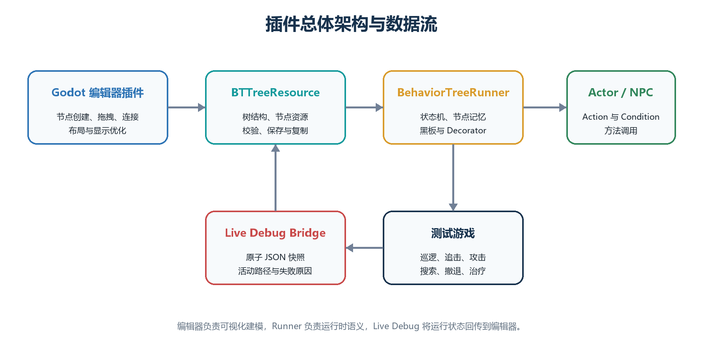

# 致谢

此处预留给作者感谢导师，以及帮助测试软件和审阅论文的人。提交前应由作者自行完成最终文字。

# 声明

本论文作为本人申请游戏工程理学硕士学位的材料提交给华威大学。论文由本人完成，且未曾用于申请其他学位。除明确引用的资料外，本文所述软件、测试数据和分析均来自本项目。本文没有报告任何参与者实验结果。正式提交前，作者必须根据学校规定审阅并个性化本声明，包括如实说明生成式人工智能的使用方式。

# 摘要

可视化行为树常用于编写游戏智能体的决策，但传统节点–连线编辑器在树增大后会出现两个直接问题：一是节点卡片和文字占用的画布越来越大，二是拖拽、连线、运行状态和无关分支会同时争夺注意力。本文在 Godot 4.6 中实现了一个完整的行为树编辑与运行平台，并把研究重点放在大型行为树的显示和编辑交互上。当前 Display 菜单只保留五项可切换功能：智能拖拽重排、自适应缩放细节、可读连线覆盖、相关节点聚焦和鱼眼聚焦。搜索、直线连接、活动路径、失败说明和概览控件作为固定基础能力存在，不计入五项功能比较。

实验使用五棵实际控制可玩敌人的行为树，分别包含 31、61、121、241 和 364 个资源节点。三种屏幕条件来自 15.94、26.96 和 31.55 英寸设备的真实 EDID 物理尺寸。本轮正式实验在同一块 NVIDIA GeForce RTX 5070 Laptop GPU 上，以 SubViewport 重放三种尺寸配置。每项功能在相同树、相同目标和相同视图下进行关闭–开启配对，共得到 450 条状态记录和 225 组比较。实验同时检查树拓扑、保存坐标和同级执行顺序，并使用同内容截图和结构化开发者评价说明数字之外的使用取舍。

结果表明，智能拖拽重排在 45/45 个受控场景中消除了人为造成的卡片重叠；自适应缩放细节使卡片总面积平均减少 45.14%，且没有新增层级违反；相关节点聚焦正确淡化了 5,637/5,637 个无关节点实例，使视口内全亮候选平均减少 58.30%。鱼眼聚焦把目标卡片平均宽度从 119.43 px 提高到 192.56 px，在小屏幕和 241–364 节点树上增益最大，但在 17/45 个场景中引入了新的局部重叠。可读连线覆盖保持连接路线不变，并通过 0.72 的背景不透明度系数让被卡片遮住的线段部分显现，但现有证据只支持把它视为局部辅助功能。

综合功能覆盖范围、对实际编辑任务的直接性、可逆性和副作用，自适应缩放细节是五项中最稳定的通用优化；智能拖拽重排和相关节点聚焦分别最适合节点编辑和结构检查；鱼眼聚焦适合小屏幕上的大型树局部查看；可读连线覆盖适合特定连线遮挡场景。本文的自动数据说明的是可测显示和交互状态变化，不能代替真实开发者参与的可用性研究。

关键词：行为树；Godot；节点–连线编辑器；语义缩放；焦点与上下文；图布局；游戏人工智能

# 第1章　引言

## 1.1　研究背景

现代游戏智能体需要执行复杂的行为逻辑。对于小型原型，把全部决策写在单一过程式脚本中是可行的；但随着状态和中断条件增加，控制流会越来越难以检查和修改。行为树（Behaviour Tree，BT）把决策逻辑表示为控制节点和叶节点组成的层级结构。复合节点决定如何选择子节点，条件和动作则把抽象决策结构连接到游戏状态与 Actor 代码。高层策略可以独立于移动、动画或战斗方法进行编辑，这是行为树在游戏开发中的主要价值之一（Colledanchise and Ögren, 2018; Iovino et al., 2022）。

传统节点–连线树能够直接表达父子拓扑，但会随宽度和深度增长而迅速占用空间。行为树卡片还可能显示参数、描述、Decorator、黑板键和执行状态，比只显示标签的普通层级图更大。当数十或数百张卡片放入有限画布时，开发者必须频繁缩放、平移和搜索，当前执行路径也可能淹没在非活动分支中。这不只是美观问题，因为节点图正是设计者定位任务、理解顺序、修改条件和诊断失败的主要工具。

因此，本项目把一个能够保存、运行和调试真实 NPC 决策的 Godot 插件作为实验平台，并把研究范围缩小到五项当前仍在 Display 菜单中的显示功能。这五项功能分别处理拖动造成的遮挡、缩放时的信息密度、卡片对连线的遮挡、选中节点的关系范围，以及概览状态下的局部细节。功能可以独立关闭，便于恢复基线并检查是否留下视觉残留。

## 1.2　问题定义与研究空白

已有研究分别讨论了整洁树布局、节点避让、语义缩放、焦点与上下文、子图强调和边拥挤。经典树布局强调层级、顺序和紧凑性（Reingold and Tilford, 1981; Sugiyama et al., 1981; Buchheim et al., 2006）；布局调整研究提出在消除重叠时尽量保留原位置和拓扑（Misue et al., 1995; Dwyer et al., 2006, 2009）。语义缩放会随尺度改变表示内容（Bederson et al., 1996; Summers et al., 2003），鱼眼视图则在保留上下文时放大焦点（Furnas, 1986; Sarkar and Brown, 1994）。交互式强调可以帮助用户在较大节点–连线图中查看相关子图（Ware and Bobrow, 2005），EdgeLens 等工作则直接处理连线拥挤和遮挡（Wong et al., 2003）。

这些研究提供了设计基础，但没有直接回答游戏行为树编辑器应如何组合这些方法。行为树与文件目录等普通层级不同：同级顺序可能决定执行优先级；叶节点会调用 Actor 代码；Decorator 可能阻止分支运行；运行状态会持续变化。一个可用的方案必须保持执行顺序，支持编辑与撤销，公开黑板状态，并在不向游戏画面加入调试覆盖层的前提下解释失败。

现有研究也不能替代本项目自己的比较。其他论文中的图类型、节点数量、屏幕、任务和参与者都不同。面积减少、透明度变化或目标放大可以说明界面发生了什么，但不能自动证明开发者理解得更快。因此，本项目需要在同一个可执行行为树平台上，分别记录每项功能的前后变化、适用环境和副作用。

## 1.3　研究目标与问题

本文目标是在一个经过功能验证、能够驱动真实 NPC 的 Godot 4.6 可视化行为树平台上，设计并评估可组合的大型树显示优化。研究问题为：在不同的行为树节点规模和物理屏幕尺寸下，本项目提出的可组合显示优化，相较于传统基线显示，能否改善大型行为树的可测显示与编辑交互表现，同时保持行为树结构和执行语义不变？

本文的主要贡献如下：

- 实现一个包含编辑、资源、运行时、黑板、Decorator 和 Live Debug 的 Godot 4.6 行为树平台；
- 将 Display 菜单整理为五项面向不同问题的可切换功能，并说明它们与固定基础能力的边界；
- 使用五棵真实游戏行为树和三种物理尺寸配置完成 225 组关闭–开启配对；
- 使用结构化开发者评价统一记录每项功能的帮助、代价、适用规模、适用屏幕和建议状态；
- 给出“总体最稳定”和“特定场景最有效”的结论，而不是把不同单位的指标合成一个没有意义的总分。

## 1.4　研究目标与成功标准

项目工作分为平台建设与研究评估。平台建设包括：实现可序列化的树、节点、Decorator 和类型化黑板资源；实现 Root、Sequence、Selector、Reactive Selector、Random Selector、Parallel、Repeat、Wait、Action 和 Condition 的 success、failure 与 running 语义；允许可复用组件为 NPC 指定树和 Actor，并由叶节点调用 Actor 方法；提供创建、连接、断开、拖拽、框选、多节点移动、类型化编辑、校验、保存、加载、撤销和重做；只在 Godot 编辑器中显示路径、节点状态、黑板和失败原因。

在进行显示优化实验前，首先需要确认行为树插件的基础功能正确：各类节点能够按照预期执行，编辑后的行为树能够正确保存和重新打开，撤销与重做不会破坏树的内容；五个可玩敌人应分别加载 31、61、121、241 和 364 节点树，玩家拥有无限生命，敌人数量有限，击败全部敌人后游戏能够结束。

显示研究的成功标准分为三类。第一，功能必须产生它声称的直接变化，例如 Smart Drag 减少拖动造成的重叠，Adaptive 降低概览卡片面积，Related Focus 淡化无关节点。第二，功能不能改变树拓扑、Decorator 归属或同级执行顺序；自动移动的邻居只能使用临时显示偏移。第三，关闭功能后不能留下尺寸、透明度、边框或临时布局残留。测试过程中只要出现脚本错误、崩溃、内存泄漏、非法访问或异常退出，就认为测试失败，即使其他断言通过。

# 第2章　文献综述

## 2.1　作为可执行层级的行为树

行为树会重复评估一棵有根层级，并传播 success、failure 或 running 三种状态。Sequence 通常在第一个失败或运行中的子节点停止；Selector 在第一个成功或运行中的子节点停止；叶节点读取状态或执行动作。这个小型状态接口使复杂逻辑能够组合，并能明确表达中断策略（Colledanchise and Ögren, 2018）。Iovino 等（2022）的综述进一步说明，行为树已经从游戏开发扩展到机器人和其他 AI 系统，但具体执行语义仍取决于实现。

三状态接口看似简单，却包含关键实现选择。运行中的 Sequence 可以记住当前索引，而 Reactive Selector 需要重新检查高优先级条件并抢占较低优先级分支；Random Selector 在子节点运行期间应保持同一次选择；Parallel 需要成功和失败策略；Repeat 与 Wait 需要在重启或中断时清除记忆。因此，编辑器显示和运行语义不能完全分离：子节点顺序、Decorator 归属和节点身份都会影响执行，而且必须正确序列化。

黑板在感知、条件和动作之间提供共享键值状态。Unreal Engine 的技术文档说明了把黑板、Decorator 和运行观察结合的工业实践（Epic Games, n.d.）。本项目不试图重现商业系统的全部能力，而是建立足以支持真实 NPC 决策和显示实验的平台。

## 2.2　节点–连线树、层级和规模

节点–连线图适合行为树，因为边能直接表示祖先关系和同级分组。Reingold 与 Tilford（1981）提出的整洁树绘制强调父节点相对孩子居中、同层间距和子树不重叠。Sugiyama 等（1981）把层级系统的布局分为同层排序和水平位置计算，以减少交叉并提高层级清晰度。Buchheim 等（2006）进一步给出任意度有根树的线性时间绘制方法。这些方法适合从头生成树形布局，但交互式行为树还必须允许用户自由拖动。

规模增加会同时放大节点和边的问题。Ghoniem 等（2005）比较节点–连线图和矩阵表示，说明图的规模、密度与任务会共同影响表现，而不是只由节点数量决定。SpaceTree 将节点–连线树与动态布局和选择性显示结合，其研究说明表示与交互需要一起评价（Plaisant et al., 2002）。本项目仍保留可编辑节点图，因为父子方向和同级顺序是行为树的核心语义，但会在缩放和选择时控制同时出现的信息。

## 2.3　局部避让与位置稳定

交互式编辑与一次性自动布局不同。用户拖动一个节点后，如果系统把整棵树重新排列，虽然重叠可能消失，用户刚建立的位置记忆也会被破坏。Misue 等（1995）把这种问题称为布局调整，并讨论了重叠处理和心理地图。Dwyer 等（2006）把节点避让表述为分离约束问题：节点不应重叠，同时结果应尽量接近原位置。Dwyer 等（2009）又研究了在约束布局中保留已有拓扑。

这些工作解释了 Smart Drag 的设计方向，但不能直接当作实现说明。本项目没有照搬完整算法，而是限制启动距离、刷新频率、传播层数和最大受影响卡片数，并使用行为树的父子和同级关系决定哪些卡片应成组移动。系统只保护拖动前已经成立的父上子下关系；如果用户原本故意把节点反向放置，插件不会强制改成标准树形。

心理地图也不能被简单当作可用性结论。Archambault 与 Purchase（2013）回顾了动态图研究，指出位置保持是否帮助任务取决于用户需要追踪的变化和结构。因此，本文把“树结构不变”和“无关位置尽量少动”作为工程约束，但不声称它们已经证明人的理解速度提高。

## 2.4　语义缩放与焦点上下文

语义缩放与几何缩放不同。几何缩放改变物理大小，语义缩放改变显示属性。Pad++ 展示了可缩放界面中表示随尺度变化的基本思想（Bederson et al., 1996）。Summers 等（2003）在程序可视化中比较了平面表示、传统语义缩放和连续语义缩放，为“缩小时减少细节、放大时恢复字段”提供了相近领域的实证先例。但其程序、任务和参与者与本项目不同，不能把其速度和准确率结果移植到行为树。

Furnas（1986）用兴趣度描述焦点元素和上下文元素的显著程度。Sarkar 与 Brown（1994）以及 Lamping 等（1995）进一步把鱼眼和焦点+上下文用于图形层级。Cockburn 等（2008）的综述指出，概览+细节、缩放和焦点+上下文各有代价，没有一种方法在所有任务中都最好。Büring 等（2006）在小屏散点图上的 24 人研究也没有发现两种方法在完成时间上存在显著差异，虽然多数参与者偏好鱼眼。这说明鱼眼应在当前任务中单独测试，而不是提前假设它更快。

## 2.5　关系强调与连线遮挡

大型图不一定需要隐藏节点。Ware 与 Bobrow（2005）用交互式强调支持中等规模节点–连线图的视觉查询，说明选择目标后突出拓扑相关子图是一条可行路线。van Ham 与 Perer（2009）提出“搜索、显示上下文、按需扩展”，强调从兴趣目标出发控制大型图的显示范围。本项目的 Related Node Focus 不隐藏节点，而是保留全局位置，并用边框和透明度区分所选节点、祖先、后代、兄弟和无关分支。

边也会被节点和其他边遮挡。Wong 等（2003）的 EdgeLens 会在焦点附近弯曲连线，从而打开被边拥挤占据的空间。本项目没有实现 EdgeLens，也不改变连接路线；Readable Edge Overlay 采用更保守的做法，让线条透过半透明卡片背景出现，同时用文字轮廓遮住字形区域。两者解决的问题相关，但操作和视觉结果不同。

## 2.6　物理屏幕尺寸与研究空白

物理屏幕尺寸、可用显示空间和信息尺度并不是同一个变量。Jakobsen 与 Hornbæk（2013）说明，大屏和小屏上的交互结果会受信息空间和显示比例共同影响。Tan 等（2004）在控制视角的 3D 导航任务中发现物理尺寸能够影响空间表现，但该任务不是行为树编辑，因此不能把其百分比用于本项目。

综合已有研究可以看出，每项技术都有理论和实验背景，但仍缺少以下组合：一个真实可执行的 Godot 行为树平台；同一套五项当前功能；相同树和视图下的关闭–开启截图；覆盖 31 至 364 节点和多个物理尺寸配置的配对数据；以及对帮助、代价和建议状态的统一开发者评价。本文的研究空白不是发明全新的图算法，而是把这些方法转化为行为树编辑中的可复现实现，并诚实判断哪些功能值得保留。

# 第3章　研究方法

## 3.1　研究策略

本研究先实现一个能够正常编写和运行行为树的 Godot 4.6 插件，再用该插件测试大型行为树的显示优化。研究重点不是行为树是否适合制作游戏，而是这些显示优化能否在不同节点数量和屏幕尺寸下改善可测的界面表现。

研究采用两类互补证据。第一类是确定性的关闭–开启配对，记录卡片面积、重叠、透明度、目标宽度和结构安全等直接数据。第二类是结构化开发者评价，由项目开发者按照固定问题检查每项功能帮助了什么、造成了什么问题、在哪种规模和屏幕上更有用，以及是否适合作为默认功能。第二类不是参与者研究，不包含问卷分数，也不用于推断普通开发者群体。

## 3.2　实验对象

实验使用当前可玩游戏中五名敌人实际加载的行为树。资源节点包含附着在其他节点上的 Decorator，而画布卡片不单独显示 Decorator，所以资源节点数和画布卡片数必须分开报告。

| 资源节点 | 画布卡片 | Decorator | 资源 | 游戏 Actor |
| ---: | ---: | ---: | --- | --- |
| 31 | 30 | 1 | `arena_scout_31.tres` | Scout |
| 61 | 56 | 5 | `arena_skirmisher_61.tres` | Skirmisher |
| 121 | 104 | 17 | `arena_hunter_121.tres` | Hunter |
| 241 | 202 | 39 | `arena_tactician_241.tres` | Tactician |
| 364 | 301 | 63 | `arena_commander_364.tres` | Commander |

表 3.1　五棵真实行为树的资源节点、画布卡片和 Decorator 数量

五棵树都包含实际可执行的复合节点、条件、动作和 Decorator，而不是为截图创建的空结构。较大的树覆盖方向近战、远程投射物、跳跃越障、梯子攀爬、追击、最后位置搜索、撤退、治疗、巡逻和待机。规模增加时分支形状和字段内容也会改变，因此实验可以比较真实复杂度下的表现，但不能把相邻规模之间的每一个差值都解释成纯节点数量因果效应。

## 3.3　屏幕尺寸配置

屏幕条件来自 2026-08-23 对三台设备的 EDID 物理宽高记录。统一使用每厘米 35 个逻辑单位生成 SubViewport。当前只启用笔记本屏幕，因此本轮正式实验在同一块 GPU 上重放三个物理尺寸配置，不声称窗口重新在三台实体屏幕上逐台运行。

| 配置 | 物理宽×高 | 对角线 | 物理面积 | SubViewport | GraphEdit 可用区域 |
| --- | ---: | ---: | ---: | ---: | ---: |
| Laptop | 34×22 cm | 15.94 in | 748 cm² | 1190×770 | 858×642 |
| Medium | 60×33 cm | 26.96 in | 1980 cm² | 2100×1155 | 1768×1027 |
| Large | 70×39 cm | 31.55 in | 2730 cm² | 2450×1365 | 2118×1237 |

表 3.2　三种物理尺寸来源及本轮配置重放的画布大小

分辨率、刷新率和 Windows 缩放只作为设备审计信息，不进入效果解释。节点是否位于视口使用 GraphEdit 的实际可用区域计算，而不是使用包含工具栏和 Inspector 的完整 SubViewport。

## 3.4　五项功能的配对操作

每棵树预先选择左、中、右三个确定性任务目标。三个目标用于覆盖不同分支，不被当作随机重复。每个状态都重新复制树资源、重建画布并显式设置功能，因此不会继承上一条记录的临时偏移。脚本使用固定顺序，每组始终先记录关闭状态，再记录开启状态；本实验没有随机化或顺序轮换。

Smart、Adaptive、Overlay 和 Related 的关闭状态为五项实验功能全部关闭。Fisheye 是唯一例外：它用于概览状态，所以关闭和开启状态都保留 Adaptive，只比较是否额外应用鱼眼。该设计测量鱼眼相对自适应概览的增量效果。

| 功能 | 关闭状态与具体操作 | 开启状态与主要指标 |
| --- | --- | --- |
| Smart Drag Reflow | 把固定叶节点拖到固定目标卡片区域，记录人为形成的遮挡 | 使用同一路径拖动；比较重叠面积、自动移动卡片数、最大位移和远处分支移动 |
| Adaptive Zoom Detail | 在固定概览缩放下仍显示完整卡片 | 按缩放切换中/低细节；比较卡片面积、字段数、完整位于视口的卡片和层级违反 |
| Readable Edge Overlay | 固定一条穿过非端点卡片的真实父子连线，卡片保持不透明 | 背景乘以 0.72；比较穿卡片线段、加权显示长度、文字遮罩样式和路线是否不变 |
| Related Node Focus | 选定同一节点但不应用关系强调；第三个任务使用两个节点 | 取多选关系并集；比较无关节点淡化、全亮候选减少、边框角色和几何是否不变 |
| Fisheye Focus | Adaptive 概览，不应用鱼眼 | 对固定目标应用一次稳定鱼眼状态；比较目标宽度、恢复字段、远处透明度和新增遮挡 |

表 3.3　五项功能的关闭–开启操作与指标

总记录数为：5 项功能 × 3 个屏幕配置 × 5 棵树 × 3 个任务 × 2 个状态 = 450 条。它们形成 225 组一一对应的比较，每项功能 45 组。每个状态等待两个渲染帧后记录。实验使用 Godot 4.6 stable、OpenGL Compatibility 渲染器和 NVIDIA GeForce RTX 5070 Laptop GPU。

## 3.5　数据处理与成功判断

分析以 `pair_id` 对齐关闭和开启状态，每个“屏幕–树–任务”条件等权。由于任务和界面状态是确定性的，三个任务是三个固定分支案例，而不是从某个人群随机抽取的样本。因此正文报告配对平均值、中位数、范围和满足功能契约的条件数，不计算没有明确总体含义的 p 值或置信区间。

所有配对共同检查：资源节点数、父子关系、Decorator 归属、同级从左到右执行顺序和非拖动资源坐标不变；关闭功能后没有尺寸、透明度、边框或临时偏移残留；日志没有脚本错误、崩溃、泄漏或非零退出。Smart 的正式夹具在记录后取消拖动并恢复源节点，因此保存坐标可与实验前完全比较；真实使用时，用户主动拖动的节点会保存新坐标并进入 Undo/Redo，自动避让的邻居仍不写入资源。

每项功能还有自己的成功判断：Smart 必须显著减少人为重叠且不超过 24 张自动卡片；Adaptive 必须减少面积或字段，并且不增加层级违反；Overlay 必须存在穿卡片线段、背景透明度下降、文字保护样式生效且路线不变；Related 必须淡化全部无关节点；Fisheye 必须正确选择目标并使其达到至少约 180 px。Fisheye 的成功判断不要求全图零重叠，因为它被设计为允许外围遮挡的局部查看工具，新增重叠会作为副作用报告。

## 3.6　结构化开发者评价

结构化开发者评价使用与自动实验相同的树、目标和成对截图。评价者是本项目开发者本人。每项功能都回答五个相同问题：它最直接帮助了什么任务；最明显的问题是什么；在哪种节点规模下更有用；在哪种屏幕配置下更有用；应该默认开启还是按需开启。结论必须引用表格、截图或原始数据，不能只写个人偏好。

这项评价补充自动指标无法回答的设计问题，例如少量邻居移动是否可接受、低细节卡片会隐藏什么、鱼眼的局部遮挡是否破坏全局观察。它不能证明其他开发者会有同样感受。真实参与者的完成时间、错误率、缩放/平移次数和主观评分仍然留作后续研究。

## 3.7　插件功能与可玩游戏验证

显示实验建立在功能正确的平台上。验证分为资源与运行时、编辑器界面、基础游戏、复杂竞技场和五敌人通关流程。测试覆盖节点执行、Decorator、Actor 方法调用、创建与连接、保存与重新加载、撤销与重做、多选拖动、显示功能复位，以及敌人永久击败和游戏完成。

可玩验证不回答“行为树是否帮助游戏开发”这一额外研究问题。它只确认五棵实验树确实由游戏 Actor 加载，复杂行为能够执行，玩家无限生命，五个有限敌人可以被逐个击败，最后出现完成状态。这样，论文评价的不是一组脱离运行时的静态图。

# 第4章　系统设计与实现

## 4.1　总体架构

系统由编辑器插件、资源模型、运行时、调试桥和测试游戏五部分组成。编辑器插件运行在 Godot 编辑器内，负责把行为树资源显示成可操作的 GraphEdit 画布。资源模型保存节点、父子关系、Decorator、黑板 Schema 和节点坐标。运行时读取同一资源并把 Tick 结果传递给游戏 Actor。调试桥把当前状态、失败原因和黑板值送回编辑器。测试游戏只提供可执行环境，不在游戏画面上叠加行为树调试界面。

图 4.1　插件、资源、运行时、调试桥和测试游戏之间的关系

这个划分使同一棵树可以同时用于编辑、保存、自动测试和游戏运行。显示功能只修改卡片的临时尺寸、透明度、边框或画布偏移，不改写节点类型和连接。用户真正拖动并释放的节点是例外：其新坐标会正常保存，并可以撤销或重做；为了避让而自动移动的其他卡片不写回资源。

## 4.2　资源模型与结构校验

行为树资源保存根节点和节点集合。每个节点有稳定身份、类型、编辑器坐标、参数和子节点引用。Decorator 附着在拥有者节点上，而不是作为独立画布卡片。黑板 Schema 定义键名、类型和默认值，Action 与 Condition 通过类型化控件选择方法、键、比较运算和值，用户不需要手写 JSON。

保存前的校验会拒绝多个根、环、断开的非法引用、错误的子节点数量、无效 Decorator 归属和不符合 Schema 的黑板键。加载后再次建立节点卡片和连接。同级节点按照横坐标从左到右排序，这个顺序会影响 Sequence、Selector 和其他有序复合节点的执行优先级。因此，显示重排不能偷偷改变资源横坐标或同级执行顺序。

## 4.3　运行时与节点语义

运行时每次 Tick 返回 `SUCCESS`、`FAILURE` 或 `RUNNING`。Root 把结果传给唯一孩子；Sequence 从左到右执行，并在失败或运行中的孩子处停止；Selector 在成功或运行中的孩子处停止；Reactive Selector 每次重新检查高优先级分支；Random Selector 在一次运行期间保持已选孩子；Parallel 按配置统计成功与失败；Repeat 控制重复次数或无限重复；Wait 记录经过时间；Action 调用 Actor 方法；Condition 检查 Actor 方法或黑板值。

| 节点 | 主要职责 | 需要保留的运行记忆 |
| --- | --- | --- |
| Root | 进入整棵树 | 无 |
| Sequence / Selector | 按同级顺序组合结果 | 当前运行孩子 |
| Reactive Selector | 每次从高优先级重新检查 | 抢占时重置旧分支 |
| Random Selector | 随机选择孩子 | 当前选择和随机状态 |
| Parallel | 同时评价多个孩子 | 各孩子状态 |
| Repeat / Wait | 重复或等待 | 次数或经过时间 |
| Action / Condition | 调用 Actor 或读取状态 | 由具体任务决定 |

表 4.1　当前运行节点的主要语义

Decorator 在拥有者节点执行前后应用黑板条件、冷却、时间限制、结果取反、强制结果或重复规则。分支被中断时，运行中的节点和 Decorator 都会重置，避免下次进入时继承错误状态。运行时使用树资源，但不依赖编辑器是否打开，因此关闭全部显示功能不会改变游戏结果。

## 4.4　编辑工作流与固定基础显示

用户在画布空白处右键创建节点，通过端口建立父子关系，在 Inspector 中使用类型化字段编辑参数。节点可以删除、断开、框选和成组拖动；单击一个节点会清除旧的单选并选中当前节点，框选或带修饰键操作才建立多选。按住空白处可以平移视窗。所有结构修改、参数修改和用户拖动都进入 Undo/Redo，并可保存为 `.tres` 后重新加载。

编辑器用固定的直线连接显示父子关系，并对端口、选中状态和运行状态使用一致颜色。Search、Minimap、活动路径高亮、非活动分支淡化、Decorator 条件标记和失败说明属于固定基础能力，不在当前 Display 菜单中提供研究开关，也不进入五项关闭–开启比较。这样可以避免把基础导航、运行调试和本文的五项可切换优化混在一起。

## 4.5　Live Debug 与黑板检查

运行游戏时，调试桥为当前 Actor 记录活动节点、节点返回值、失败原因和黑板快照。编辑器把活动路径显示在原行为树画布上，并在侧栏显示黑板键的当前值和类型。失败说明直接标在发生失败的节点附近，例如条件不满足、方法不存在或 Decorator 阻止分支。

图 4.2　当前版本在 241 节点真实行为树上显示 Live Debug

调试界面不向正在运行的游戏添加覆盖层，也不要求 Actor 知道编辑器 UI。其目的只是证明实验树可执行，并让开发者从节点图检查“当前运行到哪里”和“为什么没有进入某个分支”。它不属于五项显示实验中的独立条件。

## 4.6　当前五项 Display 功能

Display 菜单目前只保留五项参与本研究的可切换功能。新安装的出厂设置会开启 Smart Drag、Adaptive、Related Focus 和 Fisheye，并关闭 Edge Overlay；已有项目会恢复用户上次保存的选择。正式实验不依赖出厂设置，而是为每个配对显式关闭或开启被测功能。

### 4.6.1　智能拖拽重排

智能拖拽重排用于解决“一个节点被拖到另一个节点上”造成的新遮挡。系统在累计移动达到 10 个屏幕像素后才启动，并在之后每移动 8 个屏幕像素时更新一次。单击和非常小的修正不会触发重新布局。拖动期间系统直接更新临时避让，所以用户可以在松开鼠标前看到其他卡片让开。

算法先找到与拖动卡片相撞的局部结构，再把连续 2–4 层中的相关父节点、同级节点和孩子作为小组移动。一次最多处理 24 张卡片，并限制碰撞传播次数。这样可以减少整棵树突然排成规则行列的情况。它只维持拖动前已经成立的父节点在上、子节点在下关系；如果用户原本把某组节点故意倒置，系统不会强制纠正。

单节点拖动使用智能重排。框选后的多节点拖动被当作刚性整体，不再逐节点调用求解器，避免组内相对位置变化。松开后只保存用户拖动节点的新坐标，自动避让卡片的位移仍是显示层数据。关闭功能或重建画布会清除这些临时偏移。

### 4.6.2　自适应缩放细节

自适应缩放细节把卡片大小和字段数量同时连接到 GraphEdit 缩放。缩放低于 0.62 时使用约 188×88 的紧凑卡片，只保留识别结构所需的低细节；0.62 至 0.88 之间恢复普通尺寸和中等字段；达到 0.88 后显示约 250×150 的普通卡片和完整字段。

卡片尺寸变化后，系统重新检查整张画布的碰撞，并用临时偏移尽量保持原有相对结构。它不是把树永久改成另一套布局，也不是 Smart Drag 的 24 卡片局部求解。放大后字段和普通尺寸会恢复，关闭功能后也会清除自适应尺寸与偏移。

这个功能用信息密度换取概览空间。它的目的不是让缩小后的所有文字仍可阅读，而是让用户先看清树形和分支范围，再在需要时放大查看参数。后面的实验分别记录面积减少、字段减少、完整位于视口内的卡片变化和层级关系。

### 4.6.3　可读连线覆盖

可读连线覆盖处理连线被非端点卡片挡住的局部情况。开启后，支持的卡片背景把原不透明度乘以 0.72，使卡片后方的直线能够部分显现。文字、图标和控件使用固定前景色，并加 2 px 深色轮廓，避免显现的连线直接穿过字形。连接路线、端点和执行顺序都不改变。

该功能只对 `StyleBoxFlat` 卡片背景进行透明处理。关闭时恢复原背景、文字样式和调制颜色。它不是 EdgeLens：系统不会弯曲、捆绑或重新规划连线。它也不会减少节点数量、卡片面积或全图边密度，因此预期作用比其他四项更局部。

### 4.6.4　相关节点聚焦

相关节点聚焦在选择发生后计算关系集合。所有被选节点使用白色边框；它们的全部祖先和全部后代使用黄色边框；具有同一父节点的同级节点使用绿色边框；其余无关卡片和连线把透明度乘以 0.18。节点位置和大小不变，因此用户仍能看到整棵树原来的空间上下文。

框选多个节点时，系统合并每个选中节点的祖先、后代和同级集合，而不是只让最后一个节点生效。若选中的是附着 Decorator，关系计算会先映射到其拥有者卡片。单击空白处清除选择后，所有边框和透明度恢复。

Related Focus 与运行时活动路径是不同层。前者回答“这个选中节点在结构上与谁有关”，后者回答“Actor 当前执行了什么”。两者可以同时存在，但正式实验只比较选择关系强调的开关变化。

### 4.6.5　鱼眼聚焦

鱼眼聚焦面向已经缩小的概览。系统根据稳定参考中心与指针的屏幕距离连续计算倍率，而不是只放大鼠标正下方的一张卡片。焦点区半径为 124 px，周边过渡使用 280、340 和 520 px 半径。焦点卡片至少放大 1.12 倍，并可根据当前 zoom 动态提高倍率，使屏幕宽度接近 180 px；距离很远的卡片缩小到 0.68 倍，并把透明度降到 0.12。

只有距离最近的 8 张卡片参加有限的局部避让，其他卡片可以缩放和淡化但不会推动整张画布。系统把焦点中心按 24 px、卡片尺寸按 12 px 分桶，鼠标轻微抖动不会每一帧重新排版。滚轮缩放时鱼眼暂停 0.2 秒，之后自动恢复。

鱼眼优先保证焦点和附近节点可看清，允许远处或卡片边缘发生较大遮挡。它不是零重叠布局工具，也不保证所有父子卡片始终完全分开。因此实验除了记录目标放大，还专门记录新增重叠和视觉层级违反。

## 4.7　实验记录与可复现性

五功能实验由 Godot 脚本直接建立真实编辑器视图。脚本复制树资源、设置屏幕配置和任务目标、切换一项功能、等待渲染并记录 CSV。每条记录包含实验提交、树资源哈希、屏幕配置、目标、开关状态、功能指标和安全签名。分析脚本只读取原始 CSV，生成配对表、按树汇总、按屏幕汇总、结构化评价表和前后对比图。

正式数据目录保存 450 条原始观测、225 组配对、运行环境清单、源资源 SHA-256、十张原始证据图和派生结果。可读连线覆盖另有一组更清楚的同内容截图用于论文展示，但正文数量结论仍来自 450 条正式数据，不把补充截图当作新的统计样本。

## 4.8　可玩五敌人测试游戏

测试游戏把五棵不同规模的行为树分配给 Scout、Skirmisher、Hunter、Tactician 和 Commander。敌人数量有限，玩家拥有无限生命，目标是利用移动、跳跃和攻击逐个击败敌人。场景包含远程投射物、近战方向、障碍、跳跃路线、梯子、治疗物品和危险区域。敌人可以巡逻、发现玩家、追击、搜索最后位置、越障、攀爬、撤退和恢复。

图 4.3　五种规模行为树分别控制可玩场景中的五名敌人

较小树使用较少分支完成基本行为，较大树承担更多战斗和环境反应。游戏能够在五名敌人永久击败后进入完成状态。这部分证明行为树平台不是静态图展示器，但不把游戏通关当作显示优化效果。
