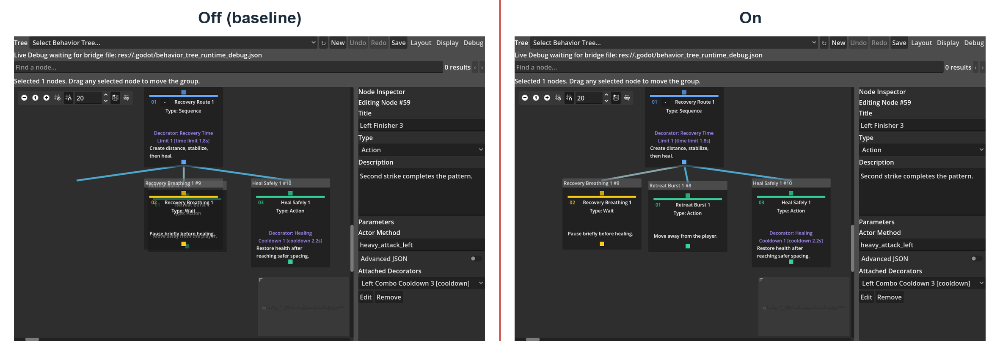
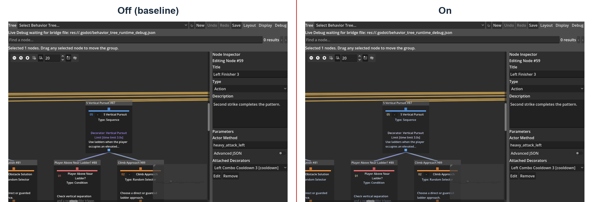
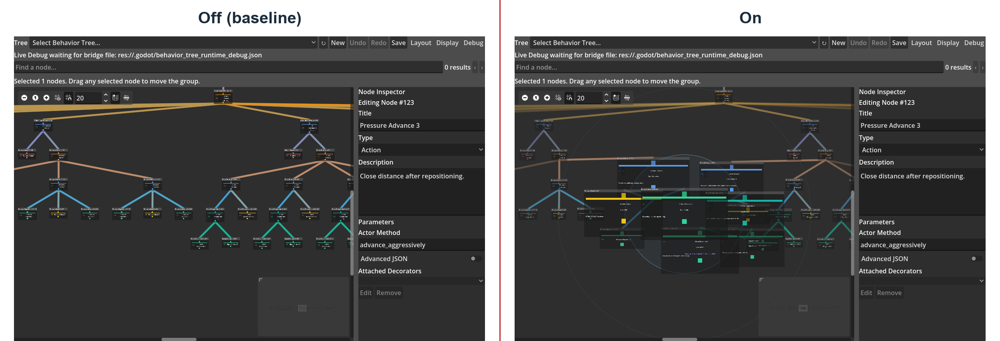
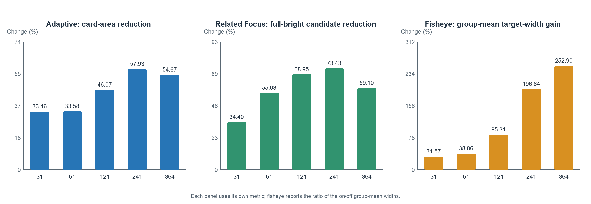
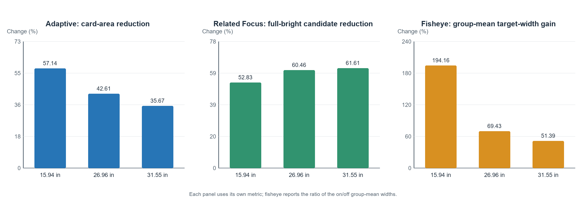

# Abstract

This project developed a visual behaviour-tree plugin for Godot 4.6 and focused mainly on the display problems of large behaviour trees. Conventional node–link editors occupy a large canvas as the tree grows, while dragging, connections and unrelated branches can all interfere with inspection. To address these problems, the current Display menu contains five switchable features: Smart Drag Reflow, Adaptive Zoom Detail, Readable Edge Overlay, Related Node Focus and Fisheye Focus. Search, straight connections, active paths, failure explanations and overview controls are fixed plugin capabilities and are not included in this five-feature comparison.

The experiment uses five genuine game behaviour trees and three physical-screen-size profiles taken from real devices. Each feature is compared in off and on states using the same tree, target and view. The formal experiment produces 225 paired comparisons and also checks tree structure, saved coordinates and sibling execution order. Before-and-after screenshots show the actual visual changes, while a structured developer evaluation explains the types of task for which each feature is more suitable.

The results show that Smart Drag Reflow can remove overlap caused by the controlled drag operation. Adaptive Zoom Detail clearly reduces card area in the overview, while Related Node Focus consistently dims every unrelated node. The revised fisheye restores the focus card to at least approximately 220 px and expands the clear area around the pointer, so its effect is more apparent on small screens and large trees. However, the stronger magnification also introduces more local overlap. Readable Edge Overlay can reveal part of a connection hidden by a card, but it only addresses a local connection problem.

Overall, Adaptive Zoom Detail is the most suitable general display feature. Smart Drag Reflow and Related Node Focus are more appropriate for node editing and structural inspection respectively. Fisheye is suitable for temporarily inspecting a local area from an overview, while Readable Edge Overlay is useful in specific edge-occlusion cases. These automated data describe measurable interface changes, but they cannot replace a usability study with real game developers.

Keywords: behaviour tree; Godot; node–link editor; semantic zoom; focus and context; graph layout; game artificial intelligence

# Chapter 1 Introduction

## 1.1 Research background

This project uses Behaviour Trees (BTs) to control enemies in a game. A behaviour tree divides a decision into composite, condition and action nodes, so high-level strategy can be edited separately from movement, animation and combat code. Putting all logic into one script can still work for a small prototype, but the control flow becomes increasingly difficult to inspect as states and interruption conditions are added. The hierarchical structure of a behaviour tree can reduce this problem, which is one of its main uses in game development (Colledanchise and Ögren, 2018; Iovino et al., 2022).

A node–link tree can show parent–child relationships directly, but the canvas grows as the tree becomes wider and deeper. Behaviour-tree cards also show parameters, descriptions, Decorators, blackboard keys and runtime states, so they normally require more space than an ordinary hierarchy that shows names only. When the canvas contains many cards, a developer needs to zoom, pan and search frequently, and the current execution path can be lost among unrelated branches. This affects node location, condition editing and failure inspection, rather than merely whether the graph looks tidy.

This project therefore first completed a Godot plugin that can save, run and debug genuine NPC decisions, and then used it to test the five display features that remain in the current version. These features address drag occlusion, information density during zooming, cards hiding connections, the relationship scope of selected nodes and local detail in an overview. Each feature can be disabled, which permits direct comparison with the original display and also checks whether disabling it leaves any visual state behind.

## 1.2 Problem definition and research gap

Previous studies approach large graphs from several directions. Tidy tree layout focuses on hierarchy, order and compactness, while layout-adjustment research is more concerned with whether original positions and topology can be preserved after overlap is removed (Reingold and Tilford, 1981; Sugiyama et al., 1981; Misue et al., 1995; Dwyer et al., 2006). Semantic zoom reduces displayed content when zooming out, whereas a fisheye view enlarges the focus while retaining the surrounding structure (Bederson et al., 1996; Furnas, 1986). Interactive emphasis and EdgeLens further address related subgraphs and edge occlusion (Ware and Bobrow, 2005; Wong et al., 2003). Together, these studies show that large graphs can be improved through layout, information density, focus and edge treatment.

However, these studies do not directly explain how these methods should be combined in a game behaviour-tree editor. A behaviour tree differs from an ordinary directory: sibling order may determine execution priority, leaf nodes call Actor code, and a Decorator can prevent a branch from running. A display feature therefore cannot simply make the graph appear tidier. It must also preserve execution order, support undo, and avoid breaking blackboard and runtime debugging.

Existing work also cannot replace testing within this project because the graphs, tasks and screen conditions used by other studies differ. Reduced card area, changed opacity or target magnification can only show what changed in the interface; they cannot directly prove that a developer understands the tree more quickly. For this reason, the project compares all five features on the same executable platform and records both their effects and their costs.

## 1.3 Aim and research question

This dissertation aims to design and evaluate composable display optimisations for large trees on a functionally validated Godot 4.6 visual behaviour-tree platform that can control genuine NPCs. The research question is: across different behaviour-tree node scales and physical screen sizes, can the composable display optimisations proposed in this project improve measurable display and editing-interaction performance for large behaviour trees compared with a conventional baseline display, while preserving behaviour-tree structure and execution semantics?

The principal contributions are:

- a Godot 4.6 behaviour-tree platform that includes editing, resources, a runtime, blackboards, Decorators and Live Debug;
- a Display menu consolidated into five switchable features that address distinct problems, together with a clear boundary between these features and fixed baseline capabilities;
- 225 off–on pairs across five real game behaviour trees and three physical-size profiles;
- a structured developer evaluation that records each feature's benefit, cost, applicable tree scale, applicable screen and recommended state using the same questions; and
- conclusions that distinguish the most stable general feature from features that are most effective in particular conditions, instead of combining measures with different units into a meaningless total score.

## 1.4 Project objectives and success criteria

The project work is divided into platform construction and research evaluation. Platform construction includes serialisable tree, node, Decorator and typed-blackboard resources; `success`, `failure` and `running` semantics for Root, Sequence, Selector, Reactive Selector, Random Selector, Parallel, Repeat, Wait, Action and Condition; a reusable component that assigns a tree and Actor to an NPC and allows leaves to call Actor methods; creation, connection, disconnection, dragging, box selection, multi-node movement, typed editing, validation, saving, loading, undo and redo; and editor-only presentation of the active path, node states, blackboard and failure reasons.

Before the display-optimisation experiment, the basic behaviour-tree plugin must first be shown to work correctly. Each node type must execute as intended; an edited behaviour tree must save and reopen correctly; and undo and redo must not corrupt tree content. The five playable enemies must load the 31-, 61-, 121-, 241- and 364-node trees respectively. The player must have unlimited health, the number of enemies must be finite, and the game must end after all enemies have been defeated.

The display study has three kinds of success criterion. First, a feature must produce its claimed direct change: for example, Smart Drag must reduce overlap caused by dragging, Adaptive must reduce overview card area, and Related Focus must dim unrelated nodes. Second, a feature must not change tree topology, Decorator ownership or sibling execution order; automatically moved neighbours may use only temporary display offsets. Third, disabling a feature must not leave residual size, opacity, frame or temporary layout state. A script error, crash, memory leak, illegal access or abnormal exit causes the test to fail even if the remaining assertions pass.

# Chapter 2 Literature review

## 2.1 Behaviour trees as executable hierarchies

A behaviour tree repeatedly evaluates a rooted hierarchy and returns `success`, `failure` or `running`. A Sequence normally stops at the first child that fails or is still running, while a Selector stops at the first child that succeeds or is still running. Colledanchise and Ögren (2018) explain how this simple status interface can be combined into more complex logic. Iovino et al. (2022) further show that behaviour trees are now used in games, robotics and other AI systems. However, different implementations can still handle `running` and interruption differently.

This means that, although the basic interface appears simple, the runtime still needs explicit rules. For example, a Sequence can remember its current execution position, while a Reactive Selector needs to recheck high-priority conditions. A Random Selector should retain one choice during an execution, while Repeat and Wait must clear their memory when restarted. In other words, the editor cannot treat node order and Decorators as purely visual information because they affect the final execution result.

A blackboard shares state between perception, conditions and actions. Unreal Engine's technical documentation shows how blackboards, Decorators and runtime observation are combined in a practical tool (Epic Games, n.d.). These capabilities are useful in game development, but this project does not need to reproduce every feature of a commercial system. It only needs a sufficiently complete platform on which genuine NPCs can run and on which the later display experiment can use valid resources.

## 2.2 Node–link trees, hierarchy and scale

Node–link diagrams are suitable for behaviour trees because connections can show parent–child relationships directly. The tidy-tree layout proposed by Reingold and Tilford (1981) emphasises centred parents, spacing within a level and separated subtrees. Sugiyama et al. (1981) further discuss within-layer ordering and node positions, while Buchheim et al. (2006) provide a more efficient drawing method for rooted trees. Taken together, these methods are useful for generating an orderly tree automatically, but they do not completely solve interactive editing because users still want to drag nodes freely.

As scale increases, both nodes and connections become more difficult to inspect. Ghoniem et al. (2005) compare node–link and matrix representations and show that results are affected by size, density and task together. SpaceTree adds dynamic layout and selective display to a node–link tree, also showing that representation and interaction need to be evaluated together (Plaisant et al., 2002). For behaviour trees, the node–link representation is still the clearest way to show parent–child direction and sibling order. This project therefore retains it and controls information density only during zooming and selection.

## 2.3 Local overlap avoidance and positional stability

Interactive editing differs from a one-off automatic layout. If the system rearranges the whole tree after a user drags one node, the overlap may disappear, but the user's memory of the original positions may also be disrupted. Misue et al. (1995) discuss this as a layout-adjustment and mental-map problem. Dwyer et al. (2006) propose that nodes should be separated while their new positions remain as close as possible to the originals. Later work also shows that existing topology needs to be preserved when constraints are introduced (Dwyer et al., 2009).

These studies suggest the direction of Smart Drag: the system should deal with new overlap, but it should not take control of the entire canvas. This project does not directly copy one complete algorithm. Instead, it limits activation distance, update frequency, propagation depth and the maximum affected region, and then uses parent–child and sibling relationships to decide which nodes should avoid each other as a group. The system only preserves parent-above-child relationships that were already valid before the drag. If a user originally chose a free layout, the plugin does not force it into a standard tree shape.

Archambault and Purchase (2013) also note that whether position preservation is helpful depends on the task. This project therefore treats unchanged structure and minimal movement of unrelated nodes as engineering requirements, rather than stating that they automatically improve usability. Whether the tree is genuinely easier to understand still requires a user study.

## 2.4 Semantic zoom and focus plus context

Semantic zoom does more than make the view smaller; it also changes the displayed content. Pad++ shows that a representation can change with the zoom level (Bederson et al., 1996). Summers et al. (2003) then compare different forms of semantic zoom in program visualisation. These studies suggest that hiding secondary fields when zooming out and restoring them when zooming in is a viable approach. However, their programs and tasks differ from behaviour-tree editing, so the reported speed and accuracy cannot be transferred directly to this project.

Focus-and-context methods address a different problem. Furnas (1986) uses degree of interest to distinguish focus from surrounding content, while Sarkar and Brown (1994) and Lamping et al. (1995) apply related ideas to graphs and hierarchies. The review by Cockburn et al. (2009) shows that overview, zoom and focus plus context each have costs, and that no method suits every task. Büring et al. (2006) also find no necessary completion-time advantage for fisheye on small-screen scatterplots, although more participants preferred it. In other words, fisheye may help local inspection, but it still needs to be tested separately in the current behaviour-tree editor.

## 2.5 Relationship emphasis and edge occlusion

A large graph does not always need to hide nodes. Ware and Bobrow (2005) use interactive emphasis to help users query node–link diagrams, showing that a related subgraph can be highlighted after a target is selected. van Ham and Perer (2009) further propose showing context from a target of interest. For a behaviour tree, this method can preserve the original spatial positions while reducing the visual intensity of unrelated branches. Related Node Focus therefore uses frames and opacity to distinguish selected nodes, ancestors, descendants, siblings and unrelated branches.

Connections can also be hidden by nodes or other edges. EdgeLens by Wong et al. (2003) bends connections near a focus to create space in a congested region. This project does not implement the same algorithm and does not alter connection routes. Readable Edge Overlay only allows a line to appear through a semi-transparent card background and uses text outlines to protect the glyphs. The methods address related problems, but the approach in this project is simpler and more limited.

## 2.6 Physical screen size and the research gap

Physical screen size, usable canvas and information scale are not the same variable. Jakobsen and Hornbæk (2013) show that results on large and small displays can be affected by display size and information space together. Tan et al. (2004) also find that physical size can affect particular spatial tasks. However, their tasks are not behaviour-tree editing. These results only show that screen size is worth considering separately; they cannot provide the effect sizes for this project.

Overall, previous work has considered layout, zoom, focus, highlighting and connections separately, but has not compared their combination in a genuine Godot behaviour-tree editor. The research gap in this project is not the proposal of a completely new graph algorithm. Instead, it turns these approaches into practical features that can be enabled, disabled and reset, and then examines them with genuine game trees at different scales and on different screen-size profiles. This can show which features are worth retaining without assuming in advance that every method must be useful.

# Chapter 3 Research method

## 3.1 Research strategy

This study first confirms that the Godot 4.6 behaviour-tree plugin can be edited and run correctly, and then tests its five large-tree display features. The focus is not whether behaviour trees are suitable for making games, but what these features change under different tree scales and screen sizes.

The evaluation has two parts. The first disables and enables each feature and records area, overlap, opacity, target width and structural safety. In the second, the project developer uses the same questions to assess practical help, the main problem, applicable environment and recommended state. The second part is only a structured personal evaluation. It is not a participant study and cannot represent the average opinion of other developers.

## 3.2 Experimental objects

The experiment uses the behaviour trees actually loaded by the five enemies in the current playable game. Resource nodes include Decorators attached to other nodes, whereas Decorators are not displayed as separate canvas cards. Resource-node counts and canvas-card counts must therefore be reported separately.

| Resource nodes | Canvas cards | Decorators | Resource | Game Actor |
| ---: | ---: | ---: | --- | --- |
| 31 | 30 | 1 | `arena_scout_31.tres` | Scout |
| 61 | 56 | 5 | `arena_skirmisher_61.tres` | Skirmisher |
| 121 | 104 | 17 | `arena_hunter_121.tres` | Hunter |
| 241 | 202 | 39 | `arena_tactician_241.tres` | Tactician |
| 364 | 301 | 63 | `arena_commander_364.tres` | Commander |

Table 3.1 Resource nodes, canvas cards and Decorators in the five real behaviour trees

All five trees contain executable composite nodes, conditions, actions and Decorators rather than empty structures created for screenshots. The larger trees cover directional melee combat, ranged projectiles, obstacle jumping, ladder climbing, pursuit, last-known-position search, retreat, healing, patrol and idle behaviour. Branch shape and field content also change as scale increases, so the experiment can compare behaviour under genuine complexity, but every difference between adjacent scales cannot be interpreted as a pure causal effect of node count.

## 3.3 Screen-size profiles

The screen conditions are derived from EDID records of the physical width and height of three devices collected on 23 August 2026. A consistent density of 35 logical units per centimetre is used to generate each SubViewport. Only the laptop screen is currently enabled, so the formal experiment replays the three physical-size profiles on the same GPU. It does not claim that the window was rerun separately on the three physical displays.

| Profile | Physical width × height | Diagonal | Physical area | SubViewport | Usable GraphEdit area |
| --- | ---: | ---: | ---: | ---: | ---: |
| Laptop | 34×22 cm | 15.94 in | 748 cm² | 1190×770 | 858×642 |
| Medium | 60×33 cm | 26.96 in | 1980 cm² | 2100×1155 | 1768×1027 |
| Large | 70×39 cm | 31.55 in | 2730 cm² | 2450×1365 | 2118×1237 |

Table 3.2 Physical-size sources and replayed canvas dimensions for the three profiles

Resolution, refresh rate and Windows scaling are retained only as device-audit information and are not used to explain effects. Whether a node lies inside the viewport is calculated from the usable GraphEdit area rather than the complete SubViewport, which also contains the toolbar and Inspector.

## 3.4 Paired operation of the five features

Three fixed targets are selected in advance from the left, centre and right of each tree to cover different branches. They are not random samples. Before each record, the script copies the tree resource, rebuilds the canvas and resets feature states, so temporary state from one record cannot enter the next. Each pair records the off state first and the on state second.

For Smart, Adaptive, Overlay and Related, the off state disables all five experimental features. Fisheye is the only exception: because it is intended for use in an overview, both its off and on states retain Adaptive and differ only in whether fisheye is additionally applied. This design measures the incremental effect of fisheye relative to an adaptive overview.

| Feature | Off state and operation | On state and principal measures |
| --- | --- | --- |
| Smart Drag Reflow | Drag a fixed leaf into the region of a fixed target card and record the deliberately induced occlusion | Repeat the same drag path; compare overlap area, number of automatically moved cards, maximum displacement and movement of distant branches |
| Adaptive Zoom Detail | Continue to show full cards at a fixed overview zoom | Switch to medium/low detail according to zoom; compare card area, field count, cards fully within the viewport and hierarchy violations |
| Readable Edge Overlay | Fix a real parent–child connection that passes through a non-endpoint card, with the card kept opaque | Multiply the background by 0.72; compare the segment crossing the card, weighted visible length, text-mask styling and route stability |
| Related Node Focus | Single-click the fixed node without applying relationship emphasis; the third task uses box selection to create two selected nodes | Take the union of ancestors, descendants and sibling relationships for all selected nodes; check white, yellow and green frames, dimming of unrelated nodes and connections, and unchanged geometry |
| Fisheye Focus | Retain the same Adaptive overview without applying fisheye | Hold the pointer near the fixed target; compare target width, restored fields, peripheral shrinking and dimming, and new occlusion |

Table 3.3 Off–on operation and measures for the five features

The total number of state records is 5 features × 3 screen profiles × 5 trees × 3 tasks × 2 states = 450. These records form 225 one-to-one comparisons, with 45 pairs for each feature. Each state waits for two rendered frames before recording. The experiment uses Godot 4.6 stable, the OpenGL Compatibility renderer and an NVIDIA GeForce RTX 5070 Laptop GPU.

## 3.5 Data processing and success criteria

The analysis aligns off and on states using `pair_id` and gives equal weight to each screen–tree–task condition. Because the tasks and interface states are deterministic, the three tasks are fixed branch cases rather than samples drawn randomly from a population. The dissertation therefore reports paired means, medians, ranges and the number of conditions that satisfy a feature contract. It does not calculate p-values or confidence intervals without a clearly defined population.

All pairs share the following checks: resource-node count, parent–child relationships, Decorator ownership, left-to-right sibling execution order and coordinates of non-dragged resource nodes remain unchanged; disabling a feature leaves no residual size, opacity, frame or temporary offset; and logs contain no script error, crash, leak or non-zero exit. The formal Smart fixture cancels the drag and restores the source node after recording, allowing saved coordinates to be compared exactly with their pre-experiment state. In normal use, a node actively dragged by the user saves its new coordinate and enters Undo/Redo, while automatically avoided neighbours remain absent from the resource.

Each feature also has its own success criteria. Smart must reduce overlap caused by dragging and limit the range of automatic movement. Adaptive must reduce card area or fields without creating new parent–child vertical-order errors. Overlay must reveal part of an occluded segment while preserving text and its connection route. Related must handle every selected node correctly and dim every unrelated node. Fisheye must select the correct target and clearly magnify it; whether it reaches the current design target of approximately 220 px is recorded separately. Fisheye is designed to tolerate peripheral occlusion and is therefore not required to keep the whole graph overlap-free, but every new overlap must be reported.

## 3.6 Structured developer evaluation

The structured developer evaluation uses the same trees, targets and before-and-after screenshots. Each feature answers five questions: which task it helps, its most apparent problem, the scale and screen on which it is more useful, and whether it should be enabled by default or on demand. Each judgement must be traceable to a table or screenshot rather than personal preference alone.

This evaluation can explain practical trade-offs that automated measures do not express, such as whether neighbour movement is acceptable or whether fisheye occlusion interferes with inspection. However, it still represents only the developer of this project. Task times, error rates and subjective ratings from real participants remain future work.

## 3.7 Plugin-function and playable-game validation

The display experiment depends on a functionally correct platform. Validation is divided into resource and runtime tests, editor-interface tests, basic-game tests, complex-arena tests and the five-enemy completion flow. It covers node execution, Decorators, Actor method calls, creation and connection, save and reload, undo and redo, multi-selection dragging, display-feature reset, permanent enemy defeat and game completion.

Playable validation does not address an additional research question about whether behaviour trees help game development. It only confirms that the five experimental trees are loaded by game Actors, that complex behaviour executes, that the player has unlimited health, that the five finite enemies can be defeated one by one, and that a completion state is eventually reached. The dissertation therefore evaluates more than a set of static graphs detached from a runtime.

# Chapter 4 System design and implementation

## 4.1 Overall architecture

The system consists of five parts: an editor plugin, a resource model, a runtime, a debugging bridge and a test game. The editor plugin runs within the Godot editor and presents a behaviour-tree resource as an interactive GraphEdit canvas. The resource model stores nodes, parent–child relationships, Decorators, the blackboard Schema and node coordinates. The runtime reads the same resource and passes tick results to the game Actor. The debugging bridge returns current state, failure reasons and blackboard values to the editor. The test game supplies an executable environment only and does not overlay a behaviour-tree debugging interface on the game view.

Figure 4.1 Relationship between the plugin, resources, runtime, debugging bridge and test game

This separation allows the same tree to be edited, saved, tested automatically and run in the game. Display features change only temporary card size, opacity, frame or canvas offset; they do not rewrite node types or connections. A node that the user deliberately drags and releases is the exception: its new coordinate is saved normally and can be undone or redone. Other cards moved automatically for avoidance are not written back to the resource.

## 4.2 Resource model and structural validation

A behaviour-tree resource stores the root and the node collection. Every node has a stable identity, type, editor coordinate, parameters and child references. A Decorator is attached to its owning node rather than represented as an independent canvas card. The blackboard Schema defines key names, types and default values. Actions and Conditions use typed controls to select methods, keys, comparison operators and values, so users do not need to write JSON manually.

Pre-save validation rejects multiple roots, cycles, disconnected invalid references, incorrect child counts, invalid Decorator ownership and blackboard keys that do not conform to the Schema. Cards and connections are reconstructed after loading. Sibling nodes are ordered from left to right by horizontal coordinate, and this order affects the execution priority of Sequence, Selector and other ordered composite nodes. Display reflow must therefore not silently change resource x-coordinates or sibling execution order.

## 4.3 Runtime and node semantics

Every runtime tick returns `SUCCESS`, `FAILURE` or `RUNNING`. Root passes the result from its only child. Sequence runs children from left to right and stops at a child that fails or remains running. Selector stops at a child that succeeds or remains running. Reactive Selector rechecks high-priority branches on every tick. Random Selector retains the selected child for one running episode. Parallel counts success and failure according to its configuration. Repeat controls a finite or infinite repetition. Wait records elapsed time. Action calls an Actor method. Condition checks an Actor method or blackboard value.

| Node | Principal responsibility | Runtime memory that must be retained |
| --- | --- | --- |
| Root | Enter the whole tree | None |
| Sequence / Selector | Combine results in sibling order | Current running child |
| Reactive Selector | Recheck from highest priority each time | Reset the previous branch when pre-empted |
| Random Selector | Select a child randomly | Current selection and random state |
| Parallel | Evaluate several children concurrently | State of each child |
| Repeat / Wait | Repeat or wait | Count or elapsed time |
| Action / Condition | Call the Actor or read state | Depends on the task |

Table 4.1 Principal semantics of the current runtime nodes

Before and after its owning node executes, a Decorator applies a blackboard condition, cooldown, time limit, result inversion, forced result or repetition rule. When a branch is interrupted, running nodes and Decorators are reset so that an incorrect state is not inherited on the next entry. The runtime uses the tree resource but does not depend on the editor being open, so disabling every display feature does not change game results.

## 4.4 Editing workflow and fixed baseline display

The user right-clicks empty canvas space to create a node, creates parent–child relationships through ports, and edits parameters through typed fields in the Inspector. Nodes can be deleted, disconnected, box-selected and dragged as a group. Clicking a node clears the previous single selection and selects the current node; only box selection or a modified selection operation creates a multi-selection. Holding the pointer on empty space pans the view. Every structural edit, parameter edit and user drag is entered into Undo/Redo and can be saved to a `.tres` resource and loaded again.

The editor displays parent–child relationships using fixed straight connections and applies consistent colours to ports, selection state and runtime state. Search, Minimap, active-path highlighting, inactive-branch dimming, Decorator condition badges and failure explanations are fixed baseline capabilities. They do not have research switches in the current Display menu and are not part of the five off–on comparisons. This distinction prevents baseline navigation and runtime debugging from being confused with the five switchable optimisations investigated here.

## 4.5 Live Debug and blackboard inspection

While the game is running, the debugging bridge records active nodes, node return values, failure reasons and a blackboard snapshot for the current Actor. The editor presents the active path on the original behaviour-tree canvas and displays the current value and type of each blackboard key in the side panel. A failure explanation is placed near the node at which the failure occurs, for example when a condition is false, a method is missing or a Decorator blocks a branch.

Figure 4.2 Live Debug on the current version of the real 241-node behaviour tree

The debugging interface does not add an overlay to the running game and does not require the Actor to know about editor UI. Its purpose is to demonstrate that the experimental trees are executable and to let a developer inspect where execution currently is and why a branch was not entered. It is not an independent condition in the five-feature display experiment.

## 4.6 The current five Display features

The Display menu now contains only the five switchable features included in this research. Factory settings for a fresh installation enable Smart Drag, Adaptive, Related Focus and Fisheye and disable Edge Overlay; an existing project restores the user's previously saved choices. The formal experiment does not depend on factory settings, because it explicitly disables or enables the tested feature for each pair.

### 4.6.1 Smart Drag Reflow

Smart Drag Reflow addresses new occlusion caused by dragging one node onto another. It activates only after cumulative movement reaches 10 screen pixels and then updates after each further 8 screen pixels. A click or a very small correction does not trigger reflow. Temporary avoidance is updated during the drag, allowing the user to see other cards move aside before the mouse button is released.

The algorithm first finds the local structure colliding with the dragged card and then moves related parents, siblings and children within two to four consecutive levels as small groups. It processes at most 24 cards in one operation and limits collision-propagation passes. This reduces the risk of the whole tree suddenly being forced into regular rows. It preserves a parent-above-child relationship only if that relationship was valid before the drag; if the user deliberately placed a group in an inverted arrangement, the system does not force it into a standard tree layout.

Smart reflow is used for a single-node drag. A box-selected multi-node drag is treated as one rigid group and does not invoke the solver for each node, preventing the relative positions within the group from changing. On release, only the new coordinate of the user-dragged node is saved; displacement of automatically avoided cards remains display-layer data. Disabling the feature or rebuilding the canvas clears these temporary offsets.

### 4.6.2 Adaptive Zoom Detail

Adaptive Zoom Detail links card size and field count to the GraphEdit zoom. Below 0.62 zoom, it uses a compact card of approximately 188×88 and retains only the low-detail information needed to identify the structure. Between 0.62 and 0.88, it restores normal size and a medium set of fields. At 0.88 and above, it presents an approximately 250×150 normal card with all fields.

After card size changes, the system checks the entire canvas for collisions and uses temporary offsets to preserve the existing relative structure where possible. This is not a permanent replacement of the tree layout and is not Smart Drag's local 24-card solver. Fields and normal card size return when the view is enlarged, and disabling the feature also clears adaptive sizes and offsets.

This feature exchanges information density for overview space. Its purpose is not to keep all text readable at the smallest zoom, but to let the user first see the tree shape and branch extent and then enlarge the view to inspect parameters when necessary. The experiment records changes in area, field count, cards completely inside the viewport and hierarchical relationships separately.

### 4.6.3 Readable Edge Overlay

Readable Edge Overlay addresses a local case in which a connection is hidden by a non-endpoint card. When enabled, supported card backgrounds multiply their original opacity by 0.72 so that a straight line behind the card can become partially visible. Text, icons and controls use fixed foreground colours with a 2 px dark outline, preventing the revealed line from passing directly through glyphs. The route, endpoints and execution order of the connection remain unchanged.

The feature applies transparency only to card backgrounds using `StyleBoxFlat`. Disabling it restores the original background, text style and modulation colour. It is not EdgeLens: the system does not curve, bundle or reroute connections. It also does not reduce the number of nodes, card area or whole-graph edge density, so its expected effect is more local than that of the other four features.

### 4.6.4 Related Node Focus

Related Node Focus calculates structural relationships after the user selects one or more nodes. The selected nodes use white frames; all their ancestors and descendants use yellow frames; other nodes under the same parent use green frames; and every unrelated node and connection becomes much dimmer. The feature does not move nodes or change card sizes, so the original tree positions remain visible.

An ordinary click selects only the current node and does not keep accumulating nodes that were clicked previously. When the user needs to select several nodes, a selection box can be dragged from empty canvas space before the nodes are moved or focused together. Multi-selection focus takes the union of the ancestors, descendants and siblings of every selected node, so each selected node contributes to the result rather than only the last one. If a Decorator is selected, the system first maps it to its owning visible card. Clearing the selection restores every frame and opacity value.

Related Focus and the runtime active path are separate layers. The former answers which nodes are structurally related to the selection; the latter answers what the Actor is currently executing. They can coexist, but the formal experiment compares only the on/off change in structural relationship emphasis.

### 4.6.5 Fisheye Focus

Fisheye Focus is mainly intended for an overview that has already been zoomed out. It does not magnify only the single card directly under the pointer. Instead, it continuously changes card size according to the distance between each node and the pointer centre. The node closest to the centre is enlarged the most, nearby nodes receive a smaller increase, and nodes outside the main range shrink and fade. The aim is to make one local area readable without first leaving the overview.

The revised focus radius is 150 px, the main transition range is 320 px, and the peripheral fading range has been expanded to 600 px. The system calculates the magnification dynamically from the current zoom and restores the focus card to at least approximately 220 px. The minimum focus magnification is 1.20× and the maximum is 8.8×. Distant cards shrink to 0.68× and their opacity falls as low as 0.12. The smaller the current zoom, the stronger the contrast between the focus and the periphery.

Only the eight nearest cards can participate in limited local avoidance, so other nodes do not push the whole canvas when the focus becomes larger. Distances are calculated from stable reference positions, and both the focus position and card dimensions are quantised into buckets. Small pointer tremors therefore do not cause reflow on every frame. Fisheye pauses briefly during mouse-wheel zoom and resumes afterwards.

This design prioritises clarity of the focus and nearby nodes rather than a completely overlap-free tree. Stronger magnification can cover nearby cards and can temporarily disrupt the visual parent-above-child relationship. The experiment therefore reports new overlap and hierarchy occlusion separately from target magnification.

## 4.7 Experimental recording and reproducibility

The five-feature experiment uses a Godot script to construct genuine editor views directly. It copies the tree resource, sets the screen profile and task target, switches one feature, waits for rendering and records a CSV row. Each record contains the experimental commit, tree-resource hash, screen profile, target, switch state, feature measures and safety signatures. The analysis script reads only the raw CSV and generates a paired table, summaries by tree and screen, a structured evaluation table and before-and-after comparison figures.

The formal data directory stores the raw observations, paired results, execution-environment manifest, SHA-256 hashes of the source resources, ten off–on evidence images and every derived table. The five comparison figures in the dissertation use this same formal evidence set, so the screenshots, tables and raw records can all be traced to one directory.

## 4.8 Playable five-enemy test game

The test game assigns the five differently sized behaviour trees to Scout, Skirmisher, Hunter, Tactician and Commander. The number of enemies is finite, the player has unlimited health, and the objective is to defeat each enemy using movement, jumping and attacks. The scene contains ranged projectiles, directional melee attacks, obstacles, jumping routes, ladders, healing items and hazardous areas. Enemies can patrol, detect the player, pursue, search the last known position, traverse obstacles, climb, retreat and recover.

Figure 4.3 Five enemies in the playable scene, each controlled by a different-sized behaviour tree

The smaller trees use fewer branches to provide basic behaviour, while larger trees handle more combat and environmental reactions. The game reaches a completion state after all five enemies have been permanently defeated. This demonstrates that the behaviour-tree platform is not a static graph viewer, but game completion is not treated as evidence of display-optimisation effectiveness.

# Chapter 5 Experimental results

## 5.1 Plugin-function and playable-game validation

Five groups of core automated tests were rerun on the current version. They cover resources and runtime, the editor, the basic game, the complex arena and the five-enemy completion flow. Every test completed normally, and the logs contained no script error, native crash, illegal memory access or leak report. The exact numbers for each group are shown in Table 5.1.

| Validation suite | Passed/total | Principal scope |
| --- | ---: | --- |
| Resources and runtime | 154/154 | Nodes, Decorators, blackboards, save and reload |
| Editor interface | 337/337 | Editing, selection, dragging, display features and reset |
| Basic game | 40/40 | Actor calls and basic scene |
| Complex arena | 34/34 | Combat, movement, recovery and environmental behaviour |
| Five-enemy flow | 215/215 | Loading five tree scales, permanent defeat and completion |
| Total | 780/780 | Current core automated assertions |

Table 5.1 Plugin-function and game-validation results for the current version

Each of the five behaviour trees controls its corresponding enemy, and the game can be completed. The following display results are therefore based on real resources that load and execute correctly. Table 5.1 only shows that the current implementation passes the specified tests; it does not show that the display features necessarily improve human use.

## 5.2 Formal display data and safety checks

The formal experiment produced 225 off–on comparisons, and all five features covered the same trees, screens and tasks. Every pair passed its feature and structural checks. Parent–child topology, Decorator ownership, sibling execution order and resource coordinates remained the same. The Smart fixture restores the dragged node after recording, so coordinate equality here means that automatic avoidance did not write to the resource; normal editing still saves a new position that the user deliberately creates.

| Feature | Before activation | After activation | Direct change | Principal side effect |
| --- | --- | --- | --- | --- |
| Smart Drag Reflow | Mean controlled overlap area of 36,611.59 px² | Reduced to 0 in 45/45 cases | Controlled overlap reduced by 100% | Mean of 1.67 other cards moved |
| Adaptive Zoom Detail | Full cards and fields | Mean total card-area reduction of 45.14% | Mean field reduction of 43.61% | Fields deliberately hidden at low zoom |
| Readable Edge Overlay | Background multiplier 1.00 | Background multiplier 0.72 | Provides a 28% visibility proxy channel | Does not reduce whole-graph density |
| Related Node Focus | All viewport candidates at normal brightness | Every unrelated node multiplied by 0.18 | Mean reduction of 58.30% in fully bright candidates | Unsuitable for simultaneously comparing unrelated branches |
| Fisheye Focus | Mean target width 119.43 px | Mean target width 224.55 px | On/off group mean increased by 88.01% | New overlap in 20/45 cases and new hierarchy occlusion in 14/45 |

Table 5.2 Principal result of each feature relative to its off state

Each row in Table 5.2 uses a different unit and the values cannot be added across rows. The following sections explain the five results separately and show before-and-after figures using the same 241-node tree, screen profile and target.

## 5.3 Before-and-after comparison of the five features

### 5.3.1 Smart Drag Reflow

Table 5.2 shows that Smart Drag removed all overlap created by the controlled drag. It normally moved only a small number of other cards, and every parent-above-child relationship that was correct before the drag was preserved. This shows that the feature mainly handles new occlusion around the dragged node rather than forcing the complete tree into a fixed layout.

Figure 5.1 Smart Drag Reflow off and on: removing card occlusion at the same dragged position

Figure 5.1 shows the difference at the same dragged position. In a small number of cases, a node in the same structural group can move even when it is visually farther from the dragged point. “Local” therefore means that the affected structure is limited; it does not mean that only the single nearest card can move.

### 5.3.2 Adaptive Zoom Detail

After Adaptive was enabled, both card area and field count fell clearly, and no new parent–child vertical-order error appeared. In some conditions, more cards were fully inside the viewport. In the remaining conditions, the number of fully contained cards did not increase, but canvas occupation still fell. This agrees with the design of showing structure first and enlarging the view later when fields are needed.

Figure 5.2 Adaptive Zoom Detail off and on: reducing card area and fields at the same overview zoom

In Figure 5.2, the on state retains node identity and structural information but no longer presents every parameter. The area change in Table 5.2 cannot be described as the same percentage increase in visible nodes, because whether a card enters the viewport completely also depends on tree shape and position.

### 5.3.3 Readable Edge Overlay

After Overlay was enabled, a connection passing through a card background became partly visible, while its route did not change and the text foreground and outline remained opaque. The feature did not reroute the connection; it only created a display channel for a segment that had previously been fully hidden.

Figure 5.3 Readable Edge Overlay off and on: the same route appears through a card background while avoiding text

Figure 5.3 uses the off and on views of the same task. The change in the table comes from the background-opacity rule, not from human connection-identification accuracy. The current evidence only shows that an occluded segment can become partly visible; it does not show that congestion across the complete tree has been reduced.

### 5.3.4 Related Node Focus

After Related Focus was enabled, every unrelated node in the experiment was dimmed correctly and the number of fully bright candidates in the viewport fell clearly. At the same time, node coordinates, card area and connection routes did not change. The user can still see the position of the complete tree, but content unrelated to the current selection no longer receives the same emphasis.

Figure 5.4 Related Node Focus off and on: keeping the selected nodes and their related branches prominent

The third task uses two box-selected nodes. The result shows that the two relationship sets are combined instead of retaining only the last node. White represents selected nodes, yellow represents ancestors and descendants, and green represents siblings. Unrelated nodes remain present but use lower opacity.

### 5.3.5 Fisheye Focus

The revised fisheye restores the target card to at least approximately 220 px and also displays more fields. Cards farther from the focus shrink and fade, so the difference between the focus area and the periphery is more apparent than in the previous version. Table 5.2 gives the overall width change, while Figure 5.5 shows the result in the same overview.

Figure 5.5 Fisheye Focus off and on: restoring target size and dimming distant nodes in an overview

The stronger magnification also has a clearer cost. Some conditions introduce new local overlap and parent–child hierarchy occlusion, especially on a small screen and in larger trees. Tree structure, execution order and saved coordinates remain safe, but the view no longer guarantees global tidiness. Fisheye is therefore more suitable for short local inspection than as a replacement for the whole-graph layout provided by Adaptive or Smart.

## 5.4 Results across node scales

Table 5.3 summarises only the three measures that changed clearly with scale. Adaptive and Related use the mean reduction from each pair. For fisheye, the mean off and on widths are first calculated separately within each scale and the ratio of these two group means is then reported, preventing a small number of extremely narrow off-state targets from disproportionately increasing the result.

| Resource nodes | Adaptive area reduction | Related fully bright candidate reduction | Fisheye mean width: off→on | Fisheye group-mean increase |
| ---: | ---: | ---: | ---: | ---: |
| 31 | 33.46% | 34.40% | 175.27→230.60 px | 31.57% |
| 61 | 33.58% | 55.63% | 165.15→229.33 px | 38.86% |
| 121 | 46.07% | 68.95% | 120.25→222.82 px | 85.31% |
| 241 | 57.93% | 73.43% | 74.16→220.00 px | 196.64% |
| 364 | 54.67% | 59.10% | 62.34→220.00 px | 252.90% |

Table 5.3 Principal display changes across five behaviour-tree scales

Figure 5.6 Effects of Adaptive, Related Focus and Fisheye across tree scales

Table 5.3 shows that Adaptive and Related have a more apparent effect on medium and large trees. Fisheye keeps target width at a similar level after activation, but the off-state target becomes smaller as the tree grows. Its relative change is therefore most apparent in the two largest trees.

Smart removes controlled drag overlap at every scale, although a larger tree tends to move slightly more structurally related nodes. Overlay mainly depends on whether the current connection passes through a card and does not increase consistently with total node count. Because these five trees are genuine game resources, branch shape and field content also change as scale grows. Not every difference in the table can therefore be attributed solely to node count.

## 5.5 Results across screen sizes

Table 5.4 uses replayed profiles derived from three real EDID physical sizes. Adaptive and Related report the mean paired percentage. Fisheye reports the mean off and on width for each screen profile and the relative change between the two group means.

| Screen profile | Adaptive area reduction | Related fully bright candidate reduction | Fisheye mean width: off→on | Fisheye group-mean increase |
| --- | ---: | ---: | ---: | ---: |
| 15.94 in | 57.14% | 52.83% | 75.05→220.76 px | 194.16% |
| 26.96 in | 42.61% | 60.46% | 133.44→226.10 px | 69.43% |
| 31.55 in | 35.67% | 61.61% | 149.81→226.80 px | 51.39% |

Table 5.4 Principal display changes under three physical-size profiles

Figure 5.7 Effects of Adaptive, Related Focus and Fisheye across screen-size profiles

Table 5.4 shows that Adaptive and fisheye have their largest relative effect on the small-screen profile. They mainly compensate for cards becoming too small in an overview. Related produces a larger candidate reduction on the medium and large profiles because the larger canvas originally contains more unrelated branches at the same time. In other words, a small screen has a stronger need to compress the whole graph and restore a local area, while a large screen is more suitable for filtering relationships without losing global positions.

The benefit of fisheye is greatest on the small-screen profile, but its new occlusion is also most apparent there. As the screen becomes larger, the off-state target is already clearer and the side effects of magnification become smaller. Smart and Overlay use the same local operations, so their principal ratios are unchanged across the three profiles. This only shows that the present replay design found no apparent screen difference; it does not cover every real device and input method.

## 5.6 Structured developer evaluation

| Recommended order | Feature | Most suitable task and environment | Advantage supported by data | Observed cost | Recommendation |
| ---: | --- | --- | --- | --- | --- |
| 1 | Adaptive Zoom Detail | Small screens and overviews of 121–364 nodes | Area and fields both fall, with no new hierarchy violation | Fields hidden at low zoom | Most stable general default |
| 2 | Smart Drag Reflow | Direct drag editing on all screens | Removes induced overlap in 45/45 cases | A small number of neighbours or structural groups move | Enable by default during editing |
| 3 | Related Node Focus | Structural tracing above 121 nodes | Dims every unrelated instance | Makes simultaneous comparison of unrelated branches less convenient | Trigger by default after selection |
| 4 | Fisheye Focus | Local inspection of 241–364 nodes on a small screen | Restores targets to at least approximately 220 px | Increased local overlap and hierarchy occlusion | Enable on demand |
| 5 | Readable Edge Overlay | A specific connection crossing a card | Keeps the route unchanged and provides a visibility channel | Local effect and subtle difference | Retain as a situational feature |

Table 5.5 Structured developer evaluation based on consistent questions

Table 5.5 does not combine five different units into one total score. The order considers feature coverage, practical tasks, the off–on difference, reset behaviour and side effects. It represents the project developer's design judgement from the current evidence and does not mean that other developers must have the same preference.

# Chapter 6 Discussion

## 6.1 Platform correctness as a prerequisite for display research

The tests in Table 5.1 and the completable game scene show that the current tree resources, editor and runtime work together. The display experiment also leaves topology, Decorator ownership, sibling execution order and resource coordinates unchanged. The changes in area, opacity and target size can therefore be attributed to the display features rather than to modified behaviour-tree content.

However, these tests validate only the current node types, scenes and assertions. They do not prove that every future Actor method will be correct, and they do not turn basic behaviour-tree functionality into another research question. The five display optimisations remain the actual objects of discussion.

## 6.2 Interpretation of the display optimisations

### 6.2.1 Effects across different complex behaviour-tree scales

Small trees already retain comparatively large cards, so the five features are not equally necessary. Table 5.3 shows that Adaptive, Related and fisheye all produce more limited changes on the small tree. Smart still has a direct use because one incorrect drag can cause occlusion, but a small tree normally does not need fisheye to remain active.

As a tree grows, card density and unrelated branches become the main problems. Adaptive first reduces the space occupied by the whole tree in an overview, while Related then makes the selected structure stand out from the other branches. They are not duplicate features: one addresses an overfilled canvas and the other addresses unclear structural relevance. This is why both become more useful on medium and large trees.

Fisheye produces the most apparent local change on the two largest trees. With fisheye disabled, the target has already become very small in the overview; enabling it restores the target to a similar readable width. However, a denser tree makes the enlarged card more likely to cover nearby content. Fisheye is therefore useful for the question “I want to read this local area now”, but it is not a solution for “I want the whole tree to remain tidy”.

The effects of Smart and Overlay depend more on local events than on total node count. Smart handles a collision created by the current drag, while Overlay has an obvious effect only when a connection passes through a card. Even when a tree is large, the same benefit cannot be assumed for every drag or every connection.

### 6.2.2 Effects across physical screen sizes

The screen results show that small and large screens need different forms of support. Cards in a small-screen overview are more likely to become too small, so Adaptive and fisheye have the largest relative effect there. Adaptive first reduces global occupation and fisheye then restores the current local region. They cannot turn a small screen into a large one, but they reduce the effect of limited space when a large tree is inspected.

A large screen already displays more content at once, so further shrinking all cards or enlarging one target has a smaller relative effect. Related Focus has a stronger role here because it preserves the global positions already visible on the large screen and only dims unrelated branches. For structural inspection on a large screen, this is more appropriate than further compression of every node.

The revised fisheye also shows a direct trade-off: local restoration is strongest on the small screen, but so is new occlusion. On a larger screen, the focus is already clearer and the change caused by fisheye is more moderate. A reasonable use is to inspect a target briefly in a small-screen overview and then exit fisheye, rather than using it continuously as the main layout.

Smart and Overlay show no apparent screen difference in the current experiment because the same local operations are used in each profile. These results come from size-profile replays on one GPU. Real viewing distance, pixel density and input devices can still change the experience.

### 6.2.3 Which features are most valuable

From practical use in this project, Adaptive is the most suitable feature to keep enabled if only one feature can be selected. It works continuously while the whole tree is browsed and restores complete cards when it is disabled. Its cost is clear: some fields are unavailable while zoomed out, but the user can restore local detail by zooming in or using fisheye.

The answer is different for specific tasks. Smart is the most direct feature during drag editing because it handles the occlusion that has just been created. Related is the most useful for structural inspection because it does not move nodes and retains the related structure of every selected node. The two features do not need to compete: one operates while positions are changed and the other operates while structure is selected and understood.

Fisheye produces the largest relative change in a particular environment, but this does not make it the best general feature. Stronger magnification also creates more local occlusion, so it is more suitable as an on-demand tool. Overlay has the most local scope. It can supplement a connection hidden by a card, but it cannot reduce the number of nodes, fields or candidates.

Overall, Adaptive is suitable as the overview foundation. Smart and Related serve editing and structural inspection respectively, while Fisheye and Overlay are used when a local problem occurs. This conclusion is closer to the real purpose of the five features than adding percentages measured in different units.

### 6.2.4 What the evidence can demonstrate

This study can show the direct changes produced by the five features in the current implementation and can identify the scales and screens on which they are more apparent. Before-and-after figures with the same content help the reader check whether the tables agree with the actual view, while structural signatures confirm that execution semantics have not changed.

However, these data cannot show how much faster an ordinary developer would complete a task, and reduced card area cannot be described directly as reduced cognitive load. The structured developer evaluation only turns the present data into design recommendations for this project. If participants can be recruited later, the same trees and tasks can be retained while completion time, incorrect selections, zoom and pan counts, and subjective ratings are recorded.

# Chapter 7 Conclusion

This project completed an editable, saveable, executable and debuggable behaviour-tree plugin for Godot 4.6 and used it to study the display of large behaviour trees. The current Display menu contains Smart Drag Reflow, Adaptive Zoom Detail, Readable Edge Overlay, Related Node Focus and Fisheye Focus. The experiment uses five genuine game trees and three screen-size profiles taken from real devices.

Tables 5.2 to 5.4 show that all five features produce the type of change they target without changing tree structure or execution order. Smart is suitable for occlusion caused by dragging, Adaptive for continuous inspection of the complete tree, and Related for inspecting the structural relationships of selected nodes. The revised fisheye provides stronger local magnification on small screens and large trees, but it also creates more occlusion. Overlay only addresses a particular connection hidden by a card.

The research question can therefore be answered with a conditional yes: these features improve the measurable display or editing state that each targets, but no feature is best at every scale, screen and task. Overall, Adaptive is the most suitable general feature. Smart and Related are appropriate for editing and structural inspection respectively, while Fisheye and Overlay are more suitable for on-demand use.

The principal value of this project is not to prove that behaviour trees are superior to other AI architectures. It places several large-graph display methods in a genuine executable behaviour-tree editor and allows them to be enabled, disabled and compared. Future work can ask external game developers to perform the same tasks and then check whether these geometric and display changes actually reduce operation time and errors.

# References

Archambault, D. and Purchase, H. C. (2013) ‘The “Map” in the Mental Map: Experimental Results in Dynamic Graph Drawing’, *International Journal of Human-Computer Studies*, 71(11), pp. 1044–1055. Available at: https://doi.org/10.1016/j.ijhcs.2013.08.004.

Bederson, B. B., Hollan, J. D., Perlin, K., Meyer, J., Bacon, D. and Furnas, G. W. (1996) ‘Pad++: A Zoomable Graphical Sketchpad for Exploring Alternate Interface Physics’, *Journal of Visual Languages & Computing*, 7(1), pp. 3–32. Available at: https://doi.org/10.1006/jvlc.1996.0002.

Buchheim, C., Jünger, M. and Leipert, S. (2006) ‘Drawing Rooted Trees in Linear Time’, *Software: Practice and Experience*, 36(6), pp. 651–665. Available at: https://doi.org/10.1002/spe.713.

Büring, T., Gerken, J. and Reiterer, H. (2006) ‘User Interaction with Scatterplots on Small Screens: A Comparative Evaluation of Geometric-Semantic Zoom and Fisheye Distortion’, *IEEE Transactions on Visualization and Computer Graphics*, 12(5), pp. 829–836. Available at: https://doi.org/10.1109/TVCG.2006.187.

Cockburn, A., Karlson, A. and Bederson, B. B. (2009) ‘A Review of Overview+Detail, Zooming, and Focus+Context Interfaces’, *ACM Computing Surveys*, 41(1), Article 2, pp. 1–31. Available at: https://doi.org/10.1145/1456650.1456652.

Colledanchise, M. and Ögren, P. (2018) *Behavior Trees in Robotics and AI: An Introduction*. Boca Raton, FL: CRC Press. Available at: https://doi.org/10.1201/9780429489105.

Dwyer, T., Marriott, K. and Stuckey, P. J. (2006) ‘Fast Node Overlap Removal’, in Healy, P. and Nikolov, N. S. (eds.) *Graph Drawing 2005*, LNCS 3843, pp. 153–164. Available at: https://doi.org/10.1007/11618058_15.

Dwyer, T., Marriott, K. and Wybrow, M. (2009) ‘Topology Preserving Constrained Graph Layout’, in Tollis, I. G. and Patrignani, M. (eds.) *Graph Drawing 2008*, LNCS 5417, pp. 230–241. Available at: https://doi.org/10.1007/978-3-642-00219-9_22.

Epic Games (n.d.) ‘Behavior Tree in Unreal Engine—Overview’. Available at: https://dev.epicgames.com/documentation/en-us/unreal-engine/behavior-tree-in-unreal-engine---overview (Accessed: 26 August 2026).

Furnas, G. W. (1986) ‘Generalized Fisheye Views’, in *Proceedings of CHI ’86*, pp. 16–23. Available at: https://doi.org/10.1145/22627.22342.

Ghoniem, M., Fekete, J.-D. and Castagliola, P. (2005) ‘On the Readability of Graphs Using Node-Link and Matrix-Based Representations: A Controlled Experiment and Statistical Analysis’, *Information Visualization*, 4(2), pp. 114–135. Available at: https://doi.org/10.1057/palgrave.ivs.9500092.

Iovino, M., Scukins, E., Styrud, J., Ögren, P. and Smith, C. (2022) ‘A Survey of Behavior Trees in Robotics and AI’, *Robotics and Autonomous Systems*, 154, 104096. Available at: https://doi.org/10.1016/j.robot.2022.104096.

Jakobsen, M. R. and Hornbæk, K. (2013) ‘Interactive Visualizations on Large and Small Displays: The Interrelation of Display Size, Information Space, and Scale’, *IEEE Transactions on Visualization and Computer Graphics*, 19(12), pp. 2336–2345. Available at: https://doi.org/10.1109/TVCG.2013.170.

Lamping, J., Rao, R. and Pirolli, P. (1995) ‘A Focus+Context Technique Based on Hyperbolic Geometry for Visualizing Large Hierarchies’, in *Proceedings of CHI ’95*, pp. 401–408. Available at: https://doi.org/10.1145/223904.223956.

Misue, K., Eades, P., Lai, W. and Sugiyama, K. (1995) ‘Layout Adjustment and the Mental Map’, *Journal of Visual Languages & Computing*, 6(2), pp. 183–210. Available at: https://doi.org/10.1006/jvlc.1995.1010.

Plaisant, C., Grosjean, J. and Bederson, B. B. (2002) ‘SpaceTree: Supporting Exploration in Large Node Link Tree, Design Evolution and Empirical Evaluation’, in *IEEE Symposium on Information Visualization*, pp. 57–64. Available at: https://doi.org/10.1109/INFVIS.2002.1173148.

Reingold, E. M. and Tilford, J. S. (1981) ‘Tidier Drawings of Trees’, *IEEE Transactions on Software Engineering*, SE-7(2), pp. 223–228. Available at: https://doi.org/10.1109/TSE.1981.234519.

Sarkar, M. and Brown, M. H. (1994) ‘Graphical Fisheye Views’, *Communications of the ACM*, 37(12), pp. 73–84. Available at: https://doi.org/10.1145/198366.198384.

Sugiyama, K., Tagawa, S. and Toda, M. (1981) ‘Methods for Visual Understanding of Hierarchical System Structures’, *IEEE Transactions on Systems, Man, and Cybernetics*, 11(2), pp. 109–125. Available at: https://doi.org/10.1109/TSMC.1981.4308636.

Summers, K. L., Goldsmith, T. E., Kubica, S. and Caudell, T. P. (2003) ‘An Experimental Evaluation of Continuous Semantic Zooming in Program Visualization’, in *IEEE Symposium on Information Visualization*, pp. 155–162. Available at: https://doi.org/10.1109/INFVIS.2003.1249021.

Tan, D. S., Gergle, D., Scupelli, P. G. and Pausch, R. (2004) ‘Physically Large Displays Improve Path Integration in 3D Virtual Navigation Tasks’, in *Proceedings of CHI ’04*, pp. 439–446. Available at: https://doi.org/10.1145/985692.985748.

van Ham, F. and Perer, A. (2009) ‘Search, Show Context, Expand on Demand: Supporting Large Graph Exploration with Degree-of-Interest’, *IEEE Transactions on Visualization and Computer Graphics*, 15(6), pp. 953–960. Available at: https://doi.org/10.1109/TVCG.2009.108.

Ware, C. and Bobrow, R. (2005) ‘Supporting Visual Queries on Medium-Sized Node-Link Diagrams’, *Information Visualization*, 4(1), pp. 49–58. Available at: https://doi.org/10.1057/palgrave.ivs.9500090.

Wong, N., Carpendale, S. and Greenberg, S. (2003) ‘EdgeLens: An Interactive Method for Managing Edge Congestion in Graphs’, in *IEEE Symposium on Information Visualization*, pp. 51–58. Available at: https://doi.org/10.1109/INFVIS.2003.1249008.
