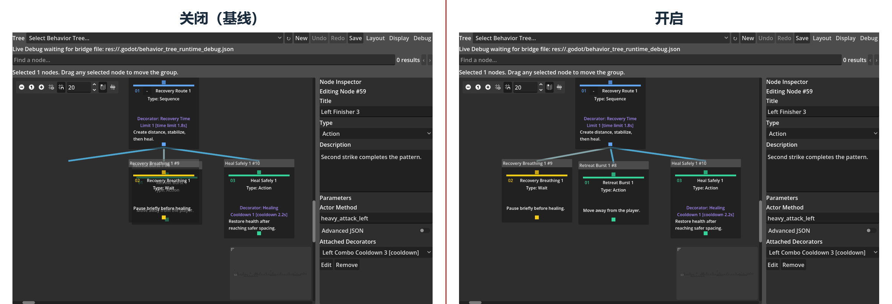
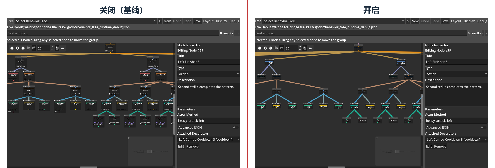
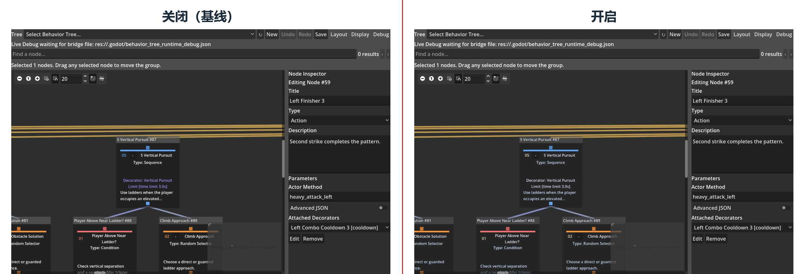
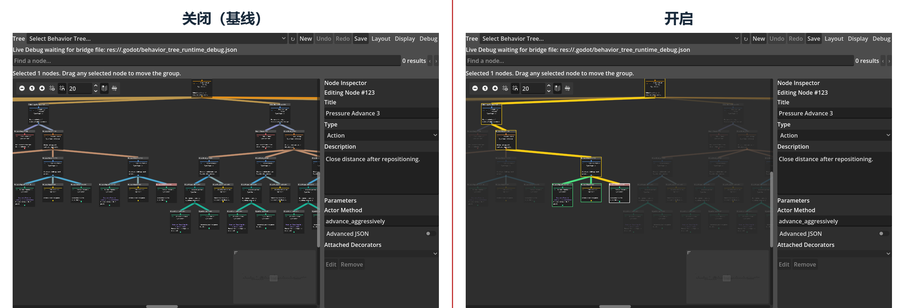
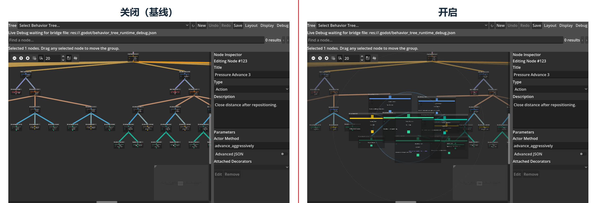
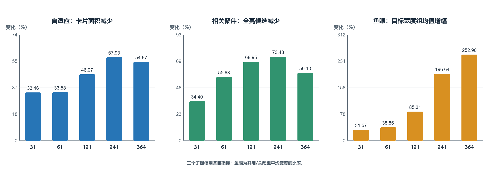
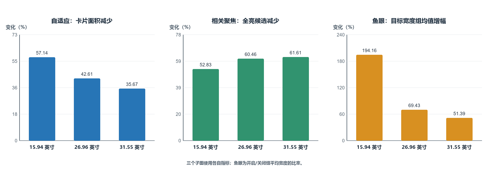

# 致谢

此处预留给作者感谢导师，以及帮助测试软件和审阅论文的人。提交前应由作者自行完成最终文字。

# 声明

本论文作为本人申请游戏工程理学硕士学位的材料提交给华威大学。论文由本人完成，且未曾用于申请其他学位。除明确引用的资料外，本文所述软件、测试数据和分析均来自本项目。本文没有报告任何参与者实验结果。正式提交前，作者必须根据学校规定审阅并个性化本声明，包括如实说明生成式人工智能的使用方式。

# 摘要

本项目制作了一个 Godot 4.6 可视化行为树插件，并把主要研究放在大型行为树的显示问题上。传统节点–连线编辑器在树变大后会占用很多画布，拖拽、连线和无关分支也容易同时干扰观察。为处理这些问题，当前 Display 菜单保留了五项可切换功能：智能拖拽重排、自适应缩放细节、可读连线覆盖、相关节点聚焦和鱼眼聚焦。搜索、直线连接、活动路径、失败说明和概览控件属于插件的固定能力，不放入这五项比较。

实验使用五棵真实游戏行为树和三种来自实际设备的物理屏幕尺寸配置。每项功能都在相同树、相同目标和相同视图下比较关闭与开启状态。正式实验形成 225 组配对，同时检查树结构、保存坐标和同级执行顺序。前后截图用来展示实际画面变化，结构化开发者评价则说明每项功能更适合什么任务。

结果显示，智能拖拽重排能够清除受控拖动产生的重叠，自适应缩放细节能够明显减少概览中的卡片面积，相关节点聚焦也能稳定淡化全部无关节点。修改后的鱼眼会把焦点卡片恢复到至少约 220 px，并扩大指针附近的清晰区域，因此在小屏幕和大型树上更明显。不过，更强的放大也带来了更多局部重叠。可读连线覆盖可以让被卡片挡住的线段部分显现，但它只处理局部连线问题。

综合来看，自适应缩放细节最适合作为通用显示功能；智能拖拽重排和相关节点聚焦分别更适合节点编辑和结构检查；鱼眼适合在概览中临时查看局部；可读连线覆盖则适合特定连线遮挡场景。这些自动数据说明界面产生了哪些可测变化，但不能代替真实开发者参与的可用性研究。

关键词：行为树；Godot；节点–连线编辑器；语义缩放；焦点与上下文；图布局；游戏人工智能

# 第1章　引言

## 1.1　研究背景

本项目使用行为树（Behaviour Tree，BT）控制游戏中的敌人。行为树把决策拆成复合节点、条件节点和动作节点，因此高层策略可以与移动、动画和战斗代码分开编辑。对于小型原型，全部逻辑写在一个脚本中仍然可行；但是状态和中断条件增加后，控制流会越来越难检查。行为树的层级结构可以缓解这个问题，也是它在游戏开发中的主要用途之一（Colledanchise and Ögren, 2018; Iovino et al., 2022）。

节点–连线树可以直接显示父子关系，但树越宽、越深，占用的画布也越大。行为树卡片还会显示参数、描述、Decorator、黑板键和运行状态，所以它通常比只显示名称的普通层级图更占空间。当画布里出现大量卡片时，开发者需要频繁缩放、平移和搜索，当前执行路径也容易被无关分支淹没。这个问题会直接影响节点定位、条件修改和失败检查，而不只是画面是否整齐。

因此，本项目先完成一个能够保存、运行和调试真实 NPC 决策的 Godot 插件，再用它测试五项当前仍保留的显示功能。这五项功能分别处理拖动遮挡、缩放时的信息密度、卡片对连线的遮挡、选中节点的关系范围，以及概览中的局部细节。每项功能都可以关闭，这样可以直接与原始显示比较，也能检查关闭后是否留下视觉状态。

## 1.2　问题定义与研究空白

已有研究从几个方向处理大型图。整洁树布局关注层级、顺序和紧凑性，而布局调整研究更关心消除重叠后能否保留原来的位置和拓扑（Reingold and Tilford, 1981; Sugiyama et al., 1981; Misue et al., 1995; Dwyer et al., 2006）。语义缩放会在缩小时减少显示内容，鱼眼视图则放大焦点并保留周围结构（Bederson et al., 1996; Furnas, 1986）。交互式强调和 EdgeLens 进一步处理相关子图与连线遮挡（Ware and Bobrow, 2005; Wong et al., 2003）。这些工作说明大型图可以从布局、信息密度、焦点和连线几个方面改进。

但是，这些研究没有直接说明游戏行为树编辑器应该怎样组合这些方法。行为树与普通目录不同，同级顺序可能决定执行优先级，叶节点会调用 Actor 代码，Decorator 也可能阻止分支运行。因此，显示功能不能只让画面看起来更整齐。它还必须保持执行顺序，支持撤销，并且不能破坏黑板和运行调试。

现有研究也不能代替本项目自己的测试，因为其他论文使用的图、任务和屏幕条件并不相同。卡片面积减少、透明度变化或目标放大只能说明界面发生了什么，不能直接证明开发者理解得更快。基于这一点，本项目在同一个可执行平台上分别比较五项功能，并同时记录它们的作用和代价。

## 1.3　研究目标与问题

本文目标是在一个经过功能验证、能够驱动真实 NPC 的 Godot 4.6 可视化行为树平台上，设计并评估可组合的大型树显示优化。研究问题为：在不同的行为树节点规模和物理屏幕尺寸下，本项目提出的可组合显示优化，相较于传统基线显示，能否改善大型行为树的可测显示与编辑交互表现，同时保持行为树结构和执行语义不变？

本文的主要贡献如下：

- 实现一个包含编辑、资源、运行时、黑板、Decorator 和 Live Debug 的 Godot 4.6 行为树平台；
- 将 Display 菜单整理为五项面向不同问题的可切换功能，并说明它们与固定基础能力的边界；
- 使用五棵真实游戏行为树和三种物理尺寸配置完成 225 组关闭–开启配对；
- 使用结构化开发者评价统一记录每项功能的帮助、代价、适用规模、适用屏幕和建议状态；
- 给出“总体最稳定”和“特定场景最有效”的结论，而不是把不同单位的指标合成一个没有意义的总分。

## 1.4　研究目标与成功标准

项目工作分为平台建设与研究评估。平台建设包括：实现可序列化的树、节点、Decorator 和类型化黑板资源；实现 Root、Sequence、Selector、Reactive Selector、Random Selector、Parallel、Repeat、Wait、Action 和 Condition 的 success、failure 与 running 语义；允许可复用组件为 NPC 指定树和 Actor，并由叶节点调用 Actor 方法；提供创建、连接、断开、拖拽、框选、多节点移动、类型化编辑、校验、保存、加载、撤销和重做；只在 Godot 编辑器中显示路径、节点状态、黑板和失败原因。

在进行显示优化实验前，首先需要确认行为树插件的基础功能正确：各类节点能够按照预期执行，编辑后的行为树能够正确保存和重新打开，撤销与重做不会破坏树的内容；五个可玩敌人应分别加载 31、61、121、241 和 364 节点树，玩家拥有无限生命，敌人数量有限，击败全部敌人后游戏能够结束。

显示研究的成功标准分为三类。第一，功能必须产生它声称的直接变化，例如 Smart Drag 减少拖动造成的重叠，Adaptive 降低概览卡片面积，Related Focus 淡化无关节点。第二，功能不能改变树拓扑、Decorator 归属或同级执行顺序；自动移动的邻居只能使用临时显示偏移。第三，关闭功能后不能留下尺寸、透明度、边框或临时布局残留。测试过程中只要出现脚本错误、崩溃、内存泄漏、非法访问或异常退出，就认为测试失败，即使其他断言通过。

# 第2章　文献综述

## 2.1　作为可执行层级的行为树

行为树会反复评估一棵有根层级，并返回 success、failure 或 running。Sequence 通常在第一个失败或仍在运行的子节点处停止，Selector 则在第一个成功或仍在运行的子节点处停止。Marzinotto 等（2014）提出了统一的行为树框架，Colledanchise 与 Ögren（2017, 2018）又从混合控制和模块化角度分析了这种组合方式。这些研究说明，行为树的基本节点看起来简单，但 Tick、running、中断和子树组合必须有明确规则。Iovino 等（2022）的综述也指出，不同领域和工具中的具体语义仍可能存在差别。

行为树已经在真实游戏任务中使用。Flórez-Puga 等（2009）把查询和已有行为复用加入游戏行为树，Lim 等（2010）则在商业即时战略游戏 DEFCON 中演化游戏智能体。两项工作研究的重点不同，但都说明行为树可以组织包含多个条件和动作的非简单游戏决策，而不只适合小型演示。

这也解释了本项目为什么先验证运行时。Sequence 可以记住当前执行位置，而 Reactive Selector 需要重新检查高优先级条件；Random Selector 应在一次运行期间保持同一个选择；Repeat 与 Wait 也必须在重启时清除记忆。黑板用于在感知、条件和动作之间共享状态，Unreal Engine 的技术文档展示了黑板、Decorator 和运行观察在实际工具中的组合方式（Epic Games, n.d.）。编辑器不能把节点顺序和 Decorator 当成纯视觉信息，因为它们会影响执行结果。不过，这些基础能力在本文中是实验平台的正确性前提，并不是需要单独证明是否有用的研究对象。

## 2.2　节点–连线树、层级和规模

节点–连线图适合显示行为树，因为连线可以直接表示父子关系。Reingold 与 Tilford（1981）提出的整洁树布局强调父节点居中、同层间距和子树分离，Sugiyama 等（1981）进一步讨论同层排序和节点位置。这些方法很适合自动生成一棵整齐的树，但没有完全解决交互式编辑的问题，因为用户仍然希望自由拖动节点。

布局是否更好不能只凭画面是否整齐判断。Purchase（1997）发现边交叉在所测试的图形美学中影响较大；Ware 等（2002）又说明路径连续性、交叉和分支会影响节点–连线图中的路径查找。Purchase、Carrington 与 Allder（2002）的结果进一步表明，只有部分美学指标会稳定影响任务表现，而且图的语义领域也会改变结果。因此，本文记录重叠、面积和结构等直接指标，但不会把这些数字直接写成人的理解能力提升。

规模增加后，节点和连线会同时变得更难观察。Ghoniem 等（2005）比较了节点–连线图与矩阵表示，并说明结果会同时受到规模、密度和任务影响。SpaceTree 把动态布局和选择性显示加入节点–连线树，也说明表示方法和交互方式需要一起评价（Plaisant et al., 2002）。对于行为树而言，节点–连线方式仍然最容易表达父子方向和同级顺序。因此，本项目保留这种表示，只在缩放和选择时控制信息量。

节点式工作流也出现在近期的人工智能开发工具中。InstructPipe 允许用户生成机器学习流程，并继续在节点图中修改它（Zhou et al., 2025）。该系统不研究行为树，也没有直接回答本项目的显示问题，但它说明节点位置、连接跟踪和流程导航仍是近期开发工具中的实际问题。

近期研究也提醒，通用布局规则不能脱离领域语义。Helmke 等（2024）发现，领域专家有时会优先保持技术结构，而不是一律减少交叉或边长。行为树同样有父子方向和同级执行顺序，因此自动布局不能只追求最小面积。Di Bartolomeo 等（2024）对图布局评价的系统综述还表明，算法、数据集、规模和指标需要一起说明。这支持本文使用真实行为树、多个规模和多个直接指标，而不是给五项功能计算一个没有明确含义的总分。

## 2.3　局部避让与位置稳定

交互式编辑与一次性自动布局不同。用户拖动节点后，如果系统重新排列整棵树，重叠可能会消失，但原来的位置记忆也会被破坏。Misue 等（1995）把它概括为布局调整和心理地图问题。Dwyer 等（2006）提出，节点需要彼此分离，同时新位置应尽量接近原位置；后续研究又说明，在加入约束时仍然需要保留原来的拓扑（Dwyer et al., 2009）。

行为树卡片有真实宽高、文字和标签，所以它们不能只被当作没有面积的点。Gansner 与 Hu（2010）强调，消除重叠时应尽量保留邻近关系和原图形状。这项研究给 Smart Drag 提供了方向：系统应该处理新重叠，但不应该借此接管整张画布。

本项目没有直接复制某一种完整算法，而是限制启动距离、刷新频率、传播层数和最大影响范围，再使用父子和同级关系决定哪些节点一起避让。系统只保持拖动前已经成立的父上子下关系。如果用户原本使用自由布局，插件不会强制把它改成标准树形。

Archambault 与 Purchase（2013）的实验说明，位置保持的帮助取决于具体任务。因此，本项目把“结构不变”和“无关节点尽量少动”作为工程要求，而不是把它们直接写成可用性提升。是否真的更容易理解，仍然需要用户实验。

## 2.4　语义缩放与焦点上下文

语义缩放不只是把画面变小，它还会改变显示内容。Pad++ 展示了表示可以随缩放层级变化（Bederson et al., 1996），Summers 等（2003）也在程序可视化中比较了不同语义缩放方式。这些研究说明，缩小时隐藏次要字段、放大后再恢复细节是一种可行方法。但是，它们使用的程序和任务与行为树不同，因此不能直接把原研究中的速度或准确率套用到本项目。

焦点与上下文方法处理的是另一个问题。Furnas（1986）用兴趣度区分焦点和周围内容，Sarkar 与 Brown（1994）随后把相近思想用于图形鱼眼。Wang 等（2019）又针对大型图的结构失真提出结构感知鱼眼。已有方法比本项目当前的卡片放大更复杂，但它们说明鱼眼不能只看倍率，还要检查结构和局部遮挡。

Cockburn 等（2009）的综述指出，概览、缩放和焦点+上下文都有自己的代价，没有一种方法适合所有任务。Büring 等（2006）在小屏散点图上的实验也没有发现鱼眼在完成时间上必然更好，虽然更多参与者偏好它。换句话说，鱼眼可能对局部查看有帮助，但仍然需要在当前行为树中单独测试。

物理屏幕尺寸会改变概览中卡片的实际大小。Jakobsen 与 Hornbæk（2013）说明，显示尺寸、信息空间和显示比例会一起影响交互。不过，该研究讨论的不是行为树编辑，所以它只能说明屏幕尺寸值得作为实验条件，不能直接提供本项目的效果比例。

## 2.5　关系强调与连线遮挡

大型图不一定要先隐藏节点。Ware 与 Bobrow（2005）使用交互式强调帮助用户查询节点–连线图，van Ham 与 Perer（2009）则从兴趣目标出发保留上下文。对于行为树，这类方法的好处是可以保留原来的空间位置，同时降低无关分支的视觉强度。本项目的 Related Node Focus 因此使用边框和透明度区分选中节点、祖先、后代、同级节点和无关分支。

连线也可能被节点或其他边挡住。Wong 等（2003）的 EdgeLens 会弯曲焦点附近的连线，为拥挤区域留出空间；Holten（2006）的层级边捆绑则沿层级组织大量连线。McGee 与 Dingliana（2012）的实验说明，捆绑可能帮助观察总体聚类，却可能降低单条路径追踪的速度和准确率。减少视觉杂乱因此不等于所有连线任务都会更容易。

本项目没有实现 EdgeLens 或边捆绑，也不改变连线路线。Readable Edge Overlay 只是让线条透过半透明卡片背景出现，并用文字轮廓保护字形。它的方法更简单，作用范围也更有限。综合前面的研究，现有工作已经分别讨论了布局、缩放、焦点、高亮、连线和节点式工作流，但缺少这些方法在真实 Godot 行为树编辑器中的组合比较。本项目的研究空白不是提出一种完全新的图算法，而是把五项方法变成可以开启、关闭和复位的实际功能，再用真实游戏树、不同规模和不同屏幕尺寸检查它们各自带来的变化与代价。

# 第3章　研究方法

## 3.1　研究策略

本研究先确认 Godot 4.6 行为树插件能够正常编辑和运行，再测试大型行为树的五项显示功能。研究重点不是行为树是否适合制作游戏，而是这些功能在不同树规模和屏幕尺寸下改变了什么。

评价分成两部分。第一部分把每项功能关闭和开启，并记录面积、重叠、透明度、目标宽度和结构安全。第二部分由项目开发者使用相同问题评价实际帮助、主要问题、适用环境和建议状态。后者只是结构化的个人评价，不是参与者研究，也不能代表其他开发者的平均意见。

## 3.2　实验对象

实验使用当前可玩游戏中五名敌人实际加载的行为树。资源节点包含附着在其他节点上的 Decorator，而画布卡片不单独显示 Decorator，所以资源节点数和画布卡片数必须分开报告。

| 资源节点 | 画布卡片 | Decorator | 资源 | 游戏 Actor |
| ---: | ---: | ---: | --- | --- |
| 31 | 30 | 1 | `arena_scout_31.tres` | Scout |
| 61 | 56 | 5 | `arena_skirmisher_61.tres` | Skirmisher |
| 121 | 104 | 17 | `arena_hunter_121.tres` | Hunter |
| 241 | 202 | 39 | `arena_tactician_241.tres` | Tactician |
| 364 | 301 | 63 | `arena_commander_364.tres` | Commander |

表 3.1　五棵真实行为树的资源节点、画布卡片和 Decorator 数量

五棵树都包含实际可执行的复合节点、条件、动作和 Decorator，而不是为截图创建的空结构。较大的树覆盖方向近战、远程投射物、跳跃越障、梯子攀爬、追击、最后位置搜索、撤退、治疗、巡逻和待机。规模增加时分支形状和字段内容也会改变，因此实验可以比较真实复杂度下的表现，但不能把相邻规模之间的每一个差值都解释成纯节点数量因果效应。

## 3.3　屏幕尺寸配置

屏幕条件来自 2026-08-23 对三台设备的 EDID 物理宽高记录。统一使用每厘米 35 个逻辑单位生成 SubViewport。当前只启用笔记本屏幕，因此本轮正式实验在同一块 GPU 上重放三个物理尺寸配置，不声称窗口重新在三台实体屏幕上逐台运行。

| 配置 | 物理宽×高 | 对角线 | 物理面积 | SubViewport | GraphEdit 可用区域 |
| --- | ---: | ---: | ---: | ---: | ---: |
| Laptop | 34×22 cm | 15.94 in | 748 cm² | 1190×770 | 858×642 |
| Medium | 60×33 cm | 26.96 in | 1980 cm² | 2100×1155 | 1768×1027 |
| Large | 70×39 cm | 31.55 in | 2730 cm² | 2450×1365 | 2118×1237 |

表 3.2　三种物理尺寸来源及本轮配置重放的画布大小

分辨率、刷新率和 Windows 缩放只作为设备审计信息，不进入效果解释。节点是否位于视口使用 GraphEdit 的实际可用区域计算，而不是使用包含工具栏和 Inspector 的完整 SubViewport。

## 3.4　五项功能的配对操作

每棵树预先选择左、中、右三个固定目标，用来覆盖不同分支。它们不是随机抽样。每次记录前都会复制树资源、重建画布并重新设置功能，因此上一条记录的临时状态不会带入下一条。每组都先记录关闭状态，再记录开启状态。

Smart、Adaptive、Overlay 和 Related 的关闭状态为五项实验功能全部关闭。Fisheye 是唯一例外：它用于概览状态，所以关闭和开启状态都保留 Adaptive，只比较是否额外应用鱼眼。该设计测量鱼眼相对自适应概览的增量效果。

| 功能 | 关闭状态与具体操作 | 开启状态与主要指标 |
| --- | --- | --- |
| Smart Drag Reflow | 把固定叶节点拖到固定目标卡片区域，记录人为形成的遮挡 | 使用同一路径拖动；比较重叠面积、自动移动卡片数、最大位移和远处分支移动 |
| Adaptive Zoom Detail | 在固定概览缩放下仍显示完整卡片 | 按缩放切换中/低细节；比较卡片面积、字段数、完整位于视口的卡片和层级违反 |
| Readable Edge Overlay | 固定一条穿过非端点卡片的真实父子连线，卡片保持不透明 | 背景乘以 0.72；比较穿卡片线段、加权显示长度、文字遮罩样式和路线是否不变 |
| Related Node Focus | 单击固定节点但不应用关系强调；第三个任务用框选建立两个选中节点 | 对所有选中节点合并祖先、后代和同级关系；检查白、黄、绿边框、无关节点与连线淡化，以及几何是否不变 |
| Fisheye Focus | 保留同一 Adaptive 概览，但不应用鱼眼 | 把指针稳定放在固定目标附近；比较目标宽度、恢复字段、外围缩小与淡化，以及新增遮挡 |

表 3.3　五项功能的关闭–开启操作与指标

总记录数为：5 项功能 × 3 个屏幕配置 × 5 棵树 × 3 个任务 × 2 个状态 = 450 条。它们形成 225 组一一对应的比较，每项功能 45 组。每个状态等待两个渲染帧后记录。实验使用 Godot 4.6 stable、OpenGL Compatibility 渲染器和 NVIDIA GeForce RTX 5070 Laptop GPU。

## 3.5　数据处理与成功判断

分析以 `pair_id` 对齐关闭和开启状态，每个“屏幕–树–任务”条件等权。由于任务和界面状态是确定性的，三个任务是三个固定分支案例，而不是从某个人群随机抽取的样本。因此正文报告配对平均值、中位数、范围和满足功能契约的条件数，不计算没有明确总体含义的 p 值或置信区间。

所有配对共同检查：资源节点数、父子关系、Decorator 归属、同级从左到右执行顺序和非拖动资源坐标不变；关闭功能后没有尺寸、透明度、边框或临时偏移残留；日志没有脚本错误、崩溃、泄漏或非零退出。Smart 的正式夹具在记录后取消拖动并恢复源节点，因此保存坐标可与实验前完全比较；真实使用时，用户主动拖动的节点会保存新坐标并进入 Undo/Redo，自动避让的邻居仍不写入资源。

每项功能还有自己的判断条件。Smart 需要减少拖动造成的重叠，并限制自动移动范围；Adaptive 需要减少卡片面积或字段，而且不能新增父子高低错误；Overlay 需要让被挡线段部分显现，同时保持文字和路线；Related 需要正确处理所有选中节点，并淡化全部无关节点；Fisheye 需要选中正确目标并明显放大它，是否达到当前约 220 px 的设计目标会另外记录。鱼眼本来就允许外围出现遮挡，所以它不要求全图零重叠，但新增重叠必须单独报告。

## 3.6　结构化开发者评价

结构化开发者评价使用同一批树、目标和前后截图。每项功能回答五个问题：它帮助什么任务，最明显的问题是什么，在哪种规模和屏幕上更有用，以及应该默认开启还是按需开启。判断必须能够回到表格或截图，不能只写个人偏好。

这种评价可以解释自动指标没有表达的实际取舍，例如邻居移动是否可以接受，或者鱼眼遮挡是否已经影响观察。但是，它仍然只代表本项目开发者。真实参与者的任务时间、错误率和主观评分需要留到后续研究。

## 3.7　插件功能与可玩游戏验证

显示实验建立在功能正确的平台上。验证分为资源与运行时、编辑器界面、基础游戏、复杂竞技场和五敌人通关流程。测试覆盖节点执行、Decorator、Actor 方法调用、创建与连接、保存与重新加载、撤销与重做、多选拖动、显示功能复位，以及敌人永久击败和游戏完成。

可玩验证不回答“行为树是否帮助游戏开发”这一额外研究问题。它只确认五棵实验树确实由游戏 Actor 加载，复杂行为能够执行，玩家无限生命，五个有限敌人可以被逐个击败，最后出现完成状态。这样，论文评价的不是一组脱离运行时的静态图。

# 第4章　系统设计与实现

## 4.1　总体架构

系统由编辑器插件、资源模型、运行时、调试桥和测试游戏五部分组成。编辑器插件运行在 Godot 编辑器内，负责把行为树资源显示成可操作的 GraphEdit 画布。资源模型保存节点、父子关系、Decorator、黑板 Schema 和节点坐标。运行时读取同一资源并把 Tick 结果传递给游戏 Actor。调试桥把当前状态、失败原因和黑板值送回编辑器。测试游戏只提供可执行环境，不在游戏画面上叠加行为树调试界面。

图 4.1　插件、资源、运行时、调试桥和测试游戏之间的关系

这个划分使同一棵树可以同时用于编辑、保存、自动测试和游戏运行。显示功能只修改卡片的临时尺寸、透明度、边框或画布偏移，不改写节点类型和连接。用户真正拖动并释放的节点是例外：其新坐标会正常保存，并可以撤销或重做；为了避让而自动移动的其他卡片不写回资源。

## 4.2　资源模型与结构校验

行为树资源保存根节点和节点集合。每个节点有稳定身份、类型、编辑器坐标、参数和子节点引用。Decorator 附着在拥有者节点上，而不是作为独立画布卡片。黑板 Schema 定义键名、类型和默认值，Action 与 Condition 通过类型化控件选择方法、键、比较运算和值，用户不需要手写 JSON。

保存前的校验会拒绝多个根、环、断开的非法引用、错误的子节点数量、无效 Decorator 归属和不符合 Schema 的黑板键。加载后再次建立节点卡片和连接。同级节点按照横坐标从左到右排序，这个顺序会影响 Sequence、Selector 和其他有序复合节点的执行优先级。因此，显示重排不能偷偷改变资源横坐标或同级执行顺序。

## 4.3　运行时与节点语义

运行时每次 Tick 返回 `SUCCESS`、`FAILURE` 或 `RUNNING`。Root 把结果传给唯一孩子；Sequence 从左到右执行，并在失败或运行中的孩子处停止；Selector 在成功或运行中的孩子处停止；Reactive Selector 每次重新检查高优先级分支；Random Selector 在一次运行期间保持已选孩子；Parallel 按配置统计成功与失败；Repeat 控制重复次数或无限重复；Wait 记录经过时间；Action 调用 Actor 方法；Condition 检查 Actor 方法或黑板值。

| 节点 | 主要职责 | 需要保留的运行记忆 |
| --- | --- | --- |
| Root | 进入整棵树 | 无 |
| Sequence / Selector | 按同级顺序组合结果 | 当前运行孩子 |
| Reactive Selector | 每次从高优先级重新检查 | 抢占时重置旧分支 |
| Random Selector | 随机选择孩子 | 当前选择和随机状态 |
| Parallel | 同时评价多个孩子 | 各孩子状态 |
| Repeat / Wait | 重复或等待 | 次数或经过时间 |
| Action / Condition | 调用 Actor 或读取状态 | 由具体任务决定 |

表 4.1　当前运行节点的主要语义

Decorator 在拥有者节点执行前后应用黑板条件、冷却、时间限制、结果取反、强制结果或重复规则。分支被中断时，运行中的节点和 Decorator 都会重置，避免下次进入时继承错误状态。运行时使用树资源，但不依赖编辑器是否打开，因此关闭全部显示功能不会改变游戏结果。

## 4.4　编辑工作流与固定基础显示

用户在画布空白处右键创建节点，通过端口建立父子关系，在 Inspector 中使用类型化字段编辑参数。节点可以删除、断开、框选和成组拖动；单击一个节点会清除旧的单选并选中当前节点，框选或带修饰键操作才建立多选。按住空白处可以平移视窗。所有结构修改、参数修改和用户拖动都进入 Undo/Redo，并可保存为 `.tres` 后重新加载。

编辑器用固定的直线连接显示父子关系，并对端口、选中状态和运行状态使用一致颜色。Search、Minimap、活动路径高亮、非活动分支淡化、Decorator 条件标记和失败说明属于固定基础能力，不在当前 Display 菜单中提供研究开关，也不进入五项关闭–开启比较。这样可以避免把基础导航、运行调试和本文的五项可切换优化混在一起。

## 4.5　Live Debug 与黑板检查

运行游戏时，调试桥为当前 Actor 记录活动节点、节点返回值、失败原因和黑板快照。编辑器把活动路径显示在原行为树画布上，并在侧栏显示黑板键的当前值和类型。失败说明直接标在发生失败的节点附近，例如条件不满足、方法不存在或 Decorator 阻止分支。

图 4.2　当前版本在 241 节点真实行为树上显示 Live Debug

调试界面不向正在运行的游戏添加覆盖层，也不要求 Actor 知道编辑器 UI。其目的只是证明实验树可执行，并让开发者从节点图检查“当前运行到哪里”和“为什么没有进入某个分支”。它不属于五项显示实验中的独立条件。

## 4.6　当前五项 Display 功能

Display 菜单目前只保留五项参与本研究的可切换功能。新安装的出厂设置会开启 Smart Drag、Adaptive、Related Focus 和 Fisheye，并关闭 Edge Overlay；已有项目会恢复用户上次保存的选择。正式实验不依赖出厂设置，而是为每个配对显式关闭或开启被测功能。

### 4.6.1　智能拖拽重排

智能拖拽重排用于解决“一个节点被拖到另一个节点上”造成的新遮挡。系统在累计移动达到 10 个屏幕像素后才启动，并在之后每移动 8 个屏幕像素时更新一次。单击和非常小的修正不会触发重新布局。拖动期间系统直接更新临时避让，所以用户可以在松开鼠标前看到其他卡片让开。

算法先找到与拖动卡片相撞的局部结构，再把连续 2–4 层中的相关父节点、同级节点和孩子作为小组移动。一次最多处理 24 张卡片，并限制碰撞传播次数。这样可以减少整棵树突然排成规则行列的情况。它只维持拖动前已经成立的父节点在上、子节点在下关系；如果用户原本把某组节点故意倒置，系统不会强制纠正。

单节点拖动使用智能重排。框选后的多节点拖动被当作刚性整体，不再逐节点调用求解器，避免组内相对位置变化。松开后只保存用户拖动节点的新坐标，自动避让卡片的位移仍是显示层数据。关闭功能或重建画布会清除这些临时偏移。

### 4.6.2　自适应缩放细节

自适应缩放细节把卡片大小和字段数量同时连接到 GraphEdit 缩放。缩放低于 0.62 时使用约 188×88 的紧凑卡片，只保留识别结构所需的低细节；0.62 至 0.88 之间恢复普通尺寸和中等字段；达到 0.88 后显示约 250×150 的普通卡片和完整字段。

卡片尺寸变化后，系统重新检查整张画布的碰撞，并用临时偏移尽量保持原有相对结构。它不是把树永久改成另一套布局，也不是 Smart Drag 的 24 卡片局部求解。放大后字段和普通尺寸会恢复，关闭功能后也会清除自适应尺寸与偏移。

这个功能用信息密度换取概览空间。它的目的不是让缩小后的所有文字仍可阅读，而是让用户先看清树形和分支范围，再在需要时放大查看参数。后面的实验分别记录面积减少、字段减少、完整位于视口内的卡片变化和层级关系。

### 4.6.3　可读连线覆盖

可读连线覆盖处理连线被非端点卡片挡住的局部情况。开启后，支持的卡片背景把原不透明度乘以 0.72，使卡片后方的直线能够部分显现。文字、图标和控件使用固定前景色，并加 2 px 深色轮廓，避免显现的连线直接穿过字形。连接路线、端点和执行顺序都不改变。

该功能只对 `StyleBoxFlat` 卡片背景进行透明处理。关闭时恢复原背景、文字样式和调制颜色。它不是 EdgeLens：系统不会弯曲、捆绑或重新规划连线。它也不会减少节点数量、卡片面积或全图边密度，因此预期作用比其他四项更局部。

### 4.6.4　相关节点聚焦

相关节点聚焦会在用户选择节点后计算结构关系。当前选中的节点使用白色边框；它们的全部祖先和后代使用黄色边框；同一父节点下的其他节点使用绿色边框。其余节点和连线都会明显变淡。该功能不移动节点，也不改变卡片尺寸，所以原来的树形位置仍然保留。

普通单击只选择当前节点，不会把之前单击过的节点一直累积起来。用户需要选择多个节点时，可以在空白处拖出选择框，再一起移动或聚焦。多选聚焦会合并所有选中节点的祖先、后代和同级关系，因此每个选中节点都会生效，而不是只处理最后一个。若选择的是 Decorator，系统会先找到它所属的可见卡片。清除选择后，边框和透明度全部恢复。

Related Focus 与运行时活动路径解决的是两个不同问题。前者说明“选中节点在树结构中与谁有关”，后者说明“Actor 现在执行到哪里”。两种高亮可以同时出现，但正式实验只切换 Related Focus。

### 4.6.5　鱼眼聚焦

鱼眼聚焦主要用于已经缩小的概览。它不是只放大鼠标正下方的一张卡片，而是根据节点到指针中心的距离连续改变大小。最靠近中心的节点放大最明显，附近节点也会得到较小的放大；超出主要范围的节点会缩小和淡化。这样做的目的是让用户在不退出概览的情况下看清一个局部区域。

修改后的焦点区半径为 150 px，主要过渡范围为 320 px，外围淡化范围扩大到 600 px。系统会根据当前 zoom 自动计算倍率，并把焦点卡片恢复到至少约 220 px；最低焦点倍率为 1.20，最大倍率为 8.8。远处卡片缩小到 0.68 倍，透明度最低为 0.12。因此，缩放越小，焦点与外围的差异越明显。

鱼眼只允许距离最近的 8 张卡片参加有限的局部避让，其他节点不会因为焦点变大而推动整张画布。系统使用稳定的参考位置计算距离，并把焦点位置和卡片尺寸分桶，所以鼠标轻微抖动不会每一帧重新排版。滚轮缩放时鱼眼会短暂停止，之后再恢复。

这种设计优先保证焦点和附近节点清楚，而不是保证整棵树完全无重叠。更强的放大可能挡住附近卡片，也可能暂时破坏父节点在子节点上方的视觉关系。因此，实验除了记录目标放大，也单独报告新增重叠和层级遮挡。

## 4.7　实验记录与可复现性

五功能实验由 Godot 脚本直接建立真实编辑器视图。脚本复制树资源、设置屏幕配置和任务目标、切换一项功能、等待渲染并记录 CSV。每条记录包含实验提交、树资源哈希、屏幕配置、目标、开关状态、功能指标和安全签名。分析脚本只读取原始 CSV，生成配对表、按树汇总、按屏幕汇总、结构化评价表和前后对比图。

正式数据目录保存原始观测、配对结果、运行环境清单、源资源 SHA-256、十张关闭–开启证据图和全部派生表格。论文中的五组比较图直接使用这批正式证据，因此截图、表格和原始记录可以从同一目录追溯。

## 4.8　可玩五敌人测试游戏

测试游戏把五棵不同规模的行为树分配给 Scout、Skirmisher、Hunter、Tactician 和 Commander。敌人数量有限，玩家拥有无限生命，目标是利用移动、跳跃和攻击逐个击败敌人。场景包含远程投射物、近战方向、障碍、跳跃路线、梯子、治疗物品和危险区域。敌人可以巡逻、发现玩家、追击、搜索最后位置、越障、攀爬、撤退和恢复。

图 4.3　五种规模行为树分别控制可玩场景中的五名敌人

较小树使用较少分支完成基本行为，较大树承担更多战斗和环境反应。游戏能够在五名敌人永久击败后进入完成状态。这部分证明行为树平台不是静态图展示器，但不把游戏通关当作显示优化效果。

# 第5章　实验结果

## 5.1　插件功能与可玩游戏验证

当前版本重新运行了五组核心自动测试。测试覆盖资源与运行时、编辑器、基础游戏、复杂竞技场和五敌人通关流程。所有测试都正常结束，日志没有脚本错误、原生崩溃、非法内存访问或泄漏报告。各组的具体数量放在表 5.1 中。

| 验证组 | 通过/总数 | 主要范围 |
| --- | ---: | --- |
| 资源与运行时 | 154/154 | 节点、Decorator、黑板、保存与重载 |
| 编辑器界面 | 337/337 | 编辑、选择、拖动、显示功能与复位 |
| 基础游戏 | 40/40 | Actor 调用和基础场景 |
| 复杂竞技场 | 34/34 | 战斗、移动、恢复和环境行为 |
| 五敌人流程 | 215/215 | 五种树加载、永久击败和通关 |
| 合计 | 780/780 | 当前核心自动断言 |

表 5.1　当前版本的插件功能和游戏验证结果

五棵行为树分别控制对应敌人，游戏能够完成。因此后续显示结果建立在正确加载和执行的真实资源上。表 5.1 只证明项目当前实现通过了指定测试，不说明显示功能一定改善人的使用体验。

## 5.2　正式显示数据与安全检查

正式实验形成 225 组关闭–开启比较，五项功能都覆盖相同的树、屏幕和任务。所有配对都通过功能与结构检查。父子拓扑、Decorator 归属、同级执行顺序和资源坐标保持一致。Smart 的测试会在记录后恢复被拖动节点，因此这里的坐标一致表示自动避让没有写入资源；真实编辑仍然会保存用户主动拖动后的新位置。

| 功能 | 启动前 | 启动后 | 直接变化 | 主要副作用 |
| --- | --- | --- | --- | --- |
| 智能拖拽重排 | 受控重叠面积平均 36,611.59 px² | 45/45 降至 0 | 受控重叠减少 100% | 平均移动 1.67 张其他卡片 |
| 自适应缩放细节 | 完整卡片与字段 | 总卡片面积平均减少 45.14% | 字段平均减少 43.61% | 低缩放时主动隐藏字段 |
| 可读连线覆盖 | 背景系数 1.00 | 背景系数 0.72 | 提供 28% 显露代理通道 | 不减少整体图密度 |
| 相关节点聚焦 | 视口候选全部正常亮度 | 无关节点全部乘以 0.18 | 全亮候选平均减少 58.30% | 不适合同时比较无关分支 |
| 鱼眼聚焦 | 目标平均宽 119.43 px | 目标平均宽 224.55 px | 开启/关闭组均值提高 88.01% | 20/45 新增重叠，14/45 新增层级遮挡 |

表 5.2　五项功能相对关闭状态的主要结果

表 5.2 的每一行使用不同单位，不能横向相加。下面分别解释五项结果，并使用同一棵 241 节点树、同一屏幕配置和同一目标的前后图展示实际变化。

## 5.3　五项功能的启动前后比较

### 5.3.1　智能拖拽重排

表 5.2 显示，Smart Drag 清除了全部受控拖动造成的重叠。它通常只移动很少的其他卡片，而且原本正确的父上子下关系都得到保留。这说明该功能主要处理拖动点附近的新遮挡，并没有把整棵树重新排成固定格式。

图 5.1　智能拖拽重排关闭与开启：同一拖动位置下消除卡片遮挡

图 5.1 展示了相同拖动位置下的差异。少数情况下，结构组中的节点虽然离拖动点较远，仍会跟随同组节点一起移动。因此，这里的“局部”表示受影响的结构受到限制，并不代表只有距离最近的一张卡片会移动。

### 5.3.2　自适应缩放细节

Adaptive 开启后，卡片面积和字段数量都明显下降，而且没有新增父子高低错误。在一部分条件中，完整位于视口内的卡片也变多；其他条件虽然没有增加完整卡片数量，但仍然减少了画布占用。这个结果符合该功能“先看结构、需要时再放大看字段”的设计。

图 5.2　自适应缩放细节关闭与开启：相同概览缩放下减少卡片面积和字段

图 5.2 中，开启状态保留节点身份和结构信息，但不再显示所有参数。表 5.2 的面积变化不能直接写成同样比例的“可见节点增加”，因为卡片是否完整进入视口还会受到树形和位置影响。

### 5.3.3　可读连线覆盖

Overlay 开启后，穿过卡片背景的连线能够部分显现，连接路线没有改变，文字前景和轮廓也保持不透明。这个功能没有重新规划连线，只是给原本完全被挡住的线段留出一个显示通道。

图 5.3　可读连线覆盖关闭与开启：相同路线透过卡片背景但避开文字

图 5.3 使用同一任务的关闭–开启画面。表中的变化来自背景透明度规则，不是人的连线识别准确率。现有证据只能说明被遮挡线段能够部分显现，不能说明复杂树的整体拥挤已经减少。

### 5.3.4　相关节点聚焦

Related Focus 开启后，实验中的无关节点都被正确淡化，视口内保持全亮的候选明显减少。与此同时，节点坐标、卡片面积和连线路线都没有改变。用户仍然能看到整棵树的位置，只是与当前选择无关的内容不再同样突出。

图 5.4　相关节点聚焦关闭与开启：选中节点及其关系分支保持突出

第三个任务使用两个框选节点。结果显示，两组关系会被合并，而不是只保留最后一个节点。白色表示选中节点，黄色表示祖先和后代，绿色表示同级节点。无关节点仍然存在，只是透明度更低。

### 5.3.5　鱼眼聚焦

修改后的鱼眼会把目标卡片恢复到至少约 220 px，同时显示更多字段。距离焦点较远的卡片会缩小并淡化，所以焦点区域与外围的差异比旧版本更明显。表 5.2 给出了整体宽度变化，图 5.5 展示了相同概览中的实际效果。

图 5.5　鱼眼聚焦关闭与开启：概览中恢复目标尺寸并淡化远处节点

更强的放大也带来了更明显的代价。部分场景出现了新的局部重叠和父子层级遮挡，尤其是在小屏幕和较大的树中。树结构、执行顺序和保存坐标仍然安全，但画面不再保证全局整洁。因此，鱼眼更适合短时间查看局部，不适合替代 Adaptive 或 Smart 的全图布局。

## 5.4　不同节点规模下的结果

表 5.3 只汇总随规模出现明显变化的三个指标。Adaptive 和 Related 使用每个配对的平均减少比例。鱼眼先分别求同一规模的关闭和开启平均宽度，再计算两个组平均值的比率，避免少数极小关闭值过度放大结果。

| 资源节点 | Adaptive 面积减少 | Related 全亮候选减少 | Fisheye 平均宽度：关→开 | Fisheye 组均值增幅 |
| ---: | ---: | ---: | ---: | ---: |
| 31 | 33.46% | 34.40% | 175.27→230.60 px | 31.57% |
| 61 | 33.58% | 55.63% | 165.15→229.33 px | 38.86% |
| 121 | 46.07% | 68.95% | 120.25→222.82 px | 85.31% |
| 241 | 57.93% | 73.43% | 74.16→220.00 px | 196.64% |
| 364 | 54.67% | 59.10% | 62.34→220.00 px | 252.90% |

表 5.3　五种行为树规模下的主要显示变化

图 5.6　Adaptive、Related Focus 和 Fisheye 随树规模变化的效果

表 5.3 显示，Adaptive 和 Related 在中型及大型树中的作用更明显。鱼眼的目标宽度保持在相近水平，但关闭状态下的目标会随着树变大而变得更小，因此它在最大两棵树上的相对变化最明显。

Smart 在所有规模都清除了受控拖动重叠，不过较大的树会带动稍多的结构相关节点。Overlay 的效果主要取决于当前线路是否穿过卡片，并没有随着节点总数稳定增加。由于五棵树是真实游戏资源，规模增加时分支形状和字段也会改变，所以不能把表中的每个差值都解释成纯节点数量造成的结果。

## 5.5　不同屏幕尺寸下的结果

表 5.4 使用三种真实 EDID 尺寸来源的配置回放。Adaptive 和 Related 报告配对平均比例；鱼眼报告每个屏幕配置的关闭与开启平均宽度以及两个组平均值的相对变化。

| 屏幕配置 | Adaptive 面积减少 | Related 全亮候选减少 | Fisheye 平均宽度：关→开 | Fisheye 组均值增幅 |
| --- | ---: | ---: | ---: | ---: |
| 15.94 in | 57.14% | 52.83% | 75.05→220.76 px | 194.16% |
| 26.96 in | 42.61% | 60.46% | 133.44→226.10 px | 69.43% |
| 31.55 in | 35.67% | 61.61% | 149.81→226.80 px | 51.39% |

表 5.4　三种物理尺寸配置下的主要显示变化

图 5.7　Adaptive、Related Focus 和 Fisheye 随屏幕尺寸配置变化的效果

表 5.4 显示，Adaptive 和鱼眼在小屏配置中的相对作用最大。它们主要补偿概览中卡片被压得过小的问题。Related 在中、大屏上的候选减少比例更高，因为更大的画布原本就能同时显示更多无关分支。换句话说，小屏更需要压缩全局并恢复局部，大屏则更适合在保留全局位置的同时筛出关系。

鱼眼在小屏上的收益最大，新增遮挡也最明显；屏幕变大后，目标在关闭状态下本来就更清楚，放大带来的副作用也随之减少。Smart 和 Overlay 使用相同的局部操作，因此主要比例在三个配置下相同。这只能说明它们在当前重放设计中没有明显屏幕差异，不能代表所有真实设备和输入方式。

## 5.6　结构化开发者评价

| 建议顺序 | 功能 | 最适合的任务和环境 | 数据支持的优势 | 观察到的代价 | 建议 |
| ---: | --- | --- | --- | --- | --- |
| 1 | 自适应缩放细节 | 小屏及 121–364 节点概览 | 面积和字段同时下降，无新增层级违反 | 低缩放隐藏字段 | 最稳定的通用默认功能 |
| 2 | 智能拖拽重排 | 各屏幕上的直接拖动编辑 | 45/45 清除诱发重叠 | 少量邻居或结构组移动 | 编辑时默认开启 |
| 3 | 相关节点聚焦 | 121 节点以上的结构追踪 | 淡化全部无关实例 | 不便同时比较无关分支 | 选择后默认触发 |
| 4 | 鱼眼聚焦 | 小屏、241–364 节点的局部查看 | 目标至少恢复到约 220 px | 局部重叠和层级遮挡增加 | 按需开启 |
| 5 | 可读连线覆盖 | 特定穿卡片连线 | 路线不变并提供显露通道 | 作用局部、差异较细 | 保留为情境功能 |

表 5.5　基于统一问题的结构化开发者评价

表 5.5 没有把五个不同单位合成一个总分。这个顺序考虑了功能覆盖范围、实际任务、关闭–开启差异、复位能力和副作用。它代表本项目开发者根据当前证据作出的设计判断，不代表其他开发者一定会有相同偏好。

# 第6章　讨论

## 6.1　平台正确性是显示研究的前提

表 5.1 中的测试和可通关场景说明，当前树资源、编辑器和运行时可以一起工作。显示实验也没有改变拓扑、Decorator 归属、同级执行顺序或资源坐标。因此，后面观察到的面积、透明度和目标尺寸变化来自显示功能，而不是行为树内容被改动。

不过，这些测试只验证当前节点类型、场景和断言。它们没有证明所有未来 Actor 方法都会正确，也没有把行为树基础功能当成新的研究问题。本文真正讨论的仍然是五项显示优化。

## 6.2　显示优化作用的解释

### 6.2.1　不同复杂行为树规模下的优化效果

小型树本来就能保留比较大的卡片，所以五项功能并不是同样必要。表 5.3 显示，Adaptive、Related 和鱼眼在小型树中的变化都比较有限。Smart 仍然有直接作用，因为一次错误拖动仍会造成遮挡，但小型树通常不需要一直使用鱼眼。

树变大后，卡片密度和无关分支逐渐成为主要问题。Adaptive 先减少整棵树在概览中占用的空间，Related 再让选中的结构从其他分支中突出。两者不是重复功能，而是分别处理“画布太满”和“相关结构不够明显”。这也是它们在中型和大型树中更有价值的原因。

鱼眼在最大两棵树中的局部变化最明显。关闭鱼眼时，目标已经被概览缩得很小；开启后，它会恢复到相近的可读宽度。不过，树越密集，放大的卡片越容易挡住附近内容。因此，鱼眼适合解决“我现在想看清这个局部”，但不适合解决“我希望整棵树一直整齐”。

Smart 和 Overlay 的作用更多取决于局部事件，而不是节点总数。Smart 处理当前拖动造成的碰撞，Overlay 只有在线路穿过卡片时才有明显作用。所以，即使一棵树很大，也不能假设每次拖动或每条连线都会得到相同帮助。

### 6.2.2　不同物理屏幕尺寸下的优化效果

屏幕结果说明，小屏和大屏需要的帮助不同。小屏概览中的卡片更容易被压得很小，因此 Adaptive 和鱼眼的相对作用最明显。Adaptive 先减少全局占用，鱼眼再恢复当前局部。它们不能把小屏变成大屏，但可以让小屏在查看大型树时少受空间限制。

大屏本来就能同时显示更多内容，所以进一步缩小卡片或放大单个目标的相对变化没有小屏那么大。Related Focus 在这里更有优势，因为它不会丢掉大屏已经显示出的全局位置，只会让无关分支变淡。对大屏来说，这比继续压缩所有节点更符合结构检查任务。

修改后的鱼眼也表现出很直接的权衡：小屏上的局部恢复最明显，新增遮挡也最多。屏幕变大后，焦点原本就更清楚，鱼眼造成的画面变化会更温和。比较合理的用法是在小屏概览中短暂查看目标，完成后退出鱼眼，而不是把它一直当作主布局。

Smart 和 Overlay 在当前实验中没有表现出明显的屏幕差异，因为它们使用的是相同局部操作。这个结果来自同一 GPU 上的尺寸配置重放。真实观看距离、像素密度和输入设备仍然可能改变使用感受。

### 6.2.3　哪些功能最有价值

从本项目的实际使用来看，如果只能选择一项一直开启的功能，Adaptive 最合适。它在浏览整棵树时持续工作，关闭后也能恢复完整卡片。它的代价很清楚：缩小时看不到全部字段，但用户可以通过放大或鱼眼恢复局部细节。

具体任务的答案并不相同。Smart 在拖动编辑时最直接，因为它处理的是刚刚产生的遮挡。Related 在结构检查时最有价值，因为它不会移动节点，只会把所有选中节点的相关结构保留下来。这两个功能没有必要互相竞争：一个在修改位置时工作，另一个在选择和理解结构时工作。

鱼眼在特定环境中的相对变化最大，但不能因为这一点就排在第一。它的放大效果越强，局部遮挡也越明显，因此更适合作为按需工具。Overlay 的作用最局部，它可以补充被卡片挡住的连线，但不能减少节点、字段或候选数量。

综合来看，Adaptive 适合作为概览基础，Smart 和 Related 分别服务编辑与结构检查，Fisheye 和 Overlay 则在局部问题出现时使用。这个结论比把五个不同单位的百分比相加更接近它们的真实用途。

### 6.2.4　证据能够说明什么

本研究可以说明五项功能在当前实现中造成了哪些直接变化，也能指出它们在哪些规模和屏幕下更明显。相同内容的前后图可以帮助读者检查表格与实际画面是否一致，结构签名则确认执行语义没有被改变。

但是，这些数据不能说明普通开发者完成任务快了多少，也不能把卡片面积减少直接写成认知负荷降低。结构化开发者评价只是把当前数据转化为项目设计建议。以后如果能够招募参与者，可以继续使用相同树和任务，再记录完成时间、错误选择、缩放和平移次数，以及主观评分。

# 第7章　结论

本项目完成了一个可以编辑、保存、运行和调试的 Godot 4.6 行为树插件，并用它研究大型行为树的显示问题。当前 Display 菜单包含智能拖拽重排、自适应缩放细节、可读连线覆盖、相关节点聚焦和鱼眼聚焦。实验使用五棵真实游戏树和三种来自实际设备的屏幕尺寸配置。

表 5.2 至表 5.4 显示，五项功能都产生了各自针对的变化，而且没有改变树结构和执行顺序。Smart 适合处理拖动产生的遮挡，Adaptive 适合持续查看整棵树，Related 适合检查选中节点的结构关系。修改后的鱼眼在小屏和大型树上提供了更强的局部放大，但也带来了更多遮挡。Overlay 则只处理特定连线被卡片挡住的情况。

因此，研究问题可以得到有条件的肯定回答：这些功能能够改善它们各自针对的可测显示或编辑状态，但没有一项在所有规模、屏幕和任务中都最好。总体上，Adaptive 最适合作为通用功能，Smart 和 Related 分别适合编辑与结构检查，Fisheye 和 Overlay 更适合按需使用。

本项目的主要价值不是证明行为树优于其他 AI 架构，而是把几种大型图显示方法放进一个真实可运行的行为树编辑器，并允许它们被开启、关闭和比较。后续工作可以让外部游戏开发者完成相同任务，再检查这些几何和显示变化是否真的减少操作时间与错误。

# 参考文献

Archambault, D. and Purchase, H. C. (2013) ‘The “Map” in the Mental Map: Experimental Results in Dynamic Graph Drawing’, *International Journal of Human-Computer Studies*, 71(11), pp. 1044–1055. Available at: https://doi.org/10.1016/j.ijhcs.2013.08.004.

Bederson, B. B., Hollan, J. D., Perlin, K., Meyer, J., Bacon, D. and Furnas, G. W. (1996) ‘Pad++: A Zoomable Graphical Sketchpad for Exploring Alternate Interface Physics’, *Journal of Visual Languages & Computing*, 7(1), pp. 3–32. Available at: https://doi.org/10.1006/jvlc.1996.0002.

Büring, T., Gerken, J. and Reiterer, H. (2006) ‘User Interaction with Scatterplots on Small Screens: A Comparative Evaluation of Geometric-Semantic Zoom and Fisheye Distortion’, *IEEE Transactions on Visualization and Computer Graphics*, 12(5), pp. 829–836. Available at: https://doi.org/10.1109/TVCG.2006.187.

Cockburn, A., Karlson, A. and Bederson, B. B. (2009) ‘A Review of Overview+Detail, Zooming, and Focus+Context Interfaces’, *ACM Computing Surveys*, 41(1), Article 2, pp. 1–31. Available at: https://doi.org/10.1145/1456650.1456652.

Colledanchise, M. and Ögren, P. (2017) ‘How Behavior Trees Modularize Hybrid Control Systems and Generalize Sequential Behavior Compositions, the Subsumption Architecture, and Decision Trees’, *IEEE Transactions on Robotics*, 33(2), pp. 372–389. Available at: https://doi.org/10.1109/TRO.2016.2633567.

Colledanchise, M. and Ögren, P. (2018) *Behavior Trees in Robotics and AI: An Introduction*. Boca Raton, FL: CRC Press. Available at: https://doi.org/10.1201/9780429489105.

Di Bartolomeo, S., Crnovrsanin, T., Saffo, D., Puerta, E., Wilson, C. and Dunne, C. (2024) ‘Evaluating Graph Layout Algorithms: A Systematic Review of Methods and Best Practices’, *Computer Graphics Forum*, 43(6), e15073. Available at: https://doi.org/10.1111/cgf.15073.

Dwyer, T., Marriott, K. and Stuckey, P. J. (2006) ‘Fast Node Overlap Removal’, in Healy, P. and Nikolov, N. S. (eds.) *Graph Drawing 2005*, LNCS 3843, pp. 153–164. Available at: https://doi.org/10.1007/11618058_15.

Dwyer, T., Marriott, K. and Wybrow, M. (2009) ‘Topology Preserving Constrained Graph Layout’, in Tollis, I. G. and Patrignani, M. (eds.) *Graph Drawing 2008*, LNCS 5417, pp. 230–241. Available at: https://doi.org/10.1007/978-3-642-00219-9_22.

Epic Games (n.d.) ‘Behavior Tree in Unreal Engine—Overview’. Available at: https://dev.epicgames.com/documentation/en-us/unreal-engine/behavior-tree-in-unreal-engine---overview (Accessed: 26 August 2026).

Flórez-Puga, G., Gómez-Martín, M. A., Gómez-Martín, P. P., Díaz-Agudo, B. and González-Calero, P. A. (2009) ‘Query-Enabled Behavior Trees’, *IEEE Transactions on Computational Intelligence and AI in Games*, 1(4), pp. 298–308. Available at: https://doi.org/10.1109/TCIAIG.2009.2036369.

Furnas, G. W. (1986) ‘Generalized Fisheye Views’, in *Proceedings of CHI ’86*, pp. 16–23. Available at: https://doi.org/10.1145/22627.22342.

Gansner, E. R. and Hu, Y. (2010) ‘Efficient, Proximity-Preserving Node Overlap Removal’, *Journal of Graph Algorithms and Applications*, 14(1), pp. 53–74. Available at: https://doi.org/10.7155/jgaa.00198.

Ghoniem, M., Fekete, J.-D. and Castagliola, P. (2005) ‘On the Readability of Graphs Using Node-Link and Matrix-Based Representations: A Controlled Experiment and Statistical Analysis’, *Information Visualization*, 4(2), pp. 114–135. Available at: https://doi.org/10.1057/palgrave.ivs.9500092.

Helmke, S., Doğan, K., Scheffler, R. and Wrobel, G. (2024) ‘Domain-Specific Rules Override Aesthetic Graph Drawing Criteria: An Exploration of User-Generated Diagrams’, in *Diagrammatic Representation and Inference: Diagrams 2024*, LNCS 14981, pp. 44–60. Available at: https://doi.org/10.1007/978-3-031-71291-3_4.

Holten, D. (2006) ‘Hierarchical Edge Bundles: Visualization of Adjacency Relations in Hierarchical Data’, *IEEE Transactions on Visualization and Computer Graphics*, 12(5), pp. 741–748. Available at: https://doi.org/10.1109/TVCG.2006.147.

Iovino, M., Scukins, E., Styrud, J., Ögren, P. and Smith, C. (2022) ‘A Survey of Behavior Trees in Robotics and AI’, *Robotics and Autonomous Systems*, 154, 104096. Available at: https://doi.org/10.1016/j.robot.2022.104096.

Jakobsen, M. R. and Hornbæk, K. (2013) ‘Interactive Visualizations on Large and Small Displays: The Interrelation of Display Size, Information Space, and Scale’, *IEEE Transactions on Visualization and Computer Graphics*, 19(12), pp. 2336–2345. Available at: https://doi.org/10.1109/TVCG.2013.170.

Lim, C.-U., Baumgarten, R. and Colton, S. (2010) ‘Evolving Behaviour Trees for the Commercial Game DEFCON’, in *Applications of Evolutionary Computation: EvoApplications 2010*, LNCS 6024, pp. 100–110. Available at: https://doi.org/10.1007/978-3-642-12239-2_11.

Marzinotto, A., Colledanchise, M., Smith, C. and Ögren, P. (2014) ‘Towards a Unified Behavior Trees Framework for Robot Control’, in *2014 IEEE International Conference on Robotics and Automation*, pp. 5420–5427. Available at: https://doi.org/10.1109/ICRA.2014.6907656.

McGee, F. and Dingliana, J. (2012) ‘An Empirical Study on the Impact of Edge Bundling on User Comprehension of Graphs’, in *Proceedings of the International Working Conference on Advanced Visual Interfaces*, pp. 620–627. Available at: https://doi.org/10.1145/2254556.2254670.

Misue, K., Eades, P., Lai, W. and Sugiyama, K. (1995) ‘Layout Adjustment and the Mental Map’, *Journal of Visual Languages & Computing*, 6(2), pp. 183–210. Available at: https://doi.org/10.1006/jvlc.1995.1010.

Plaisant, C., Grosjean, J. and Bederson, B. B. (2002) ‘SpaceTree: Supporting Exploration in Large Node Link Tree, Design Evolution and Empirical Evaluation’, in *IEEE Symposium on Information Visualization*, pp. 57–64. Available at: https://doi.org/10.1109/INFVIS.2002.1173148.

Purchase, H. C. (1997) ‘Which Aesthetic Has the Greatest Effect on Human Understanding?’, in Di Battista, G. (ed.) *Graph Drawing, GD 1997*, LNCS 1353, pp. 248–261. Available at: https://doi.org/10.1007/3-540-63938-1_67.

Purchase, H. C., Carrington, D. and Allder, J.-A. (2002) ‘Empirical Evaluation of Aesthetics-Based Graph Layout’, *Empirical Software Engineering*, 7(3), pp. 233–255. Available at: https://doi.org/10.1023/A:1016344215610.

Reingold, E. M. and Tilford, J. S. (1981) ‘Tidier Drawings of Trees’, *IEEE Transactions on Software Engineering*, SE-7(2), pp. 223–228. Available at: https://doi.org/10.1109/TSE.1981.234519.

Sarkar, M. and Brown, M. H. (1994) ‘Graphical Fisheye Views’, *Communications of the ACM*, 37(12), pp. 73–84. Available at: https://doi.org/10.1145/198366.198384.

Sugiyama, K., Tagawa, S. and Toda, M. (1981) ‘Methods for Visual Understanding of Hierarchical System Structures’, *IEEE Transactions on Systems, Man, and Cybernetics*, 11(2), pp. 109–125. Available at: https://doi.org/10.1109/TSMC.1981.4308636.

Summers, K. L., Goldsmith, T. E., Kubica, S. and Caudell, T. P. (2003) ‘An Experimental Evaluation of Continuous Semantic Zooming in Program Visualization’, in *IEEE Symposium on Information Visualization*, pp. 155–162. Available at: https://doi.org/10.1109/INFVIS.2003.1249021.

van Ham, F. and Perer, A. (2009) ‘Search, Show Context, Expand on Demand: Supporting Large Graph Exploration with Degree-of-Interest’, *IEEE Transactions on Visualization and Computer Graphics*, 15(6), pp. 953–960. Available at: https://doi.org/10.1109/TVCG.2009.108.

Ware, C. and Bobrow, R. (2005) ‘Supporting Visual Queries on Medium-Sized Node-Link Diagrams’, *Information Visualization*, 4(1), pp. 49–58. Available at: https://doi.org/10.1057/palgrave.ivs.9500090.

Ware, C., Purchase, H., Colpoys, L. and McGill, M. (2002) ‘Cognitive Measurements of Graph Aesthetics’, *Information Visualization*, 1(2), pp. 103–110. Available at: https://doi.org/10.1057/palgrave.ivs.9500013.

Wang, Y., Wang, Y., Zhang, H., Sun, Y., Fu, C.-W., Sedlmair, M., Chen, B. and Deussen, O. (2019) ‘Structure-Aware Fisheye Views for Efficient Large Graph Exploration’, *IEEE Transactions on Visualization and Computer Graphics*, 25(1), pp. 566–575. Available at: https://doi.org/10.1109/TVCG.2018.2864911.

Wong, N., Carpendale, S. and Greenberg, S. (2003) ‘EdgeLens: An Interactive Method for Managing Edge Congestion in Graphs’, in *IEEE Symposium on Information Visualization*, pp. 51–58. Available at: https://doi.org/10.1109/INFVIS.2003.1249008.

Zhou, Z., Jin, J., Phadnis, V., Yuan, X., Jiang, J., Qian, X., Wright, K., Sherwood, M., Mayes, J., Zhou, J., Huang, Y., Xu, Z., Zhang, Y., Lee, J., Olwal, A., Kim, D., Iyengar, R., Li, N. and Du, R. (2025) ‘InstructPipe: Generating Visual Blocks Pipelines with Human Instructions and LLMs’, in *Proceedings of the 2025 CHI Conference on Human Factors in Computing Systems*, Article 877, pp. 1–22. Available at: https://doi.org/10.1145/3706598.3713905.
