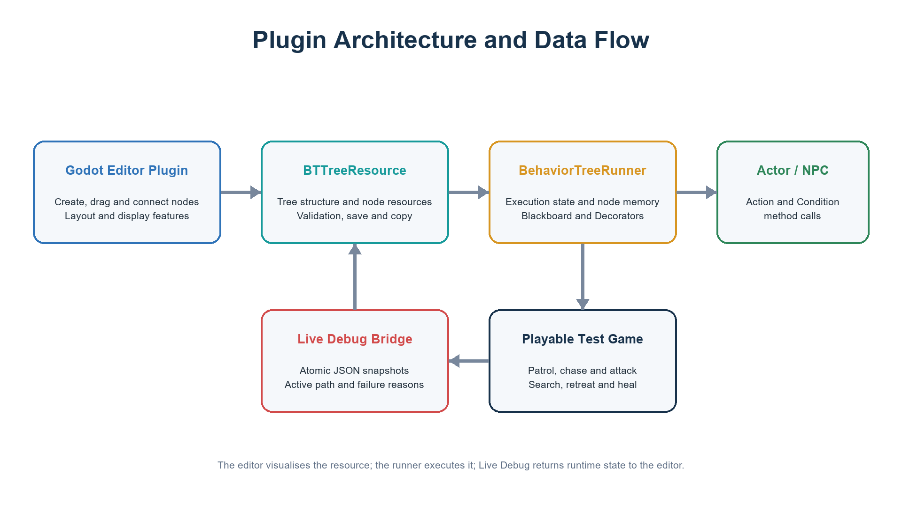
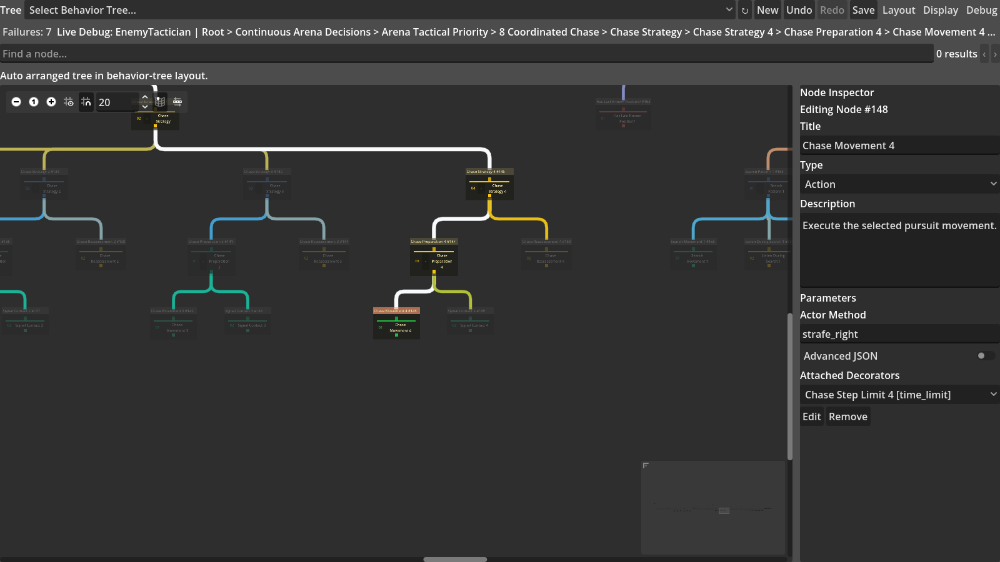
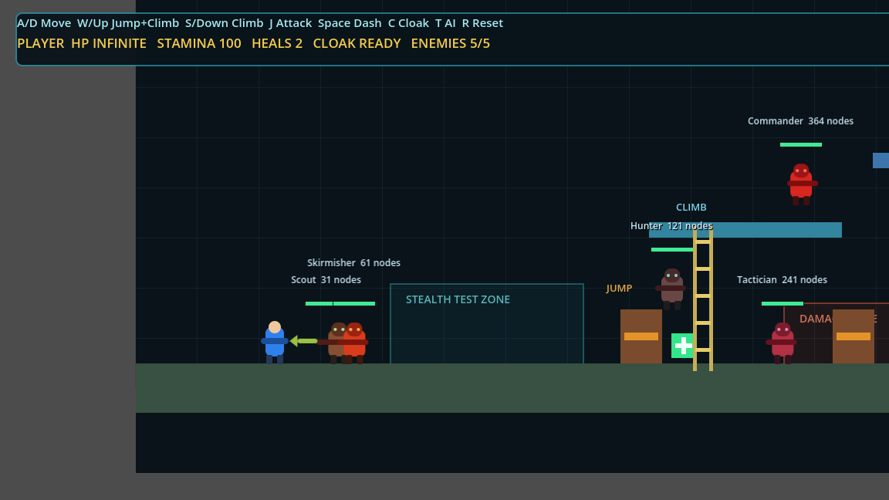
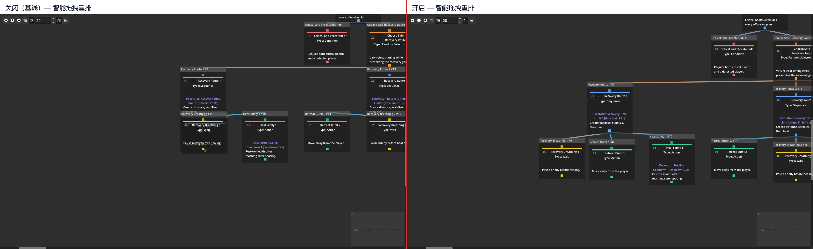
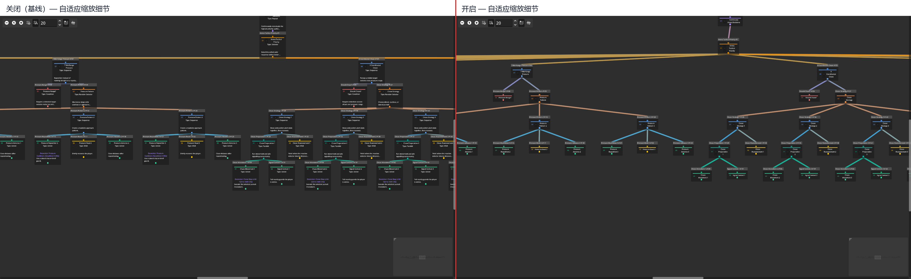
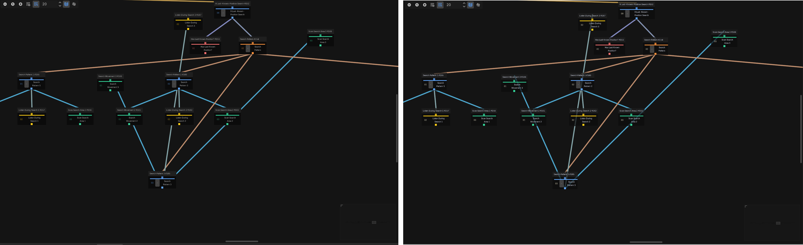
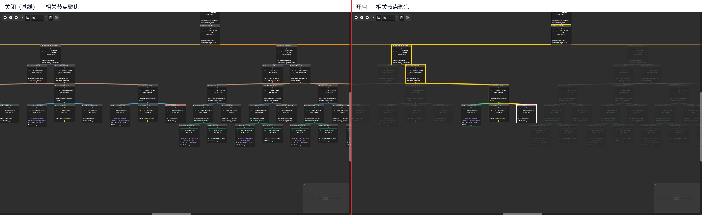
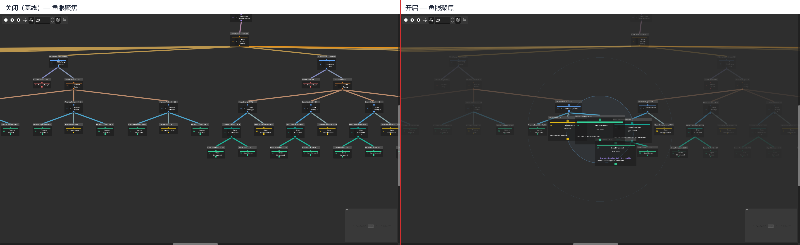

# Acknowledgements

This section is reserved for the author to thank the supervisor, and the people who helped test the software and review the dissertation. The final wording should be completed by the author before submission.

# Declaration

This dissertation is submitted to the University of Warwick as material for my MSc Games Engineering degree. The dissertation was completed by myself and has not been submitted for any other degree. Except for the materials that are clearly cited, the software, test data and analysis described in this dissertation all come from this project.

# Abstract

This project developed a visual behaviour tree plugin for Godot 4.6 and placed the main research focus on the display problems of large behaviour trees. When a traditional behaviour tree editor grows larger, it occupies a large canvas, and dragging, connections and unrelated branches can also interfere with observation at the same time. To deal with these problems, the current project implemented five display optimisation functions: Smart Drag Reflow, Adaptive Zoom Detail, Readable Edge Overlay, Related Node Focus and Fisheye Focus.

To verify the influence of these functions on developers in actual development, the project used five real behaviour trees with different node counts to build a game with a certain level of complexity, and tested it under three common screen sizes. By testing behaviour trees with different node counts and screens with different sizes, the project compared the actual optimisation effect of each improved function. It also introduced the evaluation of an actual game developer for each function.

The results show that Adaptive Zoom Detail has a relatively stable effect across different tree sizes and screen sizes, so it is the most suitable general display optimisation function. Smart Drag Reflow can handle overlap caused by node movement, and Related Node Focus can highlight the structural range of selected nodes. Fisheye Focus is more obvious on small screens and large behaviour trees, but stronger local magnification also increases some node overlap. Readable Edge Overlay can improve line segments blocked by node cards, but it mainly applies to local connection problems.

All function tests met the preset success conditions, and did not change the behaviour tree structure, saved coordinates or sibling execution order. The experiment shows that these functions can improve some measurable display and editing states of large behaviour trees, and also shows that different functions are suitable for different development environments.

Keywords: behaviour tree; Godot; node-link editor; semantic zoom; focus and context; graph layout; game artificial intelligence

# Chapter 1 Introduction

## 1.1 Research background

This project uses behaviour trees to control enemies in a game. A behaviour tree divides decisions into composite nodes, condition nodes and action nodes, so high-level strategy can be edited separately from movement, animation and combat code. For a small prototype, writing all logic in one script can still work. However, after states and interruption conditions increase, the control flow becomes increasingly difficult to check. The hierarchical structure of behaviour trees can reduce this problem, and this is also one of their main uses in game development (Colledanchise and Ögren, 2018; Iovino et al., 2022).

A node-link tree can directly show parent-child relationships, but the wider and deeper the tree becomes, the more canvas it occupies. Behaviour tree cards also show parameters, descriptions, Decorators, blackboard keys and running states, so they usually occupy more space than an ordinary hierarchy that only shows names. When many cards appear on the canvas, developers need to zoom, pan and search frequently, and the current execution path can also be drowned out by unrelated branches. This problem directly affects node location, condition modification and failure checking, not only whether the picture is tidy.

Therefore, this project first completed a Godot plugin that can save, run and debug real NPC decisions, and then used it to test the five display optimisation functions kept in the current version. These display optimisation functions respectively deal with dragging occlusion, information density during zooming, cards blocking connections, the relationship range of selected nodes, and local detail in an overview.

## 1.2 Problem definition and research gap

Existing research deals with large graphs from several directions. Tidy tree layout focuses on hierarchy, order and compactness, while layout adjustment research is more concerned with whether the original position and topology can be retained after overlap is removed (Reingold and Tilford, 1981; Sugiyama et al., 1981; Misue et al., 1995; Dwyer et al., 2006). Semantic zoom reduces displayed content when zooming out, while fisheye views enlarge the focus and keep surrounding structure (Bederson et al., 1996; Furnas, 1986). Interactive emphasis and EdgeLens further deal with related subgraphs and connection occlusion (Ware and Bobrow, 2005; Wong et al., 2003). These works show that large graphs can be improved from layout, information density, focus and connection treatment.

However, these studies do not directly explain how a game behaviour tree editor should combine these methods. A behaviour tree is different from an ordinary directory. Sibling order may decide execution priority, leaf nodes call Actor code, and Decorators may also prevent a branch from running. Therefore, a display optimisation function cannot only make the picture look tidier. It must also preserve execution order, support undo, and avoid breaking blackboard and runtime debugging.

## 1.3 Research aim and question

The aim of this dissertation is to design and evaluate composable large-tree display optimisation on a functionally verified Godot 4.6 visual behaviour tree platform that can drive real NPCs. The research question is: under different behaviour tree node scales and physical screen sizes, can the composable display optimisation proposed by this project improve the measurable display and editing interaction performance of large behaviour trees compared with a traditional baseline display, while keeping the behaviour tree structure and execution semantics unchanged?

The main contributions of this dissertation include three aspects. First, this project implemented a complete Godot 4.6 visual behaviour tree platform, so real game behaviour can be edited, run and debug in the same system. Second, the project designed and implemented five display optimisation functions that can be compared independently for the display problems of large behaviour trees. Finally, the project used five real game behaviour trees and three physical screen sizes for experiments, compared the effects and costs of different display optimisation functions in different environments, and used the results to explain which display optimisation functions are suitable as general functions and which are only suitable for specific use scenarios.

## 1.4 Project objectives and success criteria

The project work is divided into platform construction and research evaluation. Platform construction includes implementing serialisable tree, node, Decorator and typed blackboard resources; implementing the success, failure and running semantics of Root, Sequence, Selector, Reactive Selector, Random Selector, Parallel, Repeat, Wait, Action and Condition; allowing reusable components to assign a tree and Actor to an NPC, and allowing leaf nodes to call Actor methods; and providing creation, connection, disconnection, dragging, box selection, multi-node movement, typed editing, validation, saving, loading, undo and redo.

Before carrying out the display optimisation experiment, it is first necessary to confirm that the basic functions of the behaviour tree plugin are correct. Each type of node can execute as expected, the edited behaviour tree can be saved and reopened correctly, and undo and redo do not damage the tree content. Five playable enemies should respectively load the 31-, 61-, 121-, 241- and 364-node trees. The player has unlimited health, the number of enemies is limited, and the game can end after all enemies are defeated.

The success criteria of the display research are divided into three categories. First, a function must produce the direct change it claims, such as Smart Drag reducing overlap caused by dragging, Adaptive reducing overview card area, and Related Focus dimming unrelated nodes. Second, a function must not change tree topology, Decorator ownership or sibling execution order. Third, after a function is disabled, it must not leave size, opacity, border or temporary layout residue. If the test process has a program error or stops unexpectedly, the test is still counted as failed even if other checks pass.

# Chapter 2 Literature review

## 2.1 Behaviour trees

Earlier behaviour tree research mainly focused on game artificial intelligence. Flórez-Puga et al. (2009) added queries and the reuse of existing behaviours to game behaviour trees, while Lim et al. (2010) used behaviour trees to create agents for the commercial real-time strategy game DEFCON. These studies show that behaviour trees were already used early on to organise game decisions containing multiple conditions and actions, and were not only suitable for simple demonstrations.

After that, related research began to further explain the execution method and theoretical features of behaviour trees. Marzinotto et al. (2014) proposed a unified behaviour tree framework for robot control, and Colledanchise and Ögren (2017, 2018) analysed behaviour trees from the perspectives of hybrid control and modularity. By the time Iovino et al. (2022) conducted their survey, behaviour tree research had already covered game artificial intelligence, robotics, automatic learning, planning and design tools. This development process shows that behaviour trees have gradually developed from a practical tool in games into a more general agent control method.

Before testing display optimisation functions, it is necessary to confirm that the behaviour tree itself can run correctly. Otherwise, it is impossible to judge whether problems in the test come from the display optimisation function or the behaviour tree execution system. In this project, Sequence can remember the current execution position, while Reactive Selector needs to recheck high-priority conditions. Random Selector should keep the same choice during one running period. Repeat and Wait must also clear their memory when restarted. The blackboard is used to share state between perception, conditions and actions, and Decorator is used to restrict or change branch execution without modifying the child node itself. The editor cannot treat node order and Decorator as purely visual information, because they affect execution results.

## 2.2 Node-link trees, hierarchy and scale

Node-link diagrams are suitable for displaying behaviour trees, because connections can directly represent parent-child relationships. The tidy tree layout proposed by Reingold and Tilford (1981) emphasises centred parent nodes, spacing within the same layer and separated subtrees, while Sugiyama et al. (1981) further discuss ordering within layers and node positions. These methods are very suitable for automatically generating a tidy tree, but they do not completely solve the problem of interactive editing, because users still want to drag nodes freely.

Whether a layout is better cannot be judged only by whether the picture is tidy. Purchase (1997) found that edge crossings had a large influence among the tested graph aesthetics. Ware et al. (2002) also showed that path continuity, crossings and branches affect path finding in node-link diagrams. The results of Purchase, Carrington and Allder (2002) further show that only some aesthetic metrics stably affect task performance, and that the semantic domain of the graph can also change the result.

After scale increases, nodes and connections become harder to observe at the same time. Ghoniem et al. (2005) compared node-link diagrams and matrix representations, and explained that results are affected by scale, density and task at the same time. SpaceTree added dynamic layout and selective display to node-link trees, also showing that representation methods and interaction methods need to be evaluated together (Plaisant et al., 2002). For behaviour trees, the node-link method is still the easiest way to express parent-child direction and sibling order.

Node-based interfaces are also used to organise other complex development processes. InstructPipe allows users to generate machine learning workflows and continue modifying them in a node graph (Zhou et al., 2025). Although its research object is not a behaviour tree, it also needs to handle node positions, connection relationships and complex workflow navigation, showing that these problems do not only exist in behaviour tree editors.

Layout design also needs to consider the structural requirements of different domains. Helmke et al. (2024) found that domain experts sometimes prioritise preserving technical structure in graphs instead of always reducing connection crossings or edge length. Behaviour trees also have their own structural requirements, such as parent-child direction and sibling execution order, so automatic layout cannot only pursue smaller occupied area. The systematic review of graph layout evaluation by Di Bartolomeo et al. (2024) also points out that the evaluation of layout algorithms needs to explain data, scale and the metrics used at the same time. This provides methodological support for this dissertation to use real behaviour trees, multiple node scales and several direct metrics.

## 2.3 Local avoidance and position stability

Interactive editing is different from one-time automatic layout. After a user drags a node, if the system rearranges the whole tree, overlap may disappear, but the original position memory will also be broken. Misue et al. (1995) summarise this as the problem of layout adjustment and the mental map. Dwyer et al. (2006) proposed that nodes need to be separated from each other while new positions should stay as close as possible to the original positions. Later research also explained that the original topology still needs to be preserved when constraints are added (Dwyer et al., 2009).

Behaviour tree cards have real width, height, text and labels, so they cannot be treated only as points without area. Gansner and Hu (2010) emphasise that overlap removal should preserve proximity relationships and the original graph shape as much as possible. This study provides direction for Smart Drag: the system should deal with new overlap, but should not take over the whole canvas because of it.

This project does not directly copy one complete algorithm. Instead, it limits the starting distance, refresh frequency, propagation layers and maximum affected range, and then uses parent-child and sibling relationships to decide which nodes move together. The system only preserves the parent-above-child relationship that was already true before dragging.

The experiment by Archambault and Purchase (2013) shows that whether preserving node positions is helpful depends on the specific task. Therefore, this project requires relayout to maintain relative relationships between nodes as much as possible and reduce unnecessary position changes, but it does not use this point alone to claim that the function improves editing experience.

## 2.4 Semantic zoom and focus-context

Semantic zoom and fisheye are both used to handle a large amount of information on a limited canvas, but they use different methods. Semantic zoom changes the displayed content according to zoom level, rather than only scaling all content proportionally. Pad++ showed that interface content can change with zoom level (Bederson et al., 1996), and Summers et al. (2003) also compared different semantic zoom methods in program visualisation. Hiding secondary fields when zoomed out and restoring details after zooming in is the main feature of this type of method.

Fisheye belongs to focus and context methods. It enlarges the area currently concerned by the user while keeping the surrounding structure. Furnas (1986) proposed using degree of interest to distinguish focus and surrounding content, and Sarkar and Brown (1994) applied a similar idea to graphical fisheye. Wang et al. (2019) further studied the structural distortion that fisheye magnification may cause in large graphs and proposed a structure-aware method.

These display methods are not necessarily suitable for all tasks. The review by Cockburn et al. (2009) points out that overview, zooming and focus-context methods each have their own advantages and costs. Büring et al. (2006) also did not find that fisheye must shorten task time in an experiment on small screens, although more participants preferred this display method. In addition, Jakobsen and Hornbæk (2013) explain that physical screen size, information space and display scale jointly affect interaction results.

These studies provide design support for semantic zoom, fisheye and screen size, but they cannot directly explain their effect in a large behaviour tree editor. Therefore, this dissertation treats semantic zoom and fisheye as two different functions and compares them separately under different tree sizes and screen sizes.

## 2.5 Relationship emphasis and connection occlusion

Large graphs do not necessarily need to hide nodes first. Ware and Bobrow (2005) used interactive emphasis to help users query node-link diagrams, while van Ham and Perer (2009) retained context from the target of interest. For behaviour trees, the advantage of this type of method is that it can keep the original spatial position while reducing the visual strength of unrelated branches. Therefore, Related Node Focus in this project uses borders and opacity to distinguish selected nodes, ancestors, descendants, sibling nodes and unrelated branches.

Connections may also be blocked by nodes or other edges. EdgeLens by Wong et al. (2003) bends connections near the focus to leave space for crowded areas, while hierarchical edge bundles by Holten (2006) organise a large number of connections along a hierarchy. The experiment by McGee and Dingliana (2012) explains that bundling may help observe overall clusters, but may reduce the speed and accuracy of tracing a single path. Reducing visual clutter therefore does not mean that every connection task becomes easier.

The studies above show that layout adjustment, semantic zoom, fisheye, highlighting and connection treatment can all reduce some display problems of large graphs. However, the graph types, tasks and evaluation conditions used in these studies are different, so they cannot directly explain the actual effect of these methods in a large behaviour tree editor. Behaviour trees also need to preserve parent-child structure, sibling execution order and node information, which makes them different from ordinary node graphs. Based on this research gap, this dissertation compares these display optimisation functions under different tree sizes and screen sizes, and checks their direct changes, suitable environments and main costs.

# Chapter 3 Research method

## 3.1 Research strategy

This research first confirms that the Godot 4.6 behaviour tree plugin can be edited and run normally, and then tests the display optimisation functions used for large behaviour trees. The research focus is how much effect these display optimisation functions can produce under different conditions, and which conditions they are more suitable for.

The test is divided into two parts. The first part compares the actual effect of single or combined display optimisation functions under different conditions. Under the same behaviour tree, screen size and operation target, the program records the results before and after the function is enabled, so as to judge whether each display optimisation function reaches its expected effect and how its effect differs under different node scales and screen sizes. The second part is that the project developer directly uses these display optimisation functions and records what each function helps with, what problems it has, and under what conditions it is suitable, according to the same set of questions. Since this part only involves the project developer, it can only be used as a supplement to usage experience and cannot represent the opinions of other game developers.

## 3.2 Experimental behaviour trees

The experiment uses five real behaviour trees from the current playable game, with node counts of 31, 61, 121, 241 and 364. They represent different scales and complexity levels from small to large.

Table 3.1 Behaviour tree sizes and main game behaviours used in the experiment

| Node count | Main game behaviours included in the tree |
| --- | --- |
| 31 | Evade, directional melee, direct chase, return to guard position, patrol and idle |
| 61 | Low-health retreat and healing, evade, directional melee, jump over obstacles, mid-range movement, chase, search last known player position, return and patrol |
| 121 | Retreat and healing, defence, melee, jump over obstacles, ladder climbing, ranged attack, mid-range movement, chase, search, return, patrol and idle |
| 241 | Includes the main behaviours of the 121-node tree, and provides more recovery, defence, melee, ranged attack, chase, search, patrol and idle options |
| 364 | Includes the above main behaviours, and adds defensive counterattack, continuous melee, combined obstacle traversal, moving shooting and multi-route chase tactical combinations |

These behaviour trees gradually increase from simpler decisions to complex decisions with many branches. They can be used to observe whether display optimisation functions produce different effects as the tree becomes larger. The experiment uses the same method on each tree, and compares the screen changes before and after enabling the display optimisation functions. The five trees are not only different in size, but also different in internal structure. Therefore, the experiment can compare their actual display effect, but cannot simply attribute every result difference to the increase in node count. However, they can reflect the actual performance of the plugin when real game behaviour trees expand from small to large.

## 3.3 Screen size configuration

The experiment sets three screen sizes, approximately 16 inches, 27 inches and 32 inches. In addition to the behaviour tree canvas, the plugin window also contains toolbars, menus and other interface content, so the area that can actually display and edit nodes is smaller. When judging whether a node is inside the screen, the experiment uses the actual editing area.

Table 3.2 Three screen sizes and their corresponding editing areas

| Screen condition | Physical size | Screen size | Plugin window size | Actual editing area |
| --- | --- | --- | --- | --- |
| Small screen | 34 x 22 cm | 15.94 inches | 1190 x 770 | 858 x 642 |
| Medium screen | 60 x 33 cm | 26.96 inches | 2100 x 1155 | 1768 x 1027 |
| Large screen | 70 x 39 cm | 31.55 inches | 2450 x 1365 | 2118 x 1237 |

Screens of different sizes can display different numbers of nodes. On a small screen, a large behaviour tree needs to be scaled down further to see the whole structure. On a larger screen, more nodes can be displayed at the same time, but a large behaviour tree may still exceed the editing area.

The experiment uses the same behaviour trees and test operations under the three screen conditions, in order to compare whether screen size affects the effect of display optimisation functions.

## 3.4 Experimental method for display optimisation functions

The experiment tests each display optimisation function separately. Each test uses the same behaviour tree, the same screen condition and the same test object. It first records the result when the function is disabled, and then records the result after the function is enabled. This can directly show the change brought by the function.

Before each test starts, the program restores the canvas to the same initial state, so that node movement, opacity or zoom changes caused by the previous test do not affect the next result. After a function is enabled, the program waits for the screen to finish updating and then records data.

In general, the program first orders the nodes from left to right according to their horizontal position on the canvas, and then selects three nodes at about 22%, 50% and 78% positions. These three nodes are roughly located on the left, middle and right of the behaviour tree. The root node and nodes that cannot produce an effective focus effect are not selected. The same target nodes are used for all screen conditions and for the before-and-after comparison of each function.

Table 3.3 Experimental method and comparison content for the display optimisation functions

| Function | Experimental method | Comparison content |
| --- | --- | --- |
| Smart Drag Reflow | The test first selects two adjacent child nodes under the same parent, and one of them is a leaf node with no children. The program drags the leaf node near the position of the other node to actively create node occlusion. When the function is disabled, the occlusion is kept. When the function is enabled, surrounding nodes are allowed to avoid it automatically. Both tests use exactly the same drag path. | Compare whether occlusion is removed, how many surrounding nodes move, how far these nodes move, and whether distant branches are affected. |
| Adaptive Zoom Detail | Under the same overview zoom ratio, the fixed target node is moved to the centre of the screen. When the function is disabled, all nodes still show full cards. After the function is enabled, nodes reduce secondary text and shrink cards according to the zoom ratio. | Compare the total area occupied by all nodes, the number of displayed text fields, the number of nodes fully displayed in the editing area, and whether the problem of a parent node moving below a child node appears. |
| Readable Edge Overlay | Three parent-child connections that are easily blocked by other nodes are selected from the behaviour tree. If the original layout does not contain a suitable case, the program temporarily moves a node card that is not at either end of the connection to form the same occlusion scene. When the function is disabled, the card background is fully opaque. After it is enabled, the background opacity is reduced to 72%, but the text remains opaque. | Compare whether the connection blocked by a node can be displayed, while checking whether node text remains clear and whether the original route of the connection changes. |
| Related Node Focus | The first two test cases each select one fixed node, and the third case selects two fixed nodes at the same time. When the function is disabled, only the normal selected state is kept. After it is enabled, selected nodes use a white border, parent and child nodes use a yellow border, sibling nodes use a green border, and other nodes and connections are dimmed. | Compare whether unrelated nodes are correctly dimmed, whether related nodes use the correct borders, whether the number of prominent nodes on the screen is reduced, and whether node positions remain unchanged. |
| Fisheye Focus | Fisheye is mainly used for zoomed-out behaviour trees, so Adaptive Zoom is kept both when Fisheye is disabled and enabled. The program fixes the mouse position on the target node. The disabled state does not enlarge nodes, while the enabled state enlarges the target and nearby nodes. | Compare how much the target node is enlarged, how much text information is restored, whether distant nodes shrink and dim, and whether new node occlusion appears after magnification. |

The first four functions do not enable other experimental functions in the disabled state. Fisheye Focus is the only exception, because it needs to be used in a zoomed-out overview screen. Therefore, the fisheye experiment compares the difference between "Adaptive Zoom only" and "Adaptive Zoom plus Fisheye Focus".

Each display optimisation function is compared across five behaviour trees, three screen sizes and three fixed test cases. Therefore, each display optimisation function contains 45 before-and-after comparisons. All display optimisation functions together form 225 comparisons. Since each comparison contains one disabled record and one enabled record, there are 450 experimental records in total.

## 3.5 Data processing and judgement criteria

During data processing, disabled and enabled records with the same screen size, behaviour tree size and test case are paired, and the difference and change ratio before and after enabling the function are calculated. The results are organised by display optimisation function, behaviour tree size and screen size, and report the mean, median, change range and number of cases that meet the preset criteria.

Table 3.4 Main metrics and success criteria for the display optimisation functions

| Function | Main metrics | Experimental success criteria |
| --- | --- | --- |
| Smart Drag Reflow | Overlap area, number of automatically moved nodes and movement range | Remove at least 95% of the overlap area, and move no more than 24 other nodes automatically |
| Adaptive Zoom Detail | Total node area, number of displayed fields and parent-child node position | Node area or field count is reduced, and parent-child vertical relationship errors must not increase |
| Readable Edge Overlay | Display of occluded connections, text display and connection route | The occluded connection can be partly displayed, node text remains clear, and the original connection route is unchanged |
| Related Node Focus | Dimming ratio of unrelated nodes and display state of related nodes | All unrelated nodes are correctly dimmed, and selected and related nodes remain clear |
| Fisheye Focus | Target node width, displayed fields and local adjustment range | The target node increases by at least 5% and shows more fields, and automatic adjustment does not exceed 8 nearby nodes |

All experiments also need to ensure that the behaviour tree itself is not affected by display optimisation functions, including node count, connection relationship, execution order and saved position. After a function is disabled, node size, opacity, border and temporary position changes must also recover. The experiment must not have errors or abnormal stops while running.

Fisheye Focus is mainly used to view local content, so it does not require the whole canvas to have no overlap at all times. The new overlap it causes is recorded and explained separately in the results and discussion.

## 3.6 Structured developer evaluation

After the automated experiment is completed, the project developer directly uses these display optimisation functions in the Godot editor. Since the evaluator is also the developer who uses behaviour trees to make the game, the evaluation is carried out from the perspective of actually viewing and editing behaviour trees.

The evaluation covers the five behaviour trees and three screen sizes. In each condition, the developer completes viewing or editing operations related to the function and records feedback after actual use.

The evaluation content includes:

- what operation the function mainly helps complete;

- whether it is easier to view or edit the behaviour tree after enabling it;

- what problems appear during use;

- what behaviour tree size the function is more suitable for;

- what screen size the function is more suitable for;

These feedback records are used together with the automated experiment data. The automated experiment explains what changes happened on the screen, while the developer evaluation explains whether these changes are helpful in actual use and what usage problems they may bring. Finally, the results of both parts are used to judge what kind of use environment each function is more suitable for.

## 3.7 Plugin function validation

Before carrying out the display experiment, the basic functions of the behaviour tree plugin need to be validated. The validation content includes whether nodes can execute correctly, whether node creation, connection and editing work normally, whether behaviour trees can be saved and reloaded correctly, and whether behaviour trees can control enemies in the game to complete the planned behaviours. This validation is only used to confirm that the experimental platform works normally.

# Chapter 4 System design and implementation

## 4.1 Overall architecture

The system consists of five parts: editor plugin, resource model, execution system, debug bridge and test game. The editor plugin runs inside the Godot editor and is responsible for displaying behaviour tree resources as an operable GraphEdit canvas. The resource model stores nodes, parent-child relationships, Decorators, blackboard Schema and node coordinates. The execution system reads the same resource and passes Tick results to the game Actor. The debug bridge sends the current state, failure reasons and blackboard values back to the editor.

This division allows the same tree to be used for editing, saving, automated testing and game running. Display optimisation functions only modify temporary card size, opacity, border or canvas offset, and do not rewrite node types or connections. The new coordinates of nodes that the user actually drags and releases are saved normally, and can be undone or redone. Other cards moved automatically for avoidance are not written back to the resource.

## 4.2 Resource model and structural validation

The behaviour tree resource stores the root node and the node collection. Each node has a stable identity, type, editor coordinate, parameters and child node references. Decorators are attached to owner nodes instead of being separate canvas cards. Blackboard Schema defines key names, types and default values. Action and Condition select methods, keys, comparison operators and values through typed controls.

Validation before saving rejects multiple roots, cycles, disconnected illegal references, wrong child counts, invalid Decorator ownership and blackboard keys that do not match the Schema. After loading, node cards and connections are rebuilt. Sibling nodes are sorted from left to right according to the horizontal coordinate, and this order affects the execution priority of Sequence, Selector and other ordered composite nodes. Therefore, display relayout cannot change resource horizontal coordinates or sibling execution order.

## 4.3 Execution system and node semantics

Each Tick of the execution system returns SUCCESS, FAILURE or RUNNING. Root passes the result to its only child. Sequence executes from left to right and stops at the child that fails or is running. Selector stops at the child that succeeds or is running. Reactive Selector rechecks high-priority branches every time. Random Selector keeps the selected child during one running period. Parallel counts success and failure according to configuration. Repeat controls repeated counts or infinite repetition. Wait records elapsed time. Action calls Actor methods. Condition checks Actor methods or blackboard values.

Table 4.1 Main semantics of the current execution nodes

| Node | Main responsibility | Runtime memory that needs to be kept |
| --- | --- | --- |
| Root | Enter the whole tree | None |
| Sequence / Selector | Combine results according to sibling order | Current running child |
| Reactive Selector | Recheck from high priority every time | Reset old branch when pre-empted |
| Random Selector | Randomly select child | Current selection and random state |
| Parallel | Evaluate multiple children at the same time | State of each child |
| Repeat / Wait | Repeat or wait | Count or elapsed time |
| Action / Condition | Call Actor or read state | Decided by the specific task |

Decorators apply blackboard conditions, cooldown, time limits, result inversion, forced results or repetition rules before and after the owner node executes. When a branch is interrupted, running nodes and Decorators are both reset, so that the next entry does not inherit an incorrect state.

## 4.4 Editing workflow and fixed basic display

The user creates nodes by right-clicking on the blank canvas, builds parent-child relationships through ports, and edits parameters with typed fields in the Inspector. Nodes can be deleted, disconnected, box-selected and moved as a group. Clicking a node clears the old single selection and selects the current node. Box selection or modifier-key operation is used to create multi-selection. Holding down on a blank area pans the view. All structural changes, parameter changes and user dragging enter Undo/Redo, and can be saved as .tres and reloaded.

## 4.5 Live Debug and blackboard checking

When the game is running, the debug bridge records active nodes, node return values, failure reasons and blackboard snapshots for the current Actor. The editor displays the active path on the original behaviour tree canvas and shows the current value and type of blackboard keys in the sidebar. Failure explanations are directly marked near the failed node, such as condition not satisfied, method not found, or Decorator blocking a branch.

## 4.6 Display optimisation functions

### 4.6.1 Smart Drag Reflow

Smart Drag Reflow is used to solve new occlusion caused by "one node being dragged onto another node". The system starts only after accumulated movement reaches 10 screen pixels, and then updates once every 8 screen pixels of movement. Clicking and very small corrections do not trigger relayout. During dragging, the system directly updates temporary avoidance, so the user can see other cards move away before releasing the mouse.

The algorithm first finds the local structure colliding with the dragged card, and then moves related parent nodes, sibling nodes and children within continuous 2 to 4 layers as a group. At most 24 cards are processed at one time, and the number of collision propagations is limited. This reduces the situation where the whole tree suddenly becomes arranged into regular rows. It only maintains the parent-above-child relationship that was already true before dragging. If the user deliberately placed a group of nodes upside down, the system does not force correction. During single-node dragging, Smart Drag automatically moves nearby cards to reduce occlusion caused by dragging. After the mouse is released, the new position of the dragged node is saved. The position changes of other cards for avoidance only affect the screen display and do not modify the coordinates saved in the behaviour tree. After this function is disabled, these cards return to their original saved positions. When the canvas is rebuilt, the system recalculates whether avoidance is needed according to the currently saved coordinates. After multiple nodes are selected by box selection, the selected nodes move and save as one whole, so their original relative relationship is preserved.

### 4.6.2 Adaptive Zoom Detail

Adaptive Zoom Detail connects card size and field count to GraphEdit zoom at the same time. When zoom is below 0.62, compact cards of about 188 x 88 are used, and only low detail needed to identify structure is kept. Between 0.62 and 0.88, normal size and medium fields are restored. After reaching 0.88, normal cards of about 250 x 150 and full fields are displayed.

After card size changes, the system rechecks collision on the whole canvas and uses temporary offsets to keep the original relative structure as much as possible. It does not permanently change the tree into another layout, and it is not the local solver of Smart Drag. After zooming in, fields and normal size recover, and disabling the function also clears adaptive size and offset.

This function exchanges information density for overview space. Its purpose is not to keep all text readable after zooming out, but to let the user first see the tree shape and branch range, and then zoom in to check parameters when needed. The later experiment records area reduction, field reduction, changes in cards fully inside the viewport, and hierarchy relationships.

### 4.6.3 Readable Edge Overlay

Readable Edge Overlay handles local cases where connections are blocked by non-endpoint cards. After it is enabled, the background opacity of supported cards is multiplied by 0.72, so the straight line behind the card can be partly shown. Text, icons and controls use fixed foreground colours and add a 2 px dark outline, so the revealed connection does not pass directly through glyphs. When disabled, the original background, text style and modulation colour are restored.

### 4.6.4 Related Node Focus

Related Node Focus calculates structural relationships after the user selects nodes. The currently selected nodes use a white border. All their ancestors and descendants use a yellow border. Other nodes under the same parent use a green border. All remaining nodes and connections are clearly dimmed.

When the user needs to select multiple nodes, they can drag a selection box on the blank area, and then move or focus them together. Multi-selection focus merges the ancestors, descendants and sibling relationships of all selected nodes. After the selection is cleared, borders and opacity all recover.

### 4.6.5 Fisheye Focus

Fisheye Focus is mainly used in an already zoomed-out overview. It continuously changes size according to the distance from the node to the pointer centre. The node closest to the centre is enlarged most clearly, and nearby nodes also receive smaller magnification. Nodes outside the main range shrink and dim. The purpose is to let the user see a local area clearly without leaving the overview.

Fisheye only allows the nearest 8 cards to participate in limited local avoidance. Other nodes do not push the whole canvas because the focus becomes larger. The system uses stable reference positions to calculate distance, and buckets focus position and card size, so slight mouse shaking does not relayout every frame. During mouse-wheel zooming, fisheye pauses briefly and then resumes.

This design prioritises keeping the focus and nearby nodes clear, instead of ensuring that the whole tree has no overlap. Stronger magnification may block nearby cards, so the experiment records target magnification and also separately reports new overlap and hierarchy occlusion.

## 4.7 Test game

The test game assigns the five behaviour trees of different sizes to five enemies. The player needs to use movement, jumping and attack to defeat these enemies one by one. The scene contains ranged attack, melee, obstacles, jumping routes, ladders, healing items and hazard areas. Enemies can patrol, detect the player, chase, search the last position where the player appeared, traverse obstacles, climb, retreat and recover.

Smaller trees use fewer branches to complete basic behaviours, while larger trees take on more combat and environmental responses. After all five enemies are defeated, the game enters the end state.

# Chapter 5 Experimental results

## 5.1 Plugin function and playable game validation

The automated tests include execution system functions, editor operations, basic game running, complex enemy behaviour and the complete game flow. All tests completed successfully, and no error or program crash appeared during the process. The specific number of each group is shown in Table 5.1.

Table 5.1 Plugin function and playable game validation results for the current version

| Validation group | Passed / total | Main scope |
| --- | --- | --- |
| Execution system function tests | 154/154 | Node execution, Decorators, blackboard, and behaviour tree saving and reloading |
| Editor function tests | 337/337 | Creating and editing nodes, selecting and dragging nodes, and enabling and disabling display optimisation functions |
| Basic game running tests | 40/40 | Game characters can receive behaviour tree actions, and the basic scene can run normally |
| Complex game behaviour tests | 34/34 | Enemy combat, movement, healing, and interaction with obstacles and ladders |
| Complete game flow tests | 215/215 | Five trees of different sizes can load, enemies can be defeated, and the game can be completed |
| Total | 780/780 | All automated checks in this round |

The five behaviour trees control the corresponding enemies, and the game can be completed. Therefore, the later display results are based on real resources that are correctly loaded and executed.

## 5.2 Formal display data and safety checks

The formal experiment tests each display optimisation function separately. Each function compares the changes before and after enabling it under five behaviour trees of different sizes, three screen sizes and three fixed test cases, forming 45 comparisons. The five display optimisation functions together form 225 comparisons. Table 5.2 summarises the overall effect and main problem of each function under these different conditions.

Table 5.2 Main results before and after enabling the display optimisation functions

| Display optimisation function | Main experimental result | Indicated effect | Main problem |
| --- | --- | --- | --- |
| Smart Drag Reflow | Drag overlap was removed in all 45 tests; on average 2.40 surrounding cards moved, with an average total movement distance of 375.90 px | It can handle node occlusion caused by dragging | It moves a small number of surrounding cards, and the user needs to accept local position changes |
| Adaptive Zoom Detail | Card area was reduced by 45.14% on average, and fields were reduced by 43.61% on average | It can reduce screen occupation when zoomed out | Some text is temporarily hidden and needs zooming in to check details |
| Readable Edge Overlay | On average, 3.62 visible connections in each test screen were blocked by non-endpoint cards; after enabling it, card background was adjusted to 72% opacity | Connections blocked by cards can be partly displayed | It only improves local connection visibility and does not reduce overall crowding |
| Related Node Focus | Fully bright candidate nodes were reduced by 58.51% on average, and unrelated nodes were uniformly dimmed | It can highlight the selected node and its related structure | It is not convenient for comparing unrelated branches at the same time |
| Fisheye Focus | Average target node width increased from 119.43 px to 224.55 px | It can temporarily view local nodes after zooming out | Some tests produced new local overlap and hierarchy occlusion |

## 5.3 Before-and-after comparison of display optimisation functions

### 5.3.1 Smart Drag Reflow

Smart Drag Reflow is used to handle new occlusion caused when the user drags a node. In the experiment, the program drags the same leaf node near another node to actively create occlusion. After the function is enabled, surrounding nodes avoid it without changing the behaviour tree logic.

Figure 5.1 compares the screen before and after the function is enabled when a node is dragged to the same position. After enabling it, the system moves surrounding nodes to avoid overlap. Sometimes, in order to keep the original tree-shaped structure, farther nodes in the same group also move together. Therefore, Smart Reflow limits the affected range, but it does not necessarily only move the node closest to the drag position.

### 5.3.2 Adaptive Zoom Detail

After Adaptive is enabled, both card area and field count clearly decrease. In some conditions, the number of cards fully inside the viewport also increases. In other conditions, even though the number of full cards does not increase, canvas occupation is still reduced. This result matches the expected function.

In Figure 5.2, the enabled state keeps node identity and structure information, but no longer shows all parameters. It clearly reduces the space occupied by nodes in the viewport, which allows the user to place more nodes under a limited viewport size.

### 5.3.3 Readable Edge Overlay

After Overlay is enabled, connections that pass through card backgrounds can be partly shown. The connection route does not change, and the text foreground and outline remain opaque.

### 5.3.4 Related Node Focus

After Related Focus is enabled, unrelated nodes in the experiment are all correctly dimmed, and the fully bright candidates in the viewport are clearly reduced. At the same time, node coordinates, card area and connection routes do not change. The user can still see the position of the whole tree, but content unrelated to the current selection is no longer equally prominent.

### 5.3.5 Fisheye Focus

Fisheye enlarges the target card and shows more fields at the same time, while cards farther from the focus shrink and dim. Figure 5.5 shows the actual effect in the same overview.

## 5.4 Results under different node scales

Table 5.3 Main display changes under five behaviour tree sizes

| Resource nodes | Adaptive area reduction | Related fully bright candidate reduction | Fisheye width increase | Smart average moved nodes | Smart average total movement distance | Overlay natural occluded-edge ratio |
| --- | --- | --- | --- | --- | --- | --- |
| 31 | 33.46% | 35.41% | 37.04% | 2.67 | 441.15 px | 0.1052 |
| 61 | 33.58% | 57.91% | 54.23% | 1.67 | 284.06 px | 0.1869 |
| 121 | 46.07% | 68.74% | 114.94% | 1.67 | 284.06 px | 0.1918 |
| 241 | 57.93% | 71.38% | 226.33% | 3.00 | 435.11 px | 0.0218 |
| 364 | 54.67% | 59.10% | 300.43% | 3.00 | 435.11 px | 0.3677 |

The relative increase of Fisheye becomes most obvious as node scale grows. The reason is not that nodes become infinitely larger after enabling it, but that the target node in a large tree has already been scaled down more in the disabled overview state. Smart removed drag overlap under all scales, but the number of moved nodes does not increase monotonically, because it depends on the local branch near the drag point. Overlay has the highest natural occlusion ratio in the 364-node tree and the lowest in the 241-node tree, which also shows that it is mainly affected by the current viewport and specific connection route, rather than only by total node count.

## 5.5 Results under different screen sizes

Table 5.4 Main display changes under three physical size configurations

| Screen configuration | Adaptive area reduction | Related fully bright candidate reduction | Fisheye width increase | Smart average moved nodes | Smart average total movement distance | Overlay natural occluded-edge ratio |
| --- | --- | --- | --- | --- | --- | --- |
| 15.94 in | 57.14% | 54.01% | 258.98% | 2.40 | 375.90 px | 0.1682 |
| 26.96 in | 42.61% | 59.61% | 104.90% | 2.40 | 375.90 px | 0.1735 |
| 31.55 in | 35.67% | 61.90% | 75.90% | 2.40 | 375.90 px | 0.1825 |

Table 5.3 shows that Adaptive is more obvious in trees above 121 nodes, because large trees need to reduce card area more in the overview. Related gradually becomes stronger from 61 to 241 nodes, showing that after the tree becomes more complex, unrelated branches do interfere more easily with the current selection. Related in the 364-node tree is slightly lower than in the 241-node tree, mainly because the fixed target is in a different branch, and the ratio of related and unrelated nodes on the screen is also different.

Related has a higher ratio on medium and large screens. The reason is that the larger the screen is, the more branches can originally be displayed at the same time, including more content unrelated to the current selection. Related does not move these nodes, but dims unrelated content, so it is more suitable for using the global space of a large screen. The average number of moved nodes for Smart is the same under the three screens, showing that avoidance in the current test is mainly decided by the drag position. The natural occlusion ratio of Overlay rises slightly with screen size, because a larger screen can show more connections and is also more likely to show some lines passing through cards.

## 5.6 Structured developer evaluation

Besides automated data, this project also evaluated each display optimisation function in actual use according to fixed questions. The evaluation questions include: what operation the function mainly helps complete, whether it is easier to view or edit the behaviour tree after enabling it, what problems appear during use, what behaviour tree size the function is more suitable for, and what screen size the function is more suitable for. Table 5.5 records the corresponding results.

Table 5.5 Structured developer evaluation results

| Display optimisation function | Main helped operation | Viewing or editing help | Problems during use | Suitable tree size | Suitable screen size |
| --- | --- | --- | --- | --- | --- |
| Smart Drag Reflow | Dragging nodes and arranging local branches to avoid card overlap after movement | When editing in dense node areas, it effectively reduces the time spent adjusting other nodes because of overlap. | The avoidance function for surrounding nodes is not stable enough. Sometimes relayout causes surrounding nodes to move a long distance, so the user needs to remember surrounding node positions again. | Medium and large behaviour trees are more likely to have dense nodes, so this function fits them better. | On a large screen, more nodes can be displayed, so the user can immediately observe the position changes of other nodes caused by automatic relayout, making it easier to build new memory. |
| Adaptive Zoom Detail | Reducing card area and field count when zooming out, making it easier to view the whole structure first | After zooming out, because card area is reduced, the structure of the whole tree can be observed more clearly. | After zooming out, some parameters are hidden, so the user may need to zoom in and out repeatedly when observing the whole structure and adjusting local parts. | Small behaviour trees have fewer nodes, so they can still be observed clearly after zooming out. This may make the function have a negative effect on small behaviour trees because it hides some information, but it performs better on large behaviour trees. | It has an obvious improvement on small screens with limited viewport resources, and is suitable for users to observe the overall tree structure. |
| Readable Edge Overlay | Viewing parent-child connections that pass through card backgrounds and reducing the case where lines are completely blocked by cards | It helps show logical relationships better in complex behaviour trees. | Although it shows occluded connections, this kind of occluded connection itself is not suitable for laying out and understanding logic. Overall, it is less useful than using a more reasonable node layout. | It is more suitable for trees with dense connections or obvious local occlusion. | Medium and large screens can show more lines, which makes this function more effective on medium and large screens. |
| Related Node Focus | Highlighting the parent nodes, child nodes and sibling nodes after selecting a node | It is intuitive for structural checking and can push unrelated branches into the background, which is suitable for adjusting a specific branch. | The definition of related branches is relatively narrow. It only highlights all parent nodes and child nodes related to the selected node and its own sibling nodes. In a complex behaviour tree, if multiple branches need to be considered at the same time, it may not show a good effect. | It is most useful for behaviour trees that are large in scale but whose branches are not strongly related to each other. Overall, it is suitable for large behaviour trees. | Since this focus function mainly highlights the branch where the selected node is located, when the tree is taller, a large screen can show the whole branch better, which better matches the function's purpose of quickly handling one branch. |
| Fisheye Focus | Temporarily enlarging target nodes near the mouse in a zoomed-out overview | It can help view local nodes clearly, but it is more suitable as a temporary viewing tool. It mainly solves the information loss caused by Adaptive Zoom Detail. | It brings local overlap. Because fisheye magnification and automatic layout to avoid overlap can cause frequent and strong relayout around it, although these layouts are temporary and recover after the function is disabled, this makes the function only suitable for temporarily viewing local information. It should be disabled when understanding the whole structure. | It is more suitable for large trees to observe some local content. Small trees generally do not need this function because of their scale. | Small screens need this function more. It can greatly compensate for editing and understanding problems caused by insufficient viewport size. |

Although these five functions have different suitable spaces, overall Smart Drag Reflow, Adaptive Zoom Detail, Readable Edge Overlay and Related Node Focus are all suitable for being enabled together for a long time. They generally do not produce very serious problems and can improve the user's situation. Fisheye Focus is only suitable for temporarily viewing part of an area, and it is better to disable it when editing the behaviour tree.

# Chapter 6 Discussion

## 6.1 Platform correctness

## 6.2 Explanation of the effect of display optimisation

### 6.2.1 Optimisation effect under different complex behaviour tree sizes

Small trees can already keep relatively large cards, so these display optimisation functions are not equally necessary. Table 5.3 shows that the changes of Adaptive, Related and Fisheye are relatively limited in small trees. Smart still has a direct effect, because one mistaken drag can still cause occlusion, but small trees usually do not need to use Fisheye all the time.

After the tree becomes larger, card density and unrelated branches gradually become the main problems. Adaptive first reduces the space occupied by the whole tree in the overview, and Related then makes the selected structure stand out from other branches. The two functions respectively deal with the problems of a too-full canvas and unclear related structure. This is why they are more valuable in medium and large trees.

Fisheye has the most obvious local change in the two largest trees. When Fisheye is disabled, the target has already been scaled very small in the overview. After it is enabled, it recovers to a similar readable width. However, the denser the tree is, the easier the enlarged card blocks nearby content. Therefore, Fisheye is suitable for solving the problem of temporarily seeing a local part clearly.

The effects of Smart and Overlay depend more on local events than on total node count. Smart handles the collision caused by the current drag, and Overlay only has an obvious effect when a line passes through a card. Therefore, even if a tree is large, it cannot be assumed that every drag or every connection will receive the same help. The key lies in node density and occlusion relationships.

### 6.2.2 Optimisation effect under different physical screen sizes

The screen results show that small screens and large screens need different help. Cards in a small-screen overview are more easily compressed very small, so the relative effects of Adaptive and Fisheye are the most obvious. Adaptive first reduces global occupation, and Fisheye then restores the current local part. They cannot turn a small screen into a large screen, but they can reduce the space limitation when viewing large trees on a small screen.

Large screens can already display more content at the same time, so further shrinking cards or enlarging a single target has a smaller relative change than on small screens. Related Focus has more advantage here, because it does not lose the global position already displayed by the large screen, and only dims unrelated branches. For large screens, this is more suitable for structural checking than continuing to compress all nodes.

Fisheye also shows a direct trade-off. The local recovery on small screens is the most obvious, and new occlusion is also the most common. After the screen becomes larger, the focus is already clearer, and the screen change caused by Fisheye becomes milder. A more reasonable use is to briefly inspect the target in a small-screen overview and then exit Fisheye, rather than treating it as the main layout all the time.

Smart and Overlay do not show obvious screen differences in the current experiment, because they use the same local operation.

### 6.2.3 Value of each function

From the actual use of this project, if only one function can be chosen to remain enabled, Adaptive is the most suitable. It works continuously when browsing the whole tree, and it can recover full cards after being disabled. Its cost is clear: not all fields can be seen when zoomed out, but the user can recover local details by zooming in or using Fisheye.

The answer is different for specific tasks. Smart is the most direct during dragging and editing, because it handles occlusion that has just been created. Related is the most valuable during structural checking, because it does not move nodes and only keeps the related structure of all selected nodes.

Fisheye has the largest relative change in specific environments. The stronger its magnification is, the more obvious the local occlusion becomes, so it is more suitable as a temporary viewing tool. Overlay has the most local effect. It can supplement connections blocked by cards, but it cannot reduce nodes, fields or candidates.

Overall, Adaptive is suitable as the basis of the overview. Smart and Related respectively serve editing and structural checking. Fisheye and Overlay are used when local problems appear.

# Chapter 7 Conclusion

This project completed a Godot 4.6 visual behaviour tree plugin and improved the display and editing problems of large behaviour trees. The plugin supports behaviour tree resource creation, connection, editing, saving and reloading, and also implements the execution system, blackboard, Decorator and Live Debug functions. Through these functions, behaviour trees can truly control enemies in the game.

This dissertation tested five display optimisation functions: Smart Drag Reflow, Adaptive Zoom Detail, Readable Edge Overlay, Related Node Focus and Fisheye Focus. The experiment used five real game behaviour trees of different sizes and compared the changes before and after enabling functions under three screen size conditions.

The experimental results show that the five display optimisation functions can all produce effects on their own targets, and they do not change behaviour tree structure, saved coordinates or sibling execution order. Among them, Adaptive Zoom Detail has the most stable effect and is suitable as a basic function enabled for a long time. Smart Drag Reflow is more suitable for node editing. Related Node Focus is more suitable for checking the structure where the selected node is located. Readable Edge Overlay mainly solves local connection occlusion. Fisheye Focus is most obvious on small screens and large behaviour trees, but it is also more likely to bring local occlusion, so it is more suitable as a temporary viewing tool.

Overall, display optimisation functions are more valuable in large behaviour trees. After node count increases, canvas occupation, unrelated branches and local occlusion affect viewing and editing more. Small screens rely more on Adaptive Zoom Detail and Fisheye Focus to compensate for insufficient space. Large screens are more suitable for using Related Node Focus, which reduces interference from unrelated branches while retaining the global structure.

This project still has some limitations. The structured developer evaluation comes from the project developer and lacks universality. The experiment uses the five real behaviour trees in this project. They can reflect the actual performance under this project scenario, but they cannot cover all types of game AI behaviour trees.

Future work can continue in two directions. More developers can be invited to conduct real use tests, recording their time, errors and subjective evaluation when completing locating, editing and debugging tasks. These display optimisation functions can also be tested on more types of game behaviour trees, to observe whether they are still suitable for more complex projects or projects with larger structural differences.

In summary, this project implemented a Godot visual behaviour tree plugin that can be used in a real game scenario, and the experiment shows that the display optimisation functions in the project can improve the developer's viewing and editing process.

# References

Archambault, D. and Purchase, H. C. (2013) ‘The “Map” in the Mental Map: Experimental Results in Dynamic Graph Drawing’, International Journal of Human-Computer Studies, 71(11), pp. 1044–1055. Available at: https://doi.org/10.1016/j.ijhcs.2013.08.004.

Bederson, B. B., Hollan, J. D., Perlin, K., Meyer, J., Bacon, D. and Furnas, G. W. (1996) ‘Pad++: A Zoomable Graphical Sketchpad for Exploring Alternate Interface Physics’, Journal of Visual Languages & Computing, 7(1), pp. 3–32. Available at: https://doi.org/10.1006/jvlc.1996.0002.

Büring, T., Gerken, J. and Reiterer, H. (2006) ‘User Interaction with Scatterplots on Small Screens: A Comparative Evaluation of Geometric-Semantic Zoom and Fisheye Distortion’, IEEE Transactions on Visualization and Computer Graphics, 12(5), pp. 829–836. Available at: https://doi.org/10.1109/TVCG.2006.187.

Cockburn, A., Karlson, A. and Bederson, B. B. (2009) ‘A Review of Overview+Detail, Zooming, and Focus+Context Interfaces’, ACM Computing Surveys, 41(1), Article 2, pp. 1–31. Available at: https://doi.org/10.1145/1456650.1456652.

Colledanchise, M. and Ögren, P. (2017) ‘How Behavior Trees Modularize Hybrid Control Systems and Generalize Sequential Behavior Compositions, the Subsumption Architecture, and Decision Trees’, IEEE Transactions on Robotics, 33(2), pp. 372–389. Available at: https://doi.org/10.1109/TRO.2016.2633567.

Colledanchise, M. and Ögren, P. (2018) Behavior Trees in Robotics and AI: An Introduction. Boca Raton, FL: CRC Press. Available at: https://doi.org/10.1201/9780429489105.

Di Bartolomeo, S., Crnovrsanin, T., Saffo, D., Puerta, E., Wilson, C. and Dunne, C. (2024) ‘Evaluating Graph Layout Algorithms: A Systematic Review of Methods and Best Practices’, Computer Graphics Forum, 43(6), e15073. Available at: https://doi.org/10.1111/cgf.15073.

Dwyer, T., Marriott, K. and Stuckey, P. J. (2006) ‘Fast Node Overlap Removal’, in Healy, P. and Nikolov, N. S. (eds.) Graph Drawing 2005, LNCS 3843, pp. 153–164. Available at: https://doi.org/10.1007/11618058_15.

Dwyer, T., Marriott, K. and Wybrow, M. (2009) ‘Topology Preserving Constrained Graph Layout’, in Tollis, I. G. and Patrignani, M. (eds.) Graph Drawing 2008, LNCS 5417, pp. 230–241. Available at: https://doi.org/10.1007/978-3-642-00219-9_22.

Flórez-Puga, G., Gómez-Martín, M. A., Gómez-Martín, P. P., Díaz-Agudo, B. and González-Calero, P. A. (2009) ‘Query-Enabled Behavior Trees’, IEEE Transactions on Computational Intelligence and AI in Games, 1(4), pp. 298–308. Available at: https://doi.org/10.1109/TCIAIG.2009.2036369.

Furnas, G. W. (1986) ‘Generalized Fisheye Views’, in Proceedings of CHI ’86, pp. 16–23. Available at: https://doi.org/10.1145/22627.22342.

Gansner, E. R. and Hu, Y. (2010) ‘Efficient, Proximity-Preserving Node Overlap Removal’, Journal of Graph Algorithms and Applications, 14(1), pp. 53–74. Available at: https://doi.org/10.7155/jgaa.00198.

Ghoniem, M., Fekete, J.-D. and Castagliola, P. (2005) ‘On the Readability of Graphs Using Node-Link and Matrix-Based Representations: A Controlled Experiment and Statistical Analysis’, Information Visualization, 4(2), pp. 114–135. Available at: https://doi.org/10.1057/palgrave.ivs.9500092.

Helmke, S., Doğan, K., Scheffler, R. and Wrobel, G. (2024) ‘Domain-Specific Rules Override Aesthetic Graph Drawing Criteria: An Exploration of User-Generated Diagrams’, in Diagrammatic Representation and Inference: Diagrams 2024, LNCS 14981, pp. 44–60. Available at: https://doi.org/10.1007/978-3-031-71291-3_4.

Holten, D. (2006) ‘Hierarchical Edge Bundles: Visualization of Adjacency Relations in Hierarchical Data’, IEEE Transactions on Visualization and Computer Graphics, 12(5), pp. 741–748. Available at: https://doi.org/10.1109/TVCG.2006.147.

Iovino, M., Scukins, E., Styrud, J., Ögren, P. and Smith, C. (2022) ‘A Survey of Behavior Trees in Robotics and AI’, Robotics and Autonomous Systems, 154, 104096. Available at: https://doi.org/10.1016/j.robot.2022.104096.

Jakobsen, M. R. and Hornbæk, K. (2013) ‘Interactive Visualizations on Large and Small Displays: The Interrelation of Display Size, Information Space, and Scale’, IEEE Transactions on Visualization and Computer Graphics, 19(12), pp. 2336–2345. Available at: https://doi.org/10.1109/TVCG.2013.170.

Lim, C.-U., Baumgarten, R. and Colton, S. (2010) ‘Evolving Behaviour Trees for the Commercial Game DEFCON’, in Applications of Evolutionary Computation: EvoApplications 2010, LNCS 6024, pp. 100–110. Available at: https://doi.org/10.1007/978-3-642-12239-2_11.

Marzinotto, A., Colledanchise, M., Smith, C. and Ögren, P. (2014) ‘Towards a Unified Behavior Trees Framework for Robot Control’, in 2014 IEEE International Conference on Robotics and Automation, pp. 5420–5427. Available at: https://doi.org/10.1109/ICRA.2014.6907656.

McGee, F. and Dingliana, J. (2012) ‘An Empirical Study on the Impact of Edge Bundling on User Comprehension of Graphs’, in Proceedings of the International Working Conference on Advanced Visual Interfaces, pp. 620–627. Available at: https://doi.org/10.1145/2254556.2254673.

Misue, K., Eades, P., Lai, W. and Sugiyama, K. (1995) ‘Layout Adjustment and the Mental Map’, Journal of Visual Languages & Computing, 6(2), pp. 183–210. Available at: https://doi.org/10.1006/jvlc.1995.1010.

Plaisant, C., Grosjean, J. and Bederson, B. B. (2002) ‘SpaceTree: Supporting Exploration in Large Node Link Tree, Design Evolution and Empirical Evaluation’, in IEEE Symposium on Information Visualization, pp. 57–64. Available at: https://doi.org/10.1109/INFVIS.2002.1173148.

Purchase, H. C. (1997) ‘Which Aesthetic Has the Greatest Effect on Human Understanding?’, in DiBattista, G. (ed.) Graph Drawing 1997, LNCS 1353, pp. 248–261. Available at: https://doi.org/10.1007/3-540-63938-1_67.

Purchase, H. C., Carrington, D. and Allder, J.-A. (2002) ‘Empirical Evaluation of Aesthetics-Based Graph Layout’, Empirical Software Engineering, 7(3), pp. 233–255. Available at: https://doi.org/10.1023/A:1016344215610.

Reingold, E. M. and Tilford, J. S. (1981) ‘Tidier Drawings of Trees’, IEEE Transactions on Software Engineering, SE-7(2), pp. 223–228. Available at: https://doi.org/10.1109/TSE.1981.234519.

Sarkar, M. and Brown, M. H. (1994) ‘Graphical Fisheye Views’, Communications of the ACM, 37(12), pp. 73–83. Available at: https://doi.org/10.1145/198366.198384.

Sugiyama, K., Tagawa, S. and Toda, M. (1981) ‘Methods for Visual Understanding of Hierarchical System Structures’, IEEE Transactions on Systems, Man, and Cybernetics, 11(2), pp. 109–125. Available at: https://doi.org/10.1109/TSMC.1981.4308636.

Summers, K. L., Kapler, T. and Mostow, J. (2003) ‘A Comparative Study of Two Semantic Zoom Implementations in a Program Visualization System’, in Proceedings of the 2003 ACM Symposium on Software Visualization, pp. 147–156. Available at: https://doi.org/10.1145/774833.774854.

van Ham, F. and Perer, A. (2009) ‘Search, Show Context, Expand on Demand: Supporting Large Graph Exploration with Degree-of-Interest’, IEEE Transactions on Visualization and Computer Graphics, 15(6), pp. 953–960. Available at: https://doi.org/10.1109/TVCG.2009.108.

Ware, C., Purchase, H., Colpoys, L. and McGill, M. (2002) ‘Cognitive Measurements of Graph Aesthetics’, Information Visualization, 1(2), pp. 103–110. Available at: https://doi.org/10.1057/palgrave.ivs.9500013.

Ware, C. and Bobrow, R. (2005) ‘Supporting Visual Queries on Medium-Sized Node-Link Diagrams’, Information Visualization, 4(1), pp. 49–58. Available at: https://doi.org/10.1057/palgrave.ivs.9500090.

Wang, Y., Wang, Y., Zhang, H., Sun, Y., Fu, C.-W., Sedlmair, M., Chen, B. and Deussen, O. (2019) ‘Structure-Aware Fisheye Views for Efficient Large Graph Exploration’, IEEE Transactions on Visualization and Computer Graphics, 25(1), pp. 566–575. Available at: https://doi.org/10.1109/TVCG.2018.2864911.

Wong, N., Carpendale, S. and Greenberg, S. (2003) ‘EdgeLens: An Interactive Method for Managing Edge Congestion in Graphs’, in IEEE Symposium on Information Visualization, pp. 51–58. Available at: https://doi.org/10.1109/INFVIS.2003.1249008.

Zhou, Z., Jin, J., Phadnis, V., Yuan, X., Jiang, J., Qian, X., Wright, K., Sherwood, M., Mayes, J., Zhou, J., Huang, Y., Xu, Z., Zhang, Y., Lee, J., Olwal, A., Kim, D., Iyengar, R., Li, N. and Du, R. (2025) ‘InstructPipe: Generating Visual Blocks Pipelines with Human Instructions and LLMs’, in Proceedings of the 2025 CHI Conference on Human Factors in Computing Systems, Article 877, pp. 1–22. Available at: https://doi.org/10.1145/3706598.3713905.
